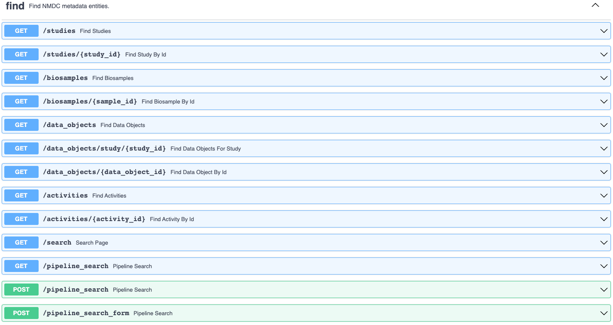
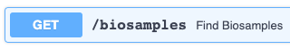
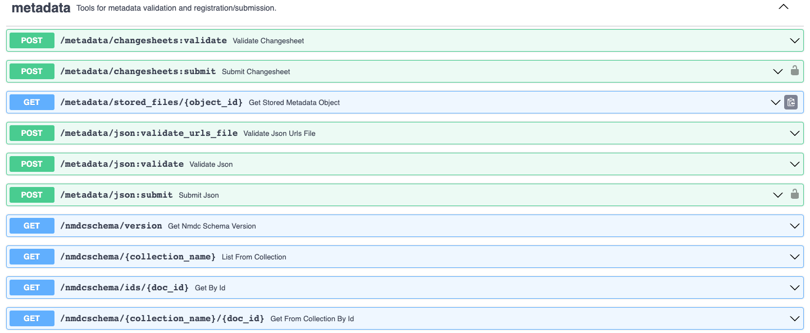

# Using the NMDC API Graphical User Interface (GUI)

## Retrieving and Submitting Metadata using the ___Find___ and ___Metadata___ API Endpoints

Metadata describing NMDC data (e.g. studies, biosamples, data objects, etc.) may be retrieved or submittied with GET and POST requests, respectively, using the **[NMDC API Graphical User Interface (GUI)](https://api.microbiomedata.org/docs#/)**. The API GUI provides an user interface for programmatic access to the NMDC data portal without needing to use the Command Line.

Requests can include various parameters to filter, sort, and organize the requested information. Field names in the parameters will vary depending on the collection. The required syntax of the paramters will also vary, depending on if it is a ___find___ or a ___metadata___ endpoint. ___Find___ endpoints are designed to use more compact syntax (for example, filtering biosamples for an "Ecosystem Category" of "Plants" would look like `ecosystem_category:Plants` using the `GET /biosamples` endpoint). While ___metadata___ endpoints use [MongoDB-language querying](https://www.mongodb.com/docs/manual/tutorial/query-documents/) (e.g. the same filter would look like `{"ecosystem_category": "Plants"}` using the `GET /nmdcshema/{collection_name}` endpoint with `collection_name` set to `biosample_set`.)

#### ___Find___ Endpoints

The [Find endpoints](https://api.microbiomedata.org/docs#/find:~:text=Find%20NMDC-,metadata,-entities.) are provided with NMDC metadata entites already specified - where metadata about studies, biosamples, data objects, and activities can be retrieved using the GET requests. [add info. about POST requests for pipeline_search and pipeline_search_form] 

The applicable parameters to the ___find___ endpoints, with acceptable syntax and examples are in the table below.

| Parameter | Description | Syntax | Example Endpoint | Example parameter
| :---: | :-----------: | :-------: | :---: | :---: |
| filter | Allows conditions to be set as part of the query, returning only results that satisfy the conditions | Comma separated string of field:value pairs. Can include comparison operators like >=, <=, <, and >. May use a `.search` after the field name to search for string portion of of a value. e.g. `field:value` or `field.search:string` |  |`ecosystem_category:Plants, part_of:gold:Gs0103573, lat_lon.latitude:>35.0` `{"part_of": "gold:Gs0114663"}` |
| search | Not yet implemented | Coming Soon | Not yet implemented |
| sort | Specifies the order in which the query returns the matching documents | Comma separated list of field:value pairs, Where value can be empty, asc, or desc (for ascending or descending order) | `depth.has_numeric_value:desc, ecosystem_type`
| page | Specifies the desired page number among the paginated results | Integer | `3`
| per_page | Specifies the number of results returned per page. Maximum allowed is 200 | Integer | `50` |
| cursor |
| group_by | Not yet implemented | Coming Soon | Not yet implmented |

##### Example: get all studies that have EMSL (Environmental Molecular Sciences Laboratory) related funding

1. Click on the drop down arrow to the right side of the **`GET /studies`** endpoint
2. Click **Try it out** in the upper right of the expanded endpoint box
3. Enter in parameters. In this case, we will input `funding_sources.search:EMSL` into the **filter** parameter. The `.search` performs a regex search to find studies with `funding_sources' that have the word "EMSL" in its value.
4. Click **Execute**
5. View the results in a json format, available to download by clicking **Download** or copy the results by clicking the clipboard icon in the bottom right corner of the response. In this case two studies were retrieved.

[Add picutures or docs or something visual]

### Parameters

Requests can include various parameters to filter, sort, and organize the requested information. Field names in the parameters will vary depending on the collection. In the first filter example in the table below, the fields of `ecosystem_category`, `part_of`, and `lat_lon.latitude` are specific to Biosamples and can only be used with Biosample related requests. It will return all biosamples with an `ecosystem_category` of Plants, that are `part_of` the study with an identifier of gold:Gs0103573, and have a `latitude` greater than 35. Please see the [NMDC schema documentation](https://microbiomedata.github.io/nmdc-schema/) to see applicable fields.

| Parameter | Description | Syntax | Example |
| :---: | :-----------: | :-------: | :---: |
| filter | Allows conditions to be set as part of the query, returning only results that satisfy the conditions | Comma separated list of field:value pairs. Can include comparison operators like >=, <=, <, and >. May use a `.search` after the field name to search for part of a value. | `ecosystem_category:Plants, part_of:gold:Gs0103573, lat_lon.latitude:>35.0` `{"part_of": "gold:Gs0114663"}` |
| search | Not yet implemented | Coming Soon | Not yet implemented |
| sort | Specifies the order in which the query returns the matching documents | Comma separated list of field:value pairs, Where value can be empty, asc, or desc (for ascending or descending order) | `depth.has_numeric_value:desc, ecosystem_type`
| page | Specifies the desired page number among the paginated results | Integer | `3`
| per_page | Specifies the number of results returned per page. Maximum allowed is 200 | Integer | `50` |
| cursor |
| group_by | Not yet implemented | Coming Soon | Not yet implmented |
| collection_name | Specifies the collection of documents to examined. Please see the [NMDC Schema Database Class doc](https://microbiomedata.github.io/nmdc-schema/Database/) for a list of collection names | String | `biosample_set` |
| max_page_size | 
| page_token |
| pipeline_spec |
| description |
| doc_id |
| object_id |
| study_id |
| data_object_id |
| activity_id |

**[alphabetize table]**

#### ___Metadata___ Endpoints

Include a list of collection names with nmdc schema links.

