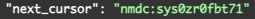
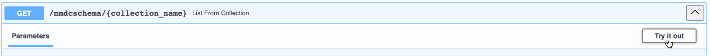
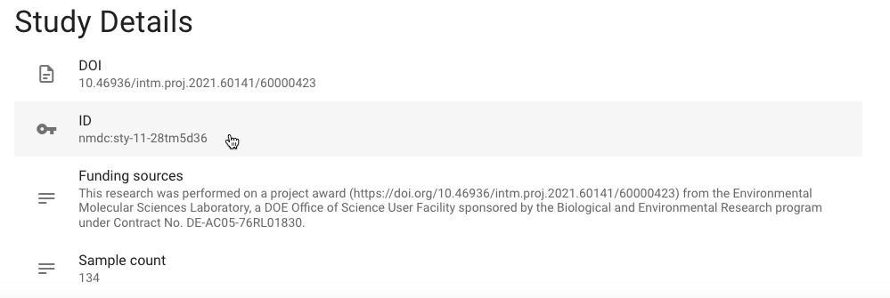
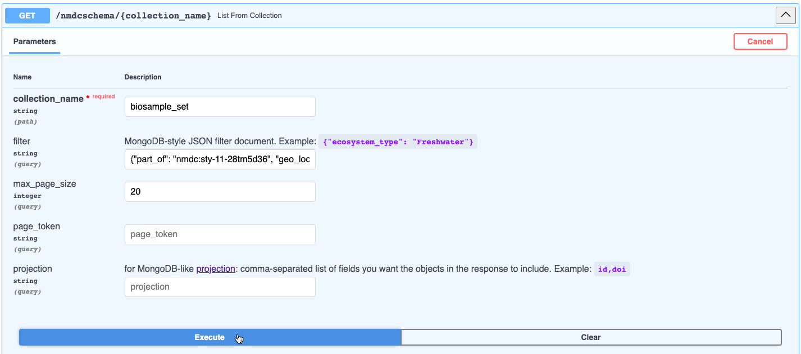
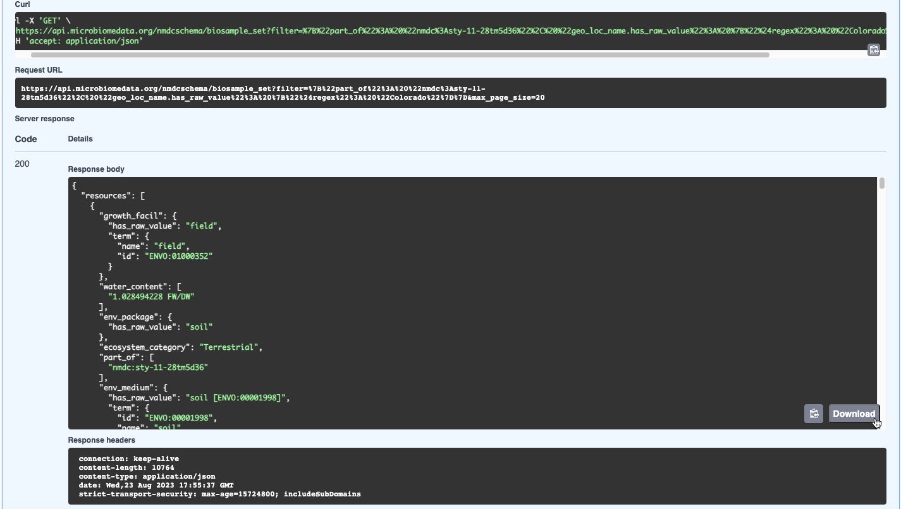

# Using the NMDC API Graphical User Interface (GUI)

Dependency versions:
nmdc-runtime=1.2.0

## Retrieving Metadata using the ___Find___ and ___Metadata___ API Endpoints

Metadata describing NMDC data (e.g. studies, biosamples, data objects, etc.) may be retrieved with GET requests, using the **[NMDC API Graphical User Interface (GUI)](https://api.microbiomedata.org/docs#/)**. The API GUI provides a guided user interface for direct access to the NMDC data portal. It allows for:
1. performing highly granular and targeted queries directly. This is especially helpful if a user has a query that may not be supported by the [NMDC Data Portal](https://data.microbiomedata.org/) yet. 
2. interactive exploration of querying capabilities. It provides code snippets that can be used in scripts for programmatic access, i.e. the request `curl` commands and URLs provided in the responses (please see the examples below).

Please note that the endpoints discussed in this documentation are targeted for users, such as NMDC data consumers. For documentation describing other endpoints, primarily used by developers, please see [nmdc-runtime-docs](https://microbiomedata.github.io/nmdc-runtime/).

Requests can include various parameters to filter, sort, and organize the requested information. Attribute names in the parameters will vary depending on the collection. The required syntax of the parameters will also vary, depending on if it is a ___find___ or a ___metadata___ endpoint. ___Find___ endpoints are designed to use more [compact syntax](https://docs.openalex.org/how-to-use-the-api/get-lists-of-entities/filter-entity-lists) (for example, filtering biosamples for an "Ecosystem Category" of "Plants" would look like `ecosystem_category:Plants` using the `GET /biosamples` endpoint). While ___metadata___ endpoints use [MongoDB-like language querying](https://www.mongodb.com/docs/manual/tutorial/query-documents/) (e.g. the same filter would look like `{"ecosystem_category": "Plants"}` using the `GET /nmdcshema/{collection_name}` endpoint with `collection_name` set to `biosample_set`).

#### ___Find___ Endpoints

The [find endpoints](https://api.microbiomedata.org/docs#/find:~:text=Find%20NMDC-,metadata,-entities.) are provided with NMDC metadata entities already specified - where metadata about [studies](https://w3id.org/nmdc/Study), [biosamples](https://w3id.org/nmdc/Biosample), [data objects](https://w3id.org/nmdc/DataObject/), and [activities](https://w3id.org/nmdc/Activity/) can be retrieved using GET requests. 

The applicable parameters of the ___find___ endpoints, with acceptable syntax and examples, are in the table below.

| Parameter | Description | Syntax | Example |
| :---: | :-----------: | :-------: | :---: |
| filter | Allows conditions to be set as part of the query, returning only results that satisfy the conditions | Comma separated string of attribute:value pairs. Can include comparison operators like >=, <=, <, and >. May use a `.search` after the attribute name to conduct a full text search of the field that are of type string. e.g. `attribute:value,attribute.search:value` | `ecosystem_category:Plants, lat_lon.latitude:>35.0` |
| search | Not yet implemented | Coming Soon | Not yet implemented |
| sort | Specifies the order in which the query returns the matching documents | Comma separated string of attribute:value pairs, where the value can be empty, `asc`, or `desc` (for ascending or descending order) e.g. `attribute` or `attribute:asc` or `attribute:desc`| `depth.has_numeric_value:desc, ecosystem_type` |
| page | Specifies the desired page number among the paginated results | Integer | `3` |
| per_page | Specifies the number of results returned per page. Maximum allowed is 2,000 | Integer | `50` |
| cursor | A bookmark for where a query can pick up where it has left off. To use cursor paging, set the `cursor` parameter to `*`. The results will include a `next_cursor` value in the response's `meta` object that can be used in the `cursor` parameter to retrieve the subsequent results  | String | `*` or `nmdc:sys0zr0fbt71` |
| group_by | Not yet implemented | Coming Soon | Not yet implemented |
| fields | Indicates the desired attributes to be included in the response. Helpful for trimming down the returned results | Comma-separated list of attributes that belong to the documents in the collection being queried | `name, ess_dive_datasets` |
| study_id | The unique identifier of a study | Curie e.g. `prefix:identifier` | `nmdc:sty-11-34xj1150` |
| sample_id | The unique identifier of a biosample | Curie e.g. `prefix:identifier` | `nmdc:bsm-11-w43vsm21` |
| data_object_id | The unique identifier of a data object | Curie e.g. `prefix:identifier` | `nmdc:dobj-11-7c6np651` |
| activity_id | The unique identifier for an NMDC workflow execution activity | Curie e.g. `prefix:identifier` | `nmdc:wfmgan-11-hvcnga50.1`|

 
 

Each endpoint is unique and requires the applicable attribute names to be known in order to structure a query in a meaningful way. Please note that endpoints with parameters that do not have a red `* required` label next to them, are optional. 
 

The `GET /studies` endpoint is a general purpose way to retrieve NMDC studies based on parameters provided by the user. Studies can be filtered and sorted based on the applicable [Study attributes](https://microbiomedata.github.io/nmdc-schema/Study/).  
 

If the study identifier is known, a study can be retrieved directly using the `GET /studies/{study_id}` endpoint. Note that only one study can be retrieved at a time using this method. 
  

The `GET /biosamples` endpoint is a general purpose way to retrieve biosample metadata using user-provided filter and sort criteria. Please see the applicable [Biosample attributes](https://microbiomedata.github.io/nmdc-schema/Biosample/). 
 

If the biosample identifier is known, a biosample can be retrieved directly using the `GET /biosamples/{sample_id}`. Note that only one biosample metadata record can be retrieved at a time using this method. 
 

To retrieve metadata about NMDC data objects (such as files, records, or omics data) the `GET /data_objects` endpoint may be used along with various parameters. Please see the applicable [Data Object attributes](https://microbiomedata.github.io/nmdc-schema/DataObject).  
 

If the data object identifier is known, the metadata can be retrieved using the `GET /data_objects/{data_object_id}` endpoint. Note that only one data object metadata record may be retrieved at a time using this method. 
 

The `GET /activities` endpoint is a general way to fetch metadata about various activities (e.g. metagenome assembly, natural organic matter analysis, library preparation, etc.). Any "slot" (a.k.a. attribute) for [WorkflowExecutionActivity](https://microbiomedata.github.io/nmdc-schema/WorkflowExecutionActivity/) or [PlannedProcess](https://microbiomedata.github.io/nmdc-schema/PlannedProcess/) classes may be used in the filter and sort parameters, including attributes of subclasses of `WorkflowExecutionActivity` and `PlannedProcess`. For example, attributes used in subclasses such as, [MetabolomicsAnalysisActivity](https://microbiomedata.github.io/nmdc-schema/MetabolomicsAnalysisActivity/) (subclass of `WorkflowExecutionActivity`) or (Extraction)[https://microbiomedata.github.io/nmdc-schema/Extraction/] (subclass of `PlannedProcess`), can be used as input criteria for the filter and sort parameters of this endpoint. 
 

If the activity identifier is known, the activity metadata can be retrieved using the `GET /activities/activity_id` endpoint. Note that only one metadata record for an activity may be returned at a time using this method. 
 

For more information and to see more examples of __find__ endpoints outside of the [autogenerated user interface](https://api.microbiomedata.org/docs#/find), please visit: https://api.microbiomedata.org/search 
 

#### Find Endpoint Example: get all studies that have EMSL (Environmental Molecular Sciences Laboratory) related funding

1. Click on the drop down arrow to the right side of the **`GET /studies`** endpoint

2. Click **Try it out** in the upper right of the expanded endpoint box

3. Enter in parameters. In this case, we will input `funding_sources.search:EMSL` into the **filter** parameter. The `.search` performs a full text search to find studies with `funding_sources` that have the word "EMSL" in its value.
4. Click **Execute**

5. View the results in JSON format, available to download by clicking **Download**, or copy the results by clicking the clipboard icon in the bottom right corner of the response. In this case, two studies were retrieved.
 
 

- Note that a curl request and request URL are provided as well for command line usage:

#### ___Metadata___ Endpoints

The [metadata endpoints](https://api.microbiomedata.org/docs#/metadata) can be used to get and filter metadata from collection set types (including studies, biosamples, activities, and data objects as discussed in the __find__ section). 

Unlike the compact syntax used in the __find__  endpoints, the syntax for the filter parameter of the metadata endpoints uses [MongoDB-like language querying](https://www.mongodb.com/docs/manual/tutorial/query-documents/). The applicable parameters of the __metadata__ endpoints, with acceptable syntax and examples, are in the table below.

| Parameter | Description | Syntax | Example |
| :---: | :-----------: | :-------: | :---: | 
| collection_name | The name of the collection to be queried. For a list of collection names please see the [Database class](https://microbiomedata.github.io/nmdc-schema/Database/) of the NMDC Schema | String | `biosample_set` |
| filter | Allows conditions to be set as part of the query, returning only results that satisfy the conditions | [MongoDB-like query language](https://www.mongodb.com/docs/manual/tutorial/query-documents/). All strings should be in double quotation marks. | `{"lat_lon.latitude": {"$gt": 45.0}, "ecosystem_category": "Plants"}` | 
| max_page_size | Specifies the maximum number of documents returned at a time | Integer | `25`
| page_token | Specifies the token of the page to return. If unspecified, the first page is returned. To retrieve a subsequent page, the value received as the `next_page_token` from the bottom of the previous results can be provided as a `page_token`.  | String | `nmdc:sys0ae1sh583`
| projection | Indicates the desired attributes to be included in the response. Helpful for trimming down the returned results | Comma-separated list of attributes that belong to the documents in the collection being queried | `name, ecosystem_type` |
| doc_id | The unique identifier of the item being requested. For example, the identifier of a biosample or an extraction | Curie e.g. `prefix:identifier` | `nmdc:bsm-11-ha3vfb58` |

 
 

The __metadata__ endpoints allow users to retrieve metadata from the data portal using the various `GET` endpoints that are slightly different than the __find__ endpoints, but some can be used similarly. As with the __find__  endpoints, parameters for the __metadata__ endpoints that do not have a red `* required` next to them are optional.  
 

To view the [NMDC Schema](https://microbiomedata.github.io/nmdc-schema/) version the database is currently using, try executing the `GET /nmdcschema/version` endpoint 
 

To get the NMDC Database collection statistics, like the total count of records in a collection or the size of the collection, try executing the `GET /nmdcschema/collection_stats` endpoint 
 

The `GET /nmdcschema/{collection_name}` endpoint is a general purpose way to retrieve metadata about a specified collection given user-provided filter and projection criteria. Please see the [Collection Names](https://microbiomedata.github.io/nmdc-schema/Database/) that may be retrieved. Please note that metadata may only be retrieved about one collection at a time. 
 

If the identifier of the record is known, the `GET /nmdcshema/ids/{doc_id}` can be used to retrieve the specified record. Note that only one identifier may be used at a time, and therefore, only one record may be retrieved at a time using this method. 
 

If both the identifier and the collection name of the desired record is known, the `GET /nmdcschema/{collection_name}/{doc_id}` can be used to retrieve the record. The projection parameter is optionally available for this endpoint to retrieve only desired attributes from a record. Please note that only one record can be retrieved at one time using this method. 
 

#### Metadata Endpoints Example 1: Get all of the biosamples that are part of the 1000 Soils Research Campaign Study sampled from Colorado

1. Click on the drop down arrow to the right side of the **`GET /nmdcschema/{collection_name}`** endpoint

2. Click **Try it out** in the upper right of the expanded endpoint box

3. In order to enter in the parameters, get the identifier for this study by navigating to the [1000 Soils Research Campaign study page](https://data.microbiomedata.org/details/study/nmdc:sty-11-28tm5d36) in the data portal and copying the `ID`

4. Enter in the parameters in the **`GET /nmdcschema/{collection_name}`** endpoint. For this example, we will input `biosample_set` into the **collection_name** parameter and `{"part_of": "nmdc:sty-11-28tm5d36", "geo_loc_name.has_raw_value": {"$regex": "Colorado"}}` into the **filter** parameter. See the [Biosample Class](https://microbiomedata.github.io/nmdc-schema/Biosample/) in the NMDC Schema to view the applicable biosample attributes (slots); for this example, they are `part_of` and `geo_loc_name.has_raw_value`. Note that `$regex` conducts a full text search for the word "Colorado" in the `geo_loc_name.has_raw_value` attribute.
5. Click **Execute**

6. View the results in JSON format, available to download by clicking **Download**; or copy the results by clicking the clipboard icon in the bottom right corner of the response. In this case, two studies were retrieved. Note that the curl and request URL are provided as well.

