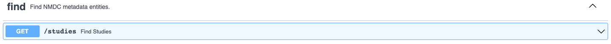

# Using the NMDC API Graphical User Interface (GUI)

## Retrieving and Submitting Metadata using the ___Find___ and ___Metadata___ API Endpoints

Metadata describing NMDC data (e.g. studies, biosamples, data objects, etc.) may be retrieved or submittied with GET and POST requests, respectively, using the **[NMDC API Graphical User Interface (GUI)](https://api.microbiomedata.org/docs#/)** The API GUI provides an user interface for programmatic access to the NMDC data portal without needing to use the Command Line.

Requests can include various parameters to filter, sort, and organize the requested information. Attribute names in the parameters will vary depending on the collection. The required syntax of the parameters will also vary, depending on if it is a ___find___ or a ___metadata___ endpoint. ___Find___ endpoints are designed to use more compact syntax (for example, filtering biosamples for an "Ecosystem Category" of "Plants" would look like `ecosystem_category:Plants` using the `GET /biosamples` endpoint). While ___metadata___ endpoints use [MongoDB-language querying](https://www.mongodb.com/docs/manual/tutorial/query-documents/) (e.g. the same filter would look like `{"ecosystem_category": "Plants"}` using the `GET /nmdcshema/{collection_name}` endpoint with `collection_name` set to `biosample_set`.)

#### ___Find___ Endpoints

The [find endpoints](https://api.microbiomedata.org/docs#/find:~:text=Find%20NMDC-,metadata,-entities.) are provided with NMDC metadata entites already specified - where metadata about [studies](https://nmdc-documentation.readthedocs.io/en/latest/reference/metadata/Study.html), [biosamples](https://nmdc-documentation.readthedocs.io/en/latest/reference/metadata/Biosample.html), [data objects](https://nmdc-documentation.readthedocs.io/en/latest/reference/metadata/DataObject.html), and [activities](https://nmdc-documentation.readthedocs.io/en/latest/reference/metadata/Activity.html) can be retrieved using GET requests. 

The applicable parameters of the ___find___ endpoints, with acceptable syntax and examples are in the table below.

| Parameter | Description | Syntax | Example |
| :---: | :-----------: | :-------: | :---: |
| filter | Allows conditions to be set as part of the query, returning only results that satisfy the conditions | Comma separated string of attribute:value pairs. Can include comparison operators like >=, <=, <, and >. May use a `.search` after the attribute name to conduct a full text search of the field that are of type string. e.g. `attribute:value,attribute.search:value` | `ecosystem_category:Plants, lat_lon.latitude:>35.0` |
| search | Not yet implemented | Coming Soon | Not yet implemented |
| sort | Specifies the order in which the query returns the matching documents | Comma separated string of attribute:value pairs, Where value can be empty, asc, or desc (for ascending or descending order) e.g. `attribute` or `attribute:asc` or `attribute:desc`| `depth.has_numeric_value:desc, ecosystem_type` |
| page | Specifies the desired page number among the paginated results | Integer | `3` |
| per_page | Specifies the number of results returned per page. Maximum allowed is 200 | Integer | `50` |
| cursor |
| group_by | Not yet implemented | Coming Soon | Not yet implmented |
| study_id | The unique identifier of a study | Curie e.g. `prefix:identifier` | `gold:Gs0114675` |
| sample_id | The unique identifier of a biosample | Curie e.g. `prefix:identifier` | `nmdc:bsm-11-w43vsm21` |
| data_object_id | The unique identifer of a data object | Curie e.g. `prefix:identifier` | `jgi:55a9caff0d87852b2150891e` |
| activity_id | The unique identifier for an nmdc workflow execution acitivty | Curie e.g. `prefix:identifier` | `nmdc:extrp-11-k5fecy41`| 
 

Each endpoint is unique and requires the applicable attribute names to be known in order to structure a query in a meaningful way. 
 

The `GET /studies` endpoint is a general purpose way to retrieve NMDC studies based on parameters provided by the user. Studies can be filtered and sorted based on the applicable [Study attributes](https://microbiomedata.github.io/nmdc-schema/Study/).  
 

If the Study identifier is known, a study can be retrieved directly using the `GET /studies{study_id}` endpoint. Note that only one study can be retrieved at a time using this method. 
  

The `GET /biosamples` endpoint is a general purpose way to retrieve biosample metadata using user-provided filter and sort criteria. Please see the applicable [Biosample attributes](https://microbiomedata.github.io/nmdc-schema/Biosample/). 
 

If the biosample identifier is known, a biosample can be retrieved directly using the `GET /biosamples/{sample_id}`. Note that only one biosample metadata record can be retrieved at a time using this method 
 

To retrieve metadata about NMDC data objects (such as files, records, or omics data) the `GET /data_objects` endpoint may be used along with various parameters. Please see the applicable [Data Object attributes](https://microbiomedata.github.io/nmdc-schema/DataObject/* 
 

Use the `GET /data_objects/study/{study_id}` find endpoint to fetch the metadata for **all** data objects, such as omics processing record metadata, based on the study identifier. Note that only one study_id may be input at a time. 
 

If the data object identifier is known, the metadata can be retrieved using the `GET /data_objects/{data_object_id}` endpoint. Note that only one data object metadata record may be retrieved at one time using this method 
 

The `GET /activities` endpoint is a general way to fetch metadata about various activities (e.g. metagenome assembly, natural organic matter analysis, libarary preparation etc). Any "slot" (aka attribute) for [WorkflowExecutionActivty](https://microbiomedata.github.io/nmdc-schema/WorkflowExecutionActivity/) or [PlannedProcess](https://microbiomedata.github.io/nmdc-schema/PlannedProcess/)  may be used in the filter and sort parameters, including attributes for subclasses of `WorkflowExecutionActvity` and `PlannedProcess`, such as slots used in the `MetabolomicsAnalysisActivity` or `Extraction` class among others. 
 

If the activity identifier is known, the activity metadata can be retrieved using the `GET /activiites/activity_id` endpoint. Note that only one metadata record for an activity may be returned at a time using this method 
 

For more information and to see more examples of __find__ endpoints outside of the [autogenerated user interface](https://api.microbiomedata.org/docs#/find), please visit: https://api.microbiomedata.org/search<b/>
<b/>

#### Find Endpoint Example: get all studies that have EMSL (Environmental Molecular Sciences Laboratory) related funding

1. Click on the drop down arrow to the right side of the **`GET /studies`** endpoint

2. Click **Try it out** in the upper right of the expanded endpoint box

3. Enter in parameters. In this case, we will input `funding_sources.search:EMSL` into the **filter** parameter. The `.search` performs a full text search to find studies with `funding_sources` that have the word "EMSL" in its value.
4. Click **Execute**

5. View the results in a json format, available to download by clicking **Download**, or copy the results by clicking the clipboard icon in the bottom right corner of the response. In this case two studies were retrieved.
<b/>
<b/>

- Note that a curl request and request url are provided as well for command line usage:

#### ___Metadata___ Endpoints

The [metadata endpoints](https://api.microbiomedata.org/docs#/metadata) can be used to get and filter metadata from collection set types (including studies, biosamples, activites, and data objects as discussed in the __find__ section), as well as validate and submit metadata to the data portal as a spreadsheet or json file. 

The syntax for the filter parameter of the __metadata__ endpoints is slightly different than that of the __find__ endpoints using [MongoDB-language querying](https://www.mongodb.com/docs/manual/tutorial/query-documents/) instead of the compact syntax the __find__ endpoints use. The applicable parameters of the __metadata__ endpoints, with acceptable syntax and examples are in the table below.

| Parameter | Description | Syntax | Example |
| :---: | :-----------: | :-------: | :---: | 
| collection_name | The name of the collection to be queried. For a list of collection names please see the [Database class](https://microbiomedata.github.io/nmdc-schema/Database/) of the NMDC Schema | String | `biosample_set` |
| filter | Allows conditions to be set as part of the query, returning only results that satisfy the conditions | [MongoDB-like query language](https://www.mongodb.com/docs/manual/tutorial/query-documents/). All strings should be in double quotation marks. | `{"lat_lon.latitude": {"$gt": 45.0}, "ecosystem_category": "Plants"}` | 
| max_page_size | Specifies the maximum number of documents returned at a time | Integer | `25`
| page_token | Specifies the token of the page to return. If unspecified, the first page is returned. To retrieve a subsequent page, the value received as the `next_page_token` from the bottom of the previous results can be provided as a `page_token`.  | String | `nmdc:sys0ae1sh583`
| projection | Indicates the desired fields to be included in the response. Helpful for trimming down the returned results | Comma separated string of field names that correspond to a `collection_name`. | `name, ecosystem_type` |
| doc_id | The unique identifier of the item being requested. For example, the identifier of a biosample or an extraction | Curie e.g. `prefix:identifier` | `gold:Gb0115231` | 
 

The __metadata__ endpoints allow users to retrieve metadata from the data portal using the various `GET` endpoints that are slightly different than the __find__ endpoints, but some can be used similarily. They also include the ability to `POST` metadata to the data portal by allowing the validation and submission of change sheets or JSON files. Change sheets are spreadsheets that specify changes to be made to existing metadata in the portal, like updating, removing, or inserting values. 
 

A csv or tsv file can be validated against the NMDC schema using the `POST /metadata/changesheets:validate` endpoint. Please see an [example changesheet](https://github.com/microbiomedata/nmdc-runtime/blob/main/metadata-translation/notebooks/data/changesheet-without-separator3.tsv). The file should include four columns:
1. `id`: the identifier of the metadata object to be updated
2. `action`: the type of update to be performed. There are four actions:
    - `insert`: inserts a new value
    - `remove item`: removes the value from a specified attribute.
    - `update`: replaces the existing value with a new value 
    - `delete`: removes the attribute entirely from the metadata document
3. `attribute`: the attribute (or field/slot) that will be updated (e.g. `name` or `ecosystem_category`, etc.)
4. `value`: the new value that will be inserted or that will replace the old value.
 
Please note that if changes are being made to multivalued attributes that have a "structured" value, e.g. [air_temp_regm](https://microbiomedata.github.io/nmdc-schema/air_temp_regm/) has a range of [TextValue](https://microbiomedata.github.io/nmdc-schema/TextValue/), use the `update` action to set the attribute to a value of some variable followed by the `insert` action to with the id is the variable with its value set to what will get populated. 
 

If submitting data to the portal, the metadata may be represented in a JSON format which can be posted in the body of the request and validated against the NMDC schema using the `POST /metatdata/json:validate` endpoint before final submission to the portal. 
 

A text file of urls that point to a JSON object may be supplied using the `POST /metadata/json:validate_urls_file` endpoint. This is helpful for validation of very large JSON metadata or if a user has a link to a JSON file but is not in an environment where it is convenient to download the file and then upload it to validate. 

collection_name endpoint: can only get once collection at a time

example: get all biosamples part of a study

example: use regex for full text search: eg.g. {"geo_loc_name.has_raw_value": {"$regex": "Colorado"}} ?

Add example to netadata endpoint to get dataset curies from study - see new projection parameter 

double check white space between comma separated projections. 

