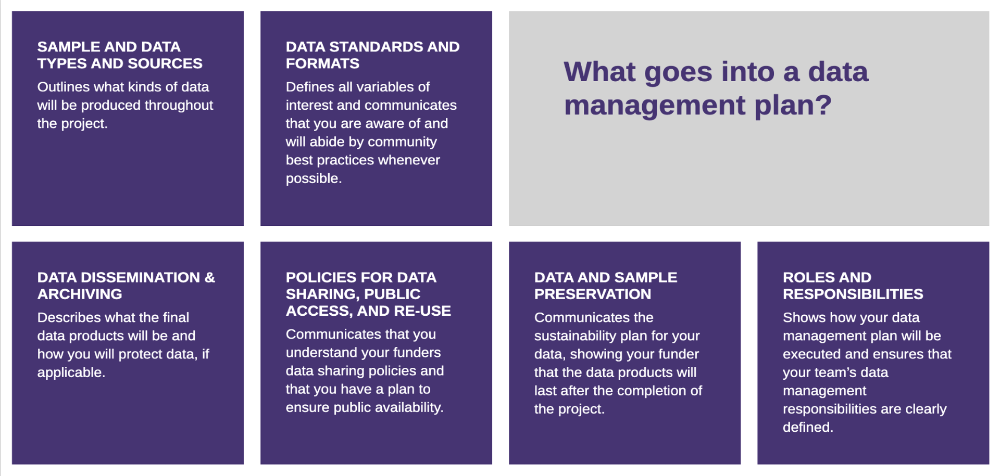

# Creating a Data Management Plan

### What is a Data Management Plan? 

A data management plan (DMP) is an integral part of grant applications. DMPs are required by every federal funder but the guidelines vary depending on the agency. Here you can find information for Federal Funding Agencies that work with microbiome data.  

Your DMP communicates how you and your team will collect, categorize, store, and share any data produced during the duration of a grant, and how that data will be preserved and made accessible after the completion of the project. While the DMP is important for your grant proposal, it is also important for laying the groundwork for producing high quality, accessible, and reusable data. A DMP should be a living document that sets expectations for your project team before and during the project. To maximize the impact of your DMP it should be public, machine readable, and openly licensed by generating a personalized identification number. 

While a new concept, making your DMP machine readable, increases the likelihood that your data will gain recognition and credit because your data can be located, reused and cited easily. To learn more about the merits of a machine readable DMPs read [Ten principles for machine-actionable data management plans.](https://journals.plos.org/ploscompbiol/article?id=10.1371/journal.pcbi.1006750) 

### What to include in your DMP? 

While your DMP should include information about all data collected through the duration of your research, these guidelines and best practices focus on large omic data generated from microbiome samples. If you are unfamiliar with microbiome data management and metadata standards, we recommend you begin with an [Introduction to Metadata and Ontologies: Everything You Always Wanted to Know About Metadata and Ontologies (But Were Afraid to Ask)](https://microbiomedata.org/introduction-to-metadata-and-ontologies/) and the [NMDC Metadata Standards Documentation](https://w3id.org/nmdc/nmdc). These resources will introduce you to multi-omics metadata standards that leverage existing community-driven standards. 

***The NMDC DMPTool Template***

In partnership with the University of California Curation Center of the California Digital Library, the NMDC team has created a microbiome-specific DMPTool Template. DMPTool is an open-source application that assists researchers in the creation of data management plans compliant with federal funding requirements. The NMDC DMPTool template is funding-organization agnostic and was developed to support microbiome data management best practices with specifications unique to microbiome standards and data processing. Once you [create an account at DMPTool](https://dmptool.org/), this link will take you to the [NMDC Microbiome Omics Research DMP Template](https://dmptool.org/plans?plan%5Bfunder%5D%5Bid%5D=%7B+%22id%22%3A+4265%2C+%22name[…]Microbiome+Data+Collaborative%22+%7D&plan%5Btemplate_id%5D=1321) ***which provides step-by-step prompts for your DMP.***

All of the sections below are laid out in the NMDC DMPTool template. This is a living document and the NMDC team welcomes community feedback on this resource. 

### For more information 
You can find more information about [Data Management Best Practices](https://microbiomedata.org/data-management/) on the NMDC website.

### Contact us

Please [email us](https://microbiomedata.org/contact/) with comments, suggestions, or questions. The NMDC team provides Data Management Plan Consultancies where we can help you draft an effective DMP and provide you with tools and resources for completing your DMP in accordance with funder requirements and community best practices. 
 
