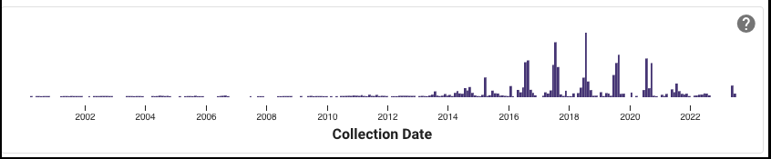
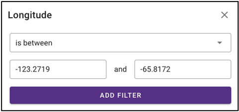

# The NMDC Data Portal User Guide

## Introduction

The pilot NMDC Data Portal (<https://data.microbiomedata.org>) provides
a resource for consistently processed multi-omics data that is
integrated to enable search, access, analysis, and download. Open-source
bioinformatics workflows are used to process raw multi-omics data and
produce interoperable and reusable annotated data from metagenome,
metatranscriptome, metaproteome, metabolome, and natural organic matter
characterizations. The NMDC Data Portal offers several search and
navigation components, and data can be downloaded through the graphical
user interface using an ORCiD authentication, with associated download
metrics, or retrieved through available RESTful APIs. All multi-omics
data are available under a Creative Commons 4.0 license, which enables
public use with attribution, as outlined in the NMDC Data Use Policy
(<https://microbiomedata.org/nmdc-data-use-policy>). This first
iteration of the NMDC Data Portal was released in March 2021, and will
continue to expand its data hostings and functionality on an ongoing. 

There is a short video tutorial showing how to navigate the portal on
Youtube (<https://www.youtube.com/watch?v=KJQDrCnJRho>).

## User-Centered Design Process

The NMDC is a resource designed together with and for the scientific
community. We have engaged in extensive user research through interviews
and direct collaboration with the scientific community that have
informed the design, development, and display of data through the NMDC
Data Portal. This methodology (1) enables the scientific community to
provide feedback, iterative and continuous improvement of our systems,
and ensures that our systems enable a high level of scientific
productivity. Feedback collected from the scientific community during
early iterations of the Data Portal can be linked to the features and
design directions found in the current release. Our community-centered
design approach ensures that the NMDC can evolve with the needs of the
microbiome research community, but will also be important for uncovering
creative design solutions, clarifying expectations, reducing redesign,
and perhaps most importantly, enabling shared ownership (2) of the NMDC.
We hope that this inclusive approach will enable us to expand our
engagements with the microbiome research community and the utility of
the NMDC Data Portal.

## Available Studies & Data

Data hostings include studies, biosamples, and 5 data types from a breadth of
environmental microbiomes, spanning river sediments, subsurface shale
carbon reservoirs, plant-microbe associations, and temperate and
tropical soils. Specifics are as follows:

## Studies

As the NMDC Data Portal is a pilot infrastructure, incoming projects for
which study information and curated environmental metadata become
available is first validated and loaded with a flag (Omics data coming
soon) before processed instrumentation data is integrated into the
portal.

## Standards

The NMDC team works closely with several standards groups and
organizations. We have adopted the Genomic Standards Consortium (GSC)
Minimum Information about any (x) Sequence (MIxS) templates (3). This
provides a standard data dictionary of sample descriptors (e.g.,
location, biome, altitude, depth) organized into seventeen environmental
packages (<https://www.gensc.org/pages/standards-intro.html>) for sequence data. The NMDC team has
mapped fields used to describe samples in the GOLD database to MIxS
version 6.1 elements. In addition, we are adopting the MIxS standards
for sequence data types (e.g., sequencing method, pcr primers and
conditions, etc.), and are leveraging standards and controlled
vocabularies developed by the Proteomics Standards Initiative (4), the
National Cancer Institute's Proteomic Data Commons
(<https://pdc.cancer.gov/data-dictionary/dictionary.html>), and the
Metabolomics Standards Initiative (5) for mass spectrometry data types
(e.g., ionization mode, mass resolution, scan rate, etc.).

### *MIxS environmental packages*

The GSC has developed standards for describing genomic and metagenomic
sequences, and the environment from which a biological sample
originates. These "[Minimum Information about any (x)
Sequence](https://www.gensc.org/pages/standards-intro.html)" (MIxS) packages provides
standardized sample descriptors (e.g., location, environment, elevation,
altitude, depth, etc.) for 17 different sample environments.

### *Environment Ontology (EnvO)*

EnvO is a community-led ontology that represents environmental entities
such as biomes, environmental features, and environmental materials.
These EnvO entities are the recommended values for several of the
mandatory terms in the MIxS packages, often referred to as the "MIxS
triad".

### *Genomes OnLine Database (GOLD)*

GOLD is an open-access repository of genome, metagenome, and
metatranscriptome sequencing projects with their associated metadata.
Biosamples (defined as the physical material collected from an
environment) are described using a five-level ecosystem classification
path that goes from ecosystem down to the type of environmental material
that describes the sample.

## Omics Data

A suite of omics processing data can be generated from available
biosamples, and the value of associating these data through a common
sample source enables researchers to probe function. The NMDC data
schema offers an approach to link omics processing runs to their source
biosample (for example, multiple organic matter characterizations can be
generated from a single sample through extraction with various solvents,
eg, chloroform, methanol, and water fractionation). Below outlines the
various omics data currently available through the portal.

### *Metagenomes.*

Illumina-sequenced shotgun metagenome data undergo pre-processing, error
correction, assembly, structural and functional annotation, and binning
leveraging the JGI's production pipelines (6), along with an additional
read-based taxonomic analysis component. Standardized outputs from the
read QC, read-based analysis, assembly, annotation, and binning are
available for search and download on the NMDC Data
Portal.

### *Metatranscriptomes.*

Illumina-sequenced shotgun reads from cDNA library undergo
pre-processing and error correction in the same way as described above
in the metagenome workflow with additional steps to filter ribosomal
reads. High-quality reads are then assembled into transcripts using
MEGAHIT (7), annotated using the annotation module described in the
metagenome workflow, and the high-quality reads are mapped back to the
annotated transcripts using HISAT2 (8) and then processed to calculate
the number of reads mapped per feature using FeatureCount (9) and RPKM
calculations per feature using edgeR (10). Results from read QC,
assembly, and annotation are available for search and download for 
metatranscriptomes on the NMDC Data Portal.

### *Metaproteomes.*

Data-dependent mass spectrometry raw data files are first converted to
mzML, using MSConvert (11). Peptide identification is achieved using
MSGF+ (12) and the associated metagenomic information in the FASTA file.
Peptide identification false discovery rate is controlled using a decoy
database approach. Intensity information is extracted using MASIC (13)
and combined with protein information. Protein annotation information is
obtained from the associated metagenome annotation output. Standardized
outputs for quality control, and peptide and protein-level quantitative
data are available for search and download for metaproteomes on the
NMDC Data Portal.

### *Metabolomes.*

The gas chromatography-mass spectrometry (GC-MS) based metabolomics
workflow (metaMS) developed by leveraging EMSL's CoreMS mass
spectrometry software framework allows target and semi-target data
analysis of metabolomics data (14). The raw data is parsed into coreMS
data structure and undergoes all the steps of signal processing (signal
noise reduction, m/z based chromatogram peak deconvolution, abundance
threshold calculation, peak picking) and molecular identification,
including the molecular search using a metabolites standard compound
library, spectral similarity calculation, and similarity score
calculation (15), all in a single step. The putative metabolite
annotation data is available to download for metabolomes on the NMDC
Data Portal. Data dependent LC-MS based workflows are currently under
development. Additionally, it should be noted that all available data
derives from exploratory, untargeted analysis and is semi-quantitative.

### *Natural Organic Matter Characterization (NOM).*

Direct Infusion Fourier Transform mass spectrometry (DI FT-MS) data
undergoes signal processing and molecular formula assignment leveraging
EMSL's CoreMS framework (14). Raw time domain data is transformed into
the *m/z* domain using Fourier Transform and Ledford equation (16). Data
is denoised followed by peak picking, recalibration using an external
reference list of known compounds, and searched against a dynamically
generated molecular formula library with a defined molecular search
space. The confidence scores for all the molecular formula candidates
are calculated based on the mass accuracy and fine isotopic structure,
and the best candidate assigned as the highest score. The molecular
formula characterization table is available to download for natural
organic matter characterizations on the NMDC Data Portal.

## Portal Functionality

#Faceted search and access

### *Search by investigator name*

NMDC-linked data can be filtered by the associated principal
investigator by selecting 'PI Name' from the left query term bar. This
selection will display studies and samples associated with that PI, and
selecting the arrow on the right side of the study name will open up
more information about that study and that principal investigator.

### *Search by omics processing information*

Samples can be queried by various omics processing information terms
including instrument name, omics type (processing runs sorted by omics
type can also be queried using the bar plot on the main portal page),
and processing institution.

### *Search by KEGG Orthology (KO)*

Under 'Function' on the query term bar, users are able to search by KEGG
Orthology (KO) terms to limit the query to samples with datasets that
include at least one of the listed KO terms. Users may list multiple KO
terms, but it is important to note that adding multiple terms will limit
the search to datasets that include at least one of those KO terms, not
all of the added terms.

### *Search by environmental descriptors*

The query term bar also includes several environmental descriptor
filtering fields of where the samples were isolated from. Users can
filter by sample isolation depth, collection date, latitude and
longitude (can also filter by latitude and longitude using the
interactive map on the omics main page), as well as geographic location
name.

### *Search by ecosystem classifications*

Samples can also be queried by ecosystem classifications using GOLD
and/or ENVO terms. Selecting GOLD classification in the query term bar
opens up a hierarchy that can be navigated through to select ecosystem
classification(s) of interest. Users can select everything under a
certain classification at any point, or can continue navigating to more
specific classifications. The Sankey diagram on the 'Environment' page
provides an interactive visualization of the GOLD classification system.

Similarly, ENVO terms can be used to query the portal, and these are
broken down into environmental biome, feature, and material categories.
ENVO is another effective classification system that can be used to
describe environments where samples were collected from.

## Interactive visualizations

### *Omics Page*

#### Barplot

The barplot on the omics page displays the number of omics processing
runs (not number of samples) for each data type available: organic
matter, metagenomic, metatranscriptomic, proteomic, and metabolomic.
Selecting the bar of a data type will limit the search to just that data
type.

#### Geographic map

The geographic map on the omics page allows for samples to be queried by
the geographic location from which they were isolated. The map displays
the geographical location (latitude, longitude) of the sample collection
sites as clusters with colors corresponding to the number of samples
from that area. The map can be zoomed in and out of, and clusters can be
selected to focus on that specific area. After zooming and moving around
the map to a region of interest, selecting the 'Search this region'
button will limit the search to the current map bounds.

#### Temporal slider

Samples can also be queried by a sample collection date range by
dragging the dots below the temporal slider on the omics page. Sample
collection dates are grouped by month.

#### Upset plot

The upset plot on the omics page displays the number of samples that
have various combinations of associated omics data. The axis at the top
of the plot refers to the different omics types (MG: metagenomic, MT:
metatranscriptomic, MP: metaproteomic, MB: metabolomic, NOM: natural
organic matter) and the dots and lines in the graph below represent the
combinations of the omics data types. The numbers and bars on the right
side represent the number of samples searchable in the NMDC data portal
with each corresponding combination of omics data types. This plot will
update as query terms are added.

### *Environment Page*

#### Sankey diagram

On the environment page, the Sankey diagram displays the environments
that NMDC-linked samples were isolated from. This visualization is based
on the GOLD ecosystem classification path, and the diagram is fully
interactive, so environments of interest can be chosen at descending
levels of specificity. This will then limit your search to samples that
came from that selected environment.

### Download

### *Individual file*

Various output data files are available from samples findable through
the NMDC that have been run through the NMDC standardized workflows.
Output files from each omic type are sorted by the specific workflow
(e.g. Metagenome Assembly, Annotation) that was run and are each
available for download when the sample of interest is selected. Users
must log in with an ORCID account before downloading data.

### *Bulk download*

In addition to the ability to download single output files from samples
run through the NMDC standardized workflows, the NMDC portal allows
users to perform bulk downloads on workflow output files. Once samples
of interest are down-selected through query terms, output files from
each NMDC standardized workflow run on those samples are available as
bulk downloads. Users must be logged in with an ORCID account before
downloading data.

## References

> 1.  Abras C, Maloney-Krichmar, D., Preece, J. 2004. User-Centered
>     Design. \_In \_Bainbridge W (ed), Encyclopedia of Human-Computer
>     Interaction. Sage Publications, Thousand Oaks.
> 2.  Preece J, Rogers, Y., & Sharp, H. 2002. Interaction design: Beyond
>     human-computer interaction. John Wiley & Sons, New York, NY.
> 3.  Yilmaz P, Kottmann R, Field D, Knight R, Cole JR, Amaral-Zettler
>     L, Gilbert JA, Karsch-Mizrachi I, Johnston A, Cochrane G, Vaughan
>     R, Hunter C, Park J, Morrison N, Rocca-Serra P, Sterk P, Arumugam
>     M, Bailey M, Baumgartner L, Birren BW, Blaser MJ, Bonazzi V, Booth
>     T, Bork P, Bushman FD, Buttigieg PL, Chain PSG, Charlson E,
>     Costello EK, Huot-Creasy H, Dawyndt P, DeSantis T, Fierer N,
>     Fuhrman JA, Gallery RE, Gevers D, Gibbs RA, Gil IS, Gonzalez A,
>     Gordon JI, Guralnick R, Hankeln W, Highlander S, Hugenholtz P,
>     Jansson J, Kau AL, Kelley ST, Kennedy J, Knights D, Koren O, et
>     al. 2011. Minimum information about a marker gene sequence
>     (MIMARKS) and minimum information about any (x) sequence (MIxS)
>     specifications. \_Nature Biotechnol. \_29:415-420.
> 4.  Taylor CF, Paton NW, Lilley KS, Binz P-A, Julian RK, Jones AR, Zhu
>     W, Apweiler R, Aebersold R, Deutsch EW, Dunn MJ, Heck AJR, Leitner
>     A, Macht M, Mann M, Martens L, Neubert TA, Patterson SD, Ping P,
>     Seymour SL, Souda P, Tsugita A, Vandekerckhove J, Vondriska TM,
>     Whitelegge JP, Wilkins MR, Xenarios I, Yates JR,
>     Hermjakob H. 2007. The minimum information about a proteomics
>     experiment (MIAPE). \_Nature Biotechnol. \_25:887-893.
> 5.  Sansone S-A, Fan T, Goodacre R, Griffin JL, Hardy NW,
>     Kaddurah-Daouk R, Kristal BS, Lindon J, Mendes P, Morrison N,
>     Nikolau B, Robertson D, Sumner LW, Taylor C, van der Werf M, van
>     Ommen B, Fiehn O, Members MSIB. 2007. The Metabolomics Standards
>     Initiative. \_Nature Biotechnol. \_25:846-848.
> 6.  Clum A, Huntemann M, Bushnell B, Foster B, Foster B, Roux S, Hajek
>     PP, Varghese N, Mukherjee S, Reddy TBK, Daum C, Yoshinaga Y,
>     O'Malley R, Seshadri R, Kyrpides NC, Eloe-Fadrosh EA, Chen I-MA,
>     Copeland A, Ivanova NN, Segata N. 2021. DOE JGI Metagenome
>     Workflow. \_mSystems \_6:e00804-20.
> 7.  Li D, Liu C-M, Luo R, Sadakane K, Lam T-W. 2015. MEGAHIT: an
>     ultra-fast single-node solution for large and complex metagenomics
>     assembly via succinct de Bruijn graph. \_Bioinformatics
>     \_31:1674-1676.
> 8.  Kim D, Paggi JM, Park C, Bennett C, Salzberg SL. 2019. Graph-based
>     genome alignment and genotyping with HISAT2 and HISAT-genotype.
>     \_Nature Biotechnol. \_37:907-915.
> 9.  Liao Y, Smyth GK, Shi W. 2014. featureCounts: an efficient general
>     purpose program for assigning sequence reads to genomic features.
>     \_Bioinformatics \_30:923-30.
> 10. Robinson MD, McCarthy DJ, Smyth GK. 2010. edgeR: a Bioconductor
>     package for differential expression analysis of digital gene
>     expression data. \_Bioinformatics \_26:139-140.
> 11. Chambers MC, Maclean B, Burke R, Amodei D, Ruderman DL, Neumann S,
>     Gatto L, Fischer B, Pratt B, Egertson J, Hoff K, Kessner D, Tasman
>     N, Shulman N, Frewen B, Baker TA, Brusniak MY, Paulse C, Creasy D,
>     Flashner L, Kani K, Moulding C, Seymour SL, Nuwaysir LM, Lefebvre
>     B, Kuhlmann F, Roark J, Rainer P, Detlev S, Hemenway T, Huhmer A,
>     Langridge J, Connolly B, Chadick T, Holly K, Eckels J, Deutsch EW,
>     Moritz RL, Katz JE, Agus DB, MacCoss M, Tabb DL, Mallick P. 2012.
>     A cross-platform toolkit for mass spectrometry and proteomics.
>     \_Nature Biotechnol. \_30:918-20.
> 12. Kim S, Gupta N, Pevzner PA. 2008. Spectral Probabilities and
>     Generating Functions of Tandem Mass Spectra: A Strike against
>     Decoy Databases. \_J Proteome Res. \_7:3354-3363.
> 13. Monroe ME, Shaw JL, Daly DS, Adkins JN, Smith RD. 2008. MASIC: A
>     software program for fast quantitation and flexible visualization
>     of chromatographic profiles from detected LC-- MS(/MS) features.
>     \_Comp. Biol. Chemistry \_32:215-217.
> 14. Corilo YE, Kew WR, McCue LA. 2021. EMSL-Computing/CoreMS: CoreMS
>     1.0.0 (v1.0.0). Zenodo. 10.5281/zenodo.4641552.
> 15. Hiller K, Hangebrauk J, Jäger C, Spura J, Schreiber K,
>     Schomburg D. 2009. MetaboliteDetector: comprehensive analysis tool
>     for targeted and nontargeted GC/MS based metabolome analysis.
>     \_Anal Chem \_81:3429-39.
> 16. Marshall AG, Hendrickson CL, Jackson GS. 1998. Fourier transform
>     ion cyclotron resonance mass spectrometry: a primer. \_Mass
>     Spectrom Rev \_17:1-35.
