#  Running the Workflows

## NMDC EDGE Quick Start User Guide

### Register for an account 

Users must register for an account within the NMDC EDGE platform or login using the user's ORCiD account. 

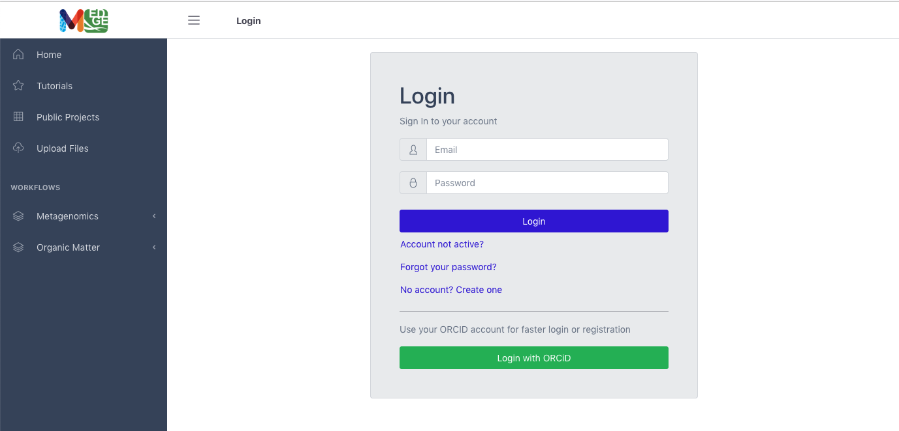

### User Profile

Once logged in, the green button with the user's initials on the right provides a drop-down menu which allows the user to manage their projects and uploads; there is also a button which allows users to edit their profile. On this profile page, there are two options: 1) the option to receive email notification of a project's status (OFF by default) and 2) the option to change the user's password (also OFF by default).

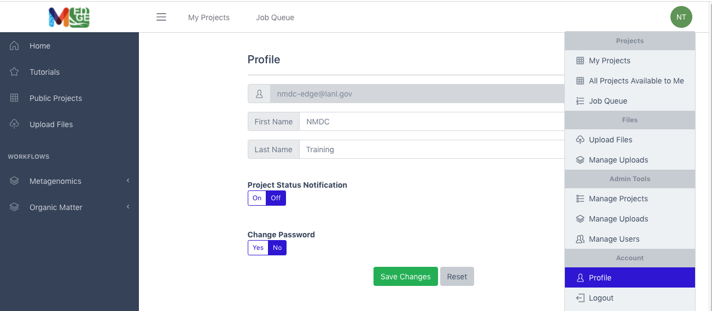

### Upload data

Two options are available for users to upload their own data to process through the workflows. The first is using the button in the left menu bar. The second is through the drop-down menu shown when clicking the green button with the user's initials on the right. Either button will open a window which allows the user to drag and drop files or browse for the user's data files. (There are also some datasets in the Public Data folder for users to test the platform.) 

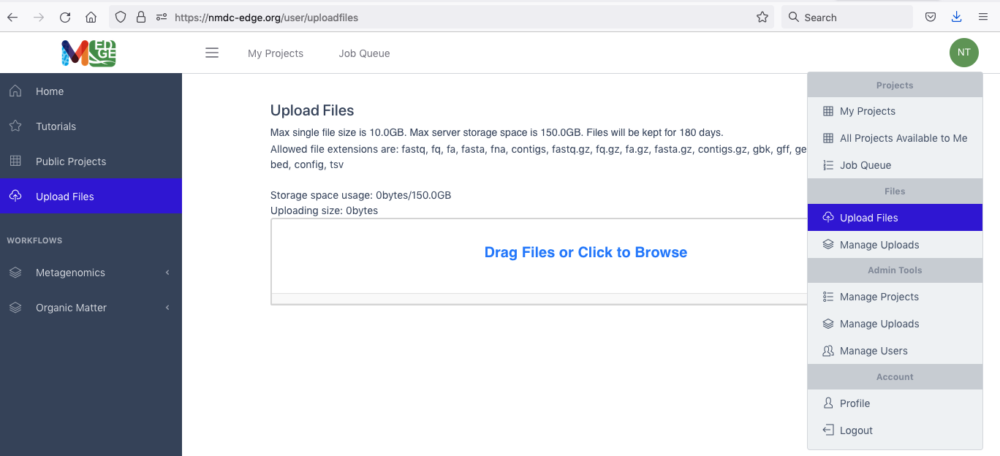

### Running a single workflow 

To run a workflow, the user must provide:

1.  A unique Project/Run Name with no spaces (underscores are fine).

2.  A description is optional, but recommended.

3.  The user then selects the workflow desired from the drop-down menu.

4.  For metagenomic/metatranscriptomic data, the user must also select if the input data is interleaved or separate files for the paired reads.

5.  Then the input file(s) from the available list of files. 

6.  The user should click "Submit.

> 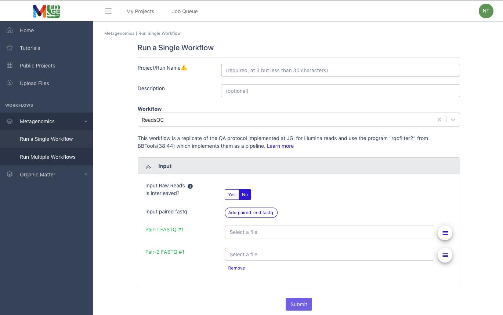

Note: Clicking on the buttons to the right of the data input blanks
opens a box called "Select a file" to allow the user to find the desired files (shown in purple) from previously run
projects, the public data folder, or user uploaded files.

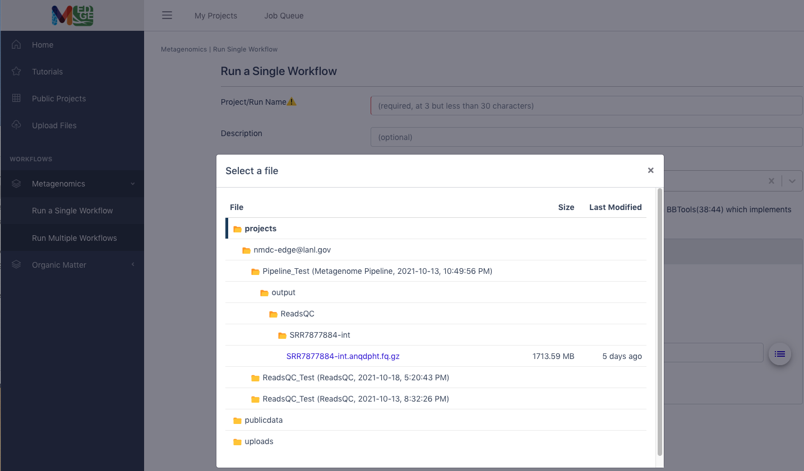

### Running multiple workflows

1.  Another option is to select "Run Multiple Workflows" if the user
    desires to run more than one of the metagenomic workflows or the
    entire metagenomic pipeline.

2.  Enter a **unique** Project/Run Name with no spaces
    (underscores are fine).

3.  A description is optional, but recommended.

4.  The user must also select if the input data is interleaved or
    separate files for the paired reads.

> 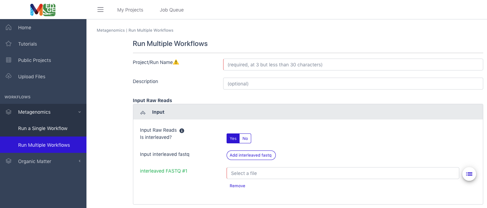

All five of the metagenomic workflows are "ON" by default, but the user
can select to turn off any workflows not desired. The pipeline uses the
output of each workflow as the input for subsequent workflows. (Note:
Some workflows require input data from prior workflows, so turning one
workflow off may result in other workflows also automatically turning
off.) Then the user can click "Submit."
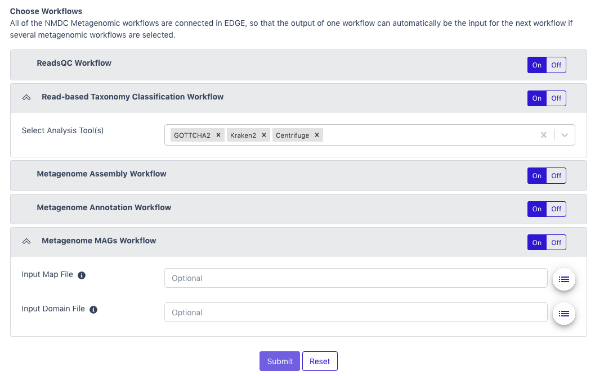

### Output 

1.  The link for 'My Projects' opens the list of projects for that user

2.  Links (in the purple circles) are provided to share projects, make projects public, or delete projects

3.  The "Status" column shows whether the job is in the queue (gray), submitted (purple), running (yellow), has failed (red) or completed (green). If a project fails, a log will give the error messages for troubleshooting.

4.  Clicking on the icon to the left of a project name opens up the results page for that project. 

> 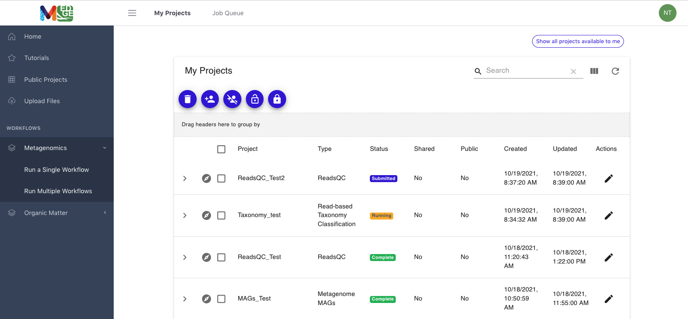

### Project Summary (Results)

The project summary page will show three categories. Clicking on the bar or tab opens up the information.

1.  General contains the project run information.

2.  "Workflow" Result contains the tabular/visual output.

3.  Browser/Download Outputs contains all the output files available for downloading. There may be several folders.

> 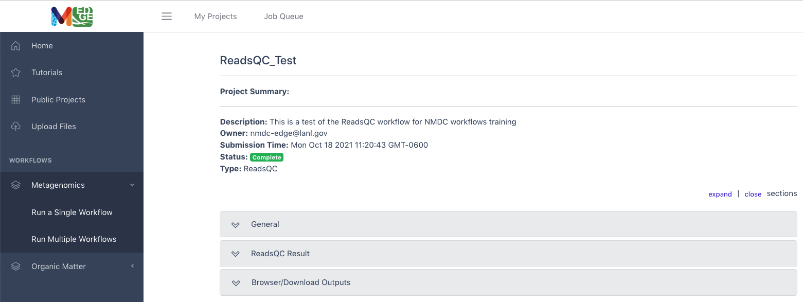

This example shows the results of a ReadsQC workflow run which shows run time under the General tab, the workflow results of quality trimming and filtering under the ReadsQC Results tab, and the files available for download (shown in purple) under the Browser/Download Outputs tab.

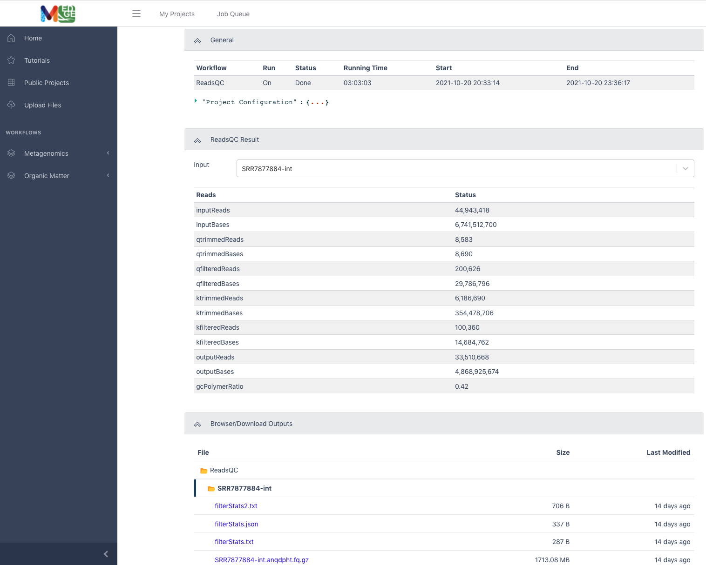

The full Metagenome pipeline or "Multiple Workflow" run results show
the results of each workflow under a separate tab and the associated
files available for download are in separate workflow folders under the
Browser/Download Outputs tab.

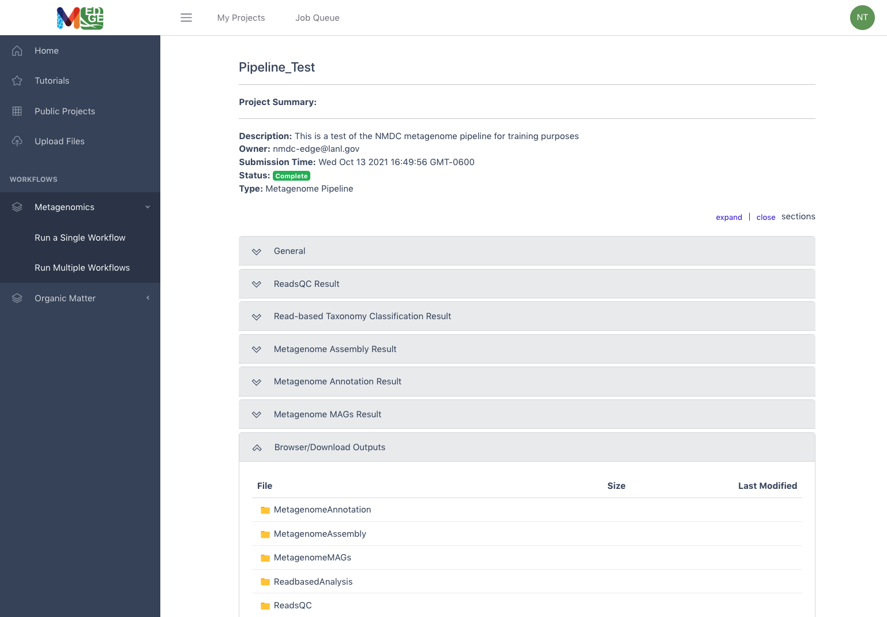

As a second example, the next two figures show the results from the Read-based Taxonomy Classification workflow. The summary includes classified reads and the number of species identified for all of the selected taxonomy classifiers. The top ten organisms identified by each tool at three taxonomic levels is also provided. Tabs for each of the classification tools providing more in-depth results are in the Detail section. Krona plots are generated for the results at each of the three taxonomic levels for each of the tools and can also be found in the Detail section. Full results files (beyond the Top 10) and the graphics are available for download.

## Metagenomics Workflows
### ReadsQC

#### Overview

This workflow performs quality control on raw Illumina reads to
trim/filter low quality data and to remove artifacts, linkers, adapters,
spike-in reads and reads mapping to several hosts and common microbial
contaminants.

#### Running the Workflow

Currently, this workflow is available in
[GitHub](https://github.com/microbiomedata/ReadsQC) and can be run from
the command line. (CLI instructions and requirements are found
[here](https://nmdc-workflow-documentation.readthedocs.io/en/latest/chapters/1_RQC_index.html).)
Alternatively, this workflow can be run in [NMDC
EDGE](https://nmdc-edge.org/).

#### Input

Metagenome ReadsQC requires paired-end Illumina data as an interleaved
file or as separate pairs of FASTQ files.

-   **Acceptable file formats:** .fastq, .fq, .fastq.gz, .fq.gz

#### Details

This workflow performs quality control on raw Illumina reads using
rqcfilter2. The workflow performs quality trimming, artifact removal,
linker trimming, adapter trimming, and spike-in removal using bbduk, and
performs human/cat/dog/mouse/microbe removal using bbmap. Full
documentation can be found in
[ReadtheDocs](https://nmdc-workflow-documentation.readthedocs.io/en/latest/chapters/1_RQC_index.html).

#### Software Versions 

-   rqcfilter2 (BBTools v38.94)

-   bbduk (BBTools v38.94)

-   bbmap (BBTools v38.94)

#### Output

Multiple output files are provided by the workflow; the primary files
are shown below. The full list of output files can be found in
[ReadtheDocs](https://nmdc-workflow-documentation.readthedocs.io/en/latest/chapters/1_RQC_index.html).

<table border="1" class="docutils">
<thead>
<tr>
<th>Primary Output Files</th>
<th>Description</th>
</tr>
</thead>
<tbody>
<tr>
<td>Filtered Sequencing Reads</td>
<td>Cleaned paired-end data in interleaved format (.fastq.gz)</td>
</tr>
<tr>
<td>QC statistics (2 files)</td>
<td>Reads QC summary statistics (.txt)</td>
</tr>
</tbody>
</table>

#### Running the Reads QC Workflow in NMDC EDGE

Select a workflow

1.  From the Metagenomics category in the left menu bar, select 'Run a
    Single Workflow'.

2.  Enter a **unique** project name with no spaces
    (underscores are fine).

3.  A description is optional, but helpful.

4.  Select 'ReadsQC' from the dropdown menu under Workflow.

> 

Input

ReadsQC requires paired-end Illumina data in FASTQ format as the input;
the file can be interleaved and can be compressed. **Acceptable file
formats:** .fastq, .fq, .fastq.gz, .fq.gz

5.  The default setting is for the raw data to be in an interleaved
    format (paired reads interleaved into one file). If the raw data is
    paired reads in separate files (forward and reverse), click 'No'.

6.  Additional data files (of the same type--interleaved or separate)
    can be added with the button below.

7.  Click the button to the right of the input blank for data to select
    the data file for the analysis. (If there are separate files, there
    will be two input blanks.) A box called 'Select a File' will open to
    allow the user to find the desired file(s) from previously run
    projects, the public data folder, or files uploaded by the user.

8.  Then click 'Submit'.

> 

Output

The General section of the output shows which workflow was run and the
run time information.

The ReadsQC Result section shows the data input and provides a variety
of metrics including the number of reads and bases before and after
trimming and filtering.

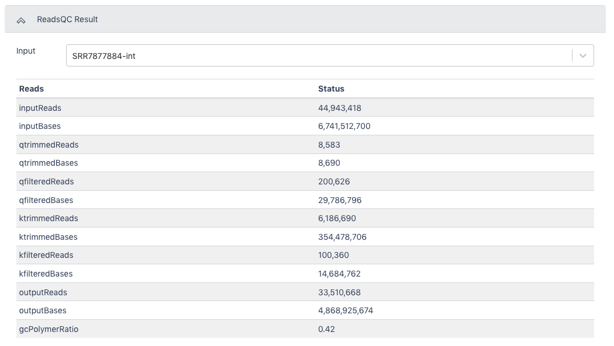

The Browser/Download Output section provides output files available to
download. The clean data will be in an interleaved .fq.gz file. General
QC statistics are in the filterStats.txt file.

### Read-based Taxonomy Classification

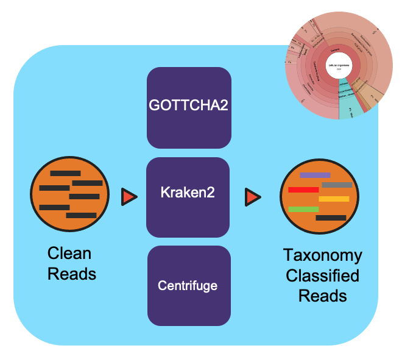

#### Overview

This workflow takes in Illumina sequencing files (single-end or
paired-end) and profiles the reads using multiple taxonomic
classification tools.

#### Running the Workflow

Currently, this workflow is available in
[GitHub](https://github.com/microbiomedata/ReadbasedAnalysis) and can be
run from the command line. (CLI instructions and requirements are found
[here](https://nmdc-workflow-documentation.readthedocs.io/en/latest/chapters/2_ReadAnalysis_index.html).)
Alternatively, this workflow can be run in [NMDC
EDGE](https://nmdc-edge.org/).

#### Input

The Metagenome Read-based Taxonomy Classification workflow requires
Illumina data and can accept data as an interleaved file or as separate
pairs of FASTQ files. Interleaved data will be treated as single-end
reads. (It is highly recommended to input clean data from the ReadsQC
workflow.)

-   **Acceptable file formats:** .fastq, .fq, .fastq.gz, .fq.gz

#### Details

To create a community profile, this workflow utilizes three taxonomy
classification tools: GOTTCHA2, Kraken2, and Centrifuge. These tools
vary in levels of specificity and sensitivity. Each tool has a separate
reference database. These databases (152 GB) are built into NMDC EDGE.
Users can select one, two, or all three of the classification tools to
run in the workflow. Full documentation can be found in
[ReadtheDocs](https://nmdc-workflow-documentation.readthedocs.io/en/latest/chapters/2_ReadAnalysis_index.html).

#### Software Versions 

-   GOTTCHA2 v2.1.6

-   Kraken2 v2.0.8

-   Centrifuge v1.0.4

#### Output

Multiple output files are provided by the workflow; the primary files
are shown below. The full list of output files can be found in
[ReadtheDocs](https://nmdc-workflow-documentation.readthedocs.io/en/latest/chapters/2_ReadAnalysis_index.html).

<table border="1" class="docutils">
<thead>
<tr>
<th>Primary Output Files</th>
<th>Description</th>
</tr>
</thead>
<tbody>
<tr>
<td>Profiling results for each tool</td>
<td>Tabular results of the profile for each tool (.tsv)</td>
</tr>
<tr>
<td>Krona plots for each tool</td>
<td>Interactive graphic file (.html)</td>
</tr>
</tbody>
</table>

#### Running the Read-based Taxonomy Classification Workflow in NMDC EDGE

Select a workflow

1.  From the Metagenomics category in the left menu bar, select 'Run a
    Single Workflow'.

2.  Enter a ***unique** project name with no spaces
    (underscores are fine).

3.  A description is optional, but helpful.

4.  Select 'Read-based Taxonomy Classification' from the dropdown menu
    under Workflow.

> 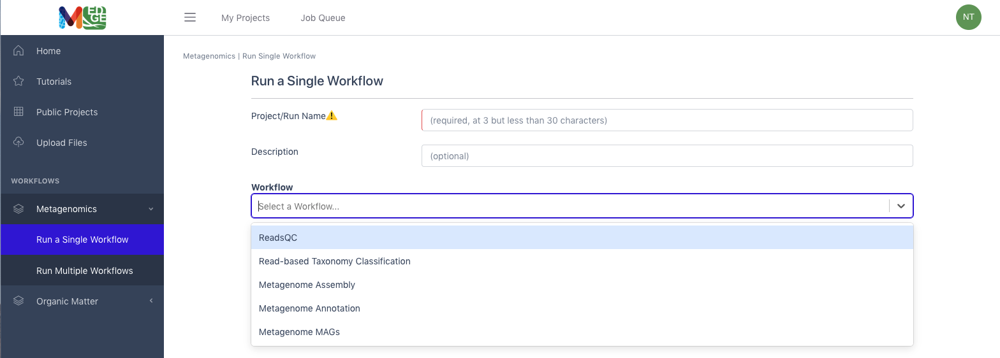

> 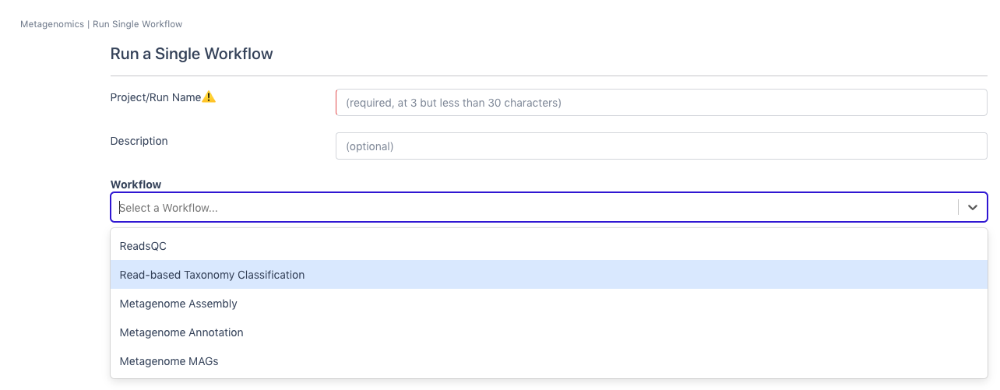

Input

This workflow accepts Illumina data in FASTQ format as the input; the
file can be interleaved and can be compressed. This input can be the
output from the ReadsQC workflow and this is recommended. **Acceptable
file formats:** .fastq, .fq, .fastq.gz, .fq.gz

5.  The default setting is for the raw data to be in an interleaved
    format (paired reads interleaved into one file). If the raw data is
    paired reads in separate files (forward and reverse), click 'No'.

6.  Additional data files (of the same type--interleaved or separate)
    can be added with the button below.

7.  Click the button to the right of the input blank for data to select
    the data file for the analysis. (If there are separate files, there
    will be two input blanks.) A box called 'Select a File' will open to
    allow the user to find the desired file(s) from previously run
    projects, the public data folder, or files uploaded by the user.

8.  Then click 'Submit'.

> 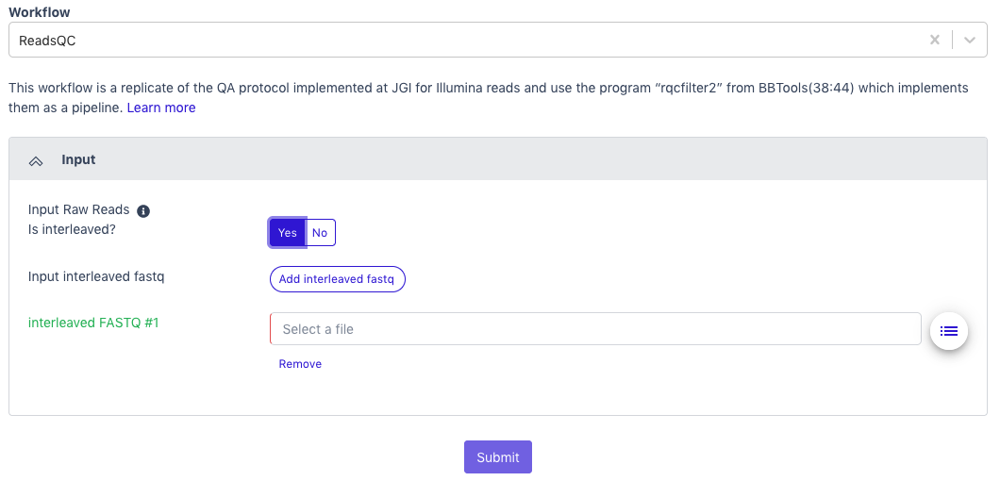

Output

The General section of the output shows which workflow and which tools
were run and the run time information.

The Read-based Taxonomy Classification Result section has a summary
section at the top and results for each tool at three levels of taxonomy
in the Taxonomy Top 10 section. The Detail section has classified reads
results and relative abundance results for each tool at three levels of
taxonomy.

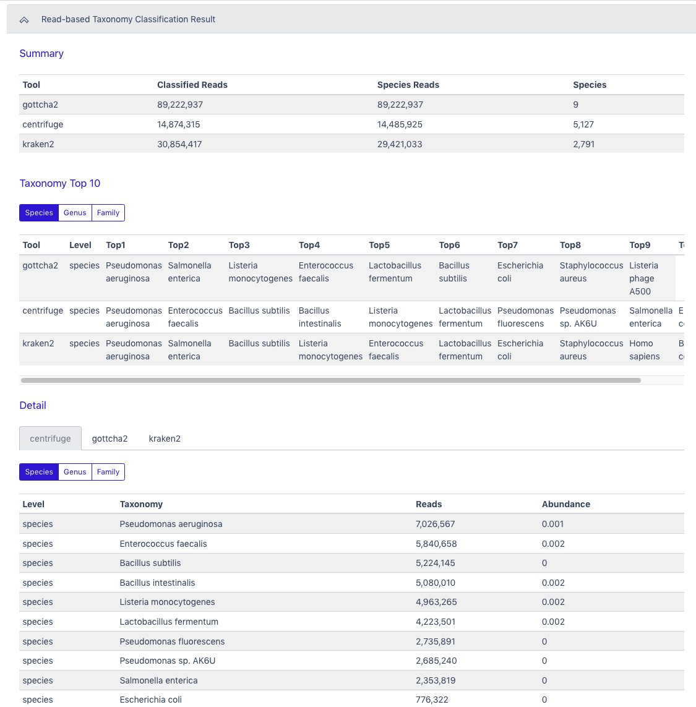

The Detail section also provides an interactive Krona plot for each
tool.

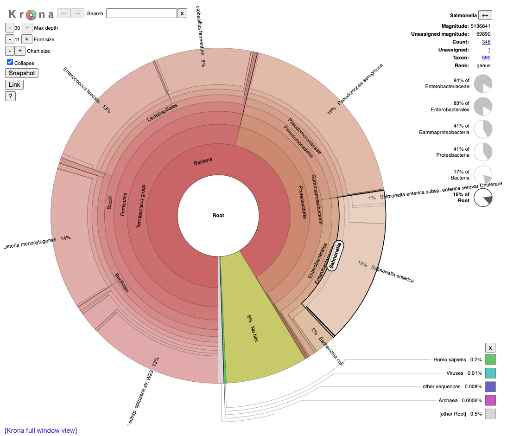

The Browser/Download Output section provides output files available to
download. Each tool has a separate folder for the results from that
tool. Full tabular results are in the largest .tsv file and the
interactive Krona plots (.html files) open in a separate browser window.

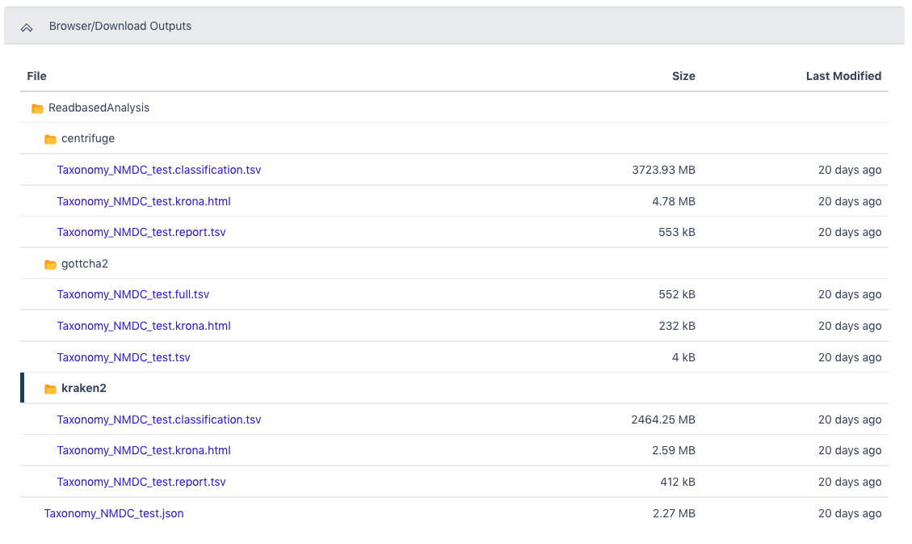

### Assembly

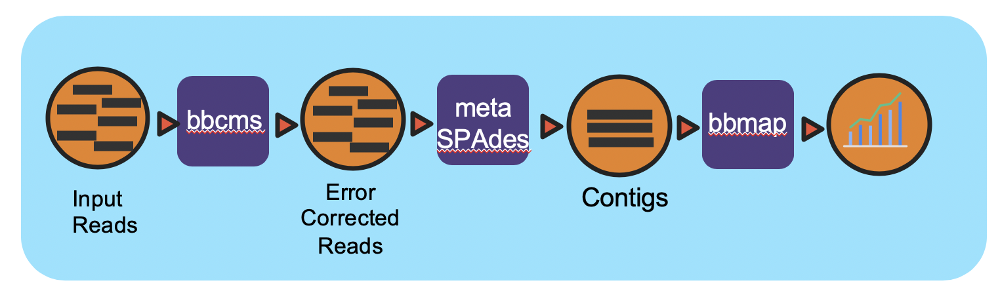

#### Overview

This workflow takes in paired-end Illumina data, runs error correction,
assembly, and assembly validation.

#### Running the Workflow

Currently, this workflow is available in
[GitHub](https://github.com/microbiomedata/metaAssembly) and can be run
from the command line. (CLI instructions and requirements are found
[here](https://nmdc-workflow-documentation.readthedocs.io/en/latest/chapters/3_MetaGAssemly_index.html).)
Alternatively, this workflow can be run in [NMDC
EDGE](https://nmdc-edge.org/).

#### Input

Metagenome Assembly requires paired-end Illumina data as an interleaved
file or as separate pairs of FASTQ files. The recommended input is the
output from the ReadsQC workflow.

-   **Acceptable file formats:** .fastq, .fq, .fastq.gz, .fq.gz

#### Details

This workflow takes in paired-end Illumina reads and performs error
correction using bbcms. Then the corrected reads are assembled using
metaSPAdes. After assembly, the reads are mapped back to the contigs
using bbmap for coverage information. Full documentation can be found in
[ReadtheDocs.](https://nmdc-workflow-documentation.readthedocs.io/en/latest/chapters/3_MetaGAssemly_index.html)

#### Software Versions and Parameters

-   bbcms (BBTools v38.94)

-   metaSpades v3.15.0

-   bbmap (BBTools v38.94)

#### Output

Multiple output files are provided by the workflow; the primary files
are shown below. The full list of output files can be found in
[ReadtheDocs](https://nmdc-workflow-documentation.readthedocs.io/en/latest/chapters/3_MetaGAssemly_index.html).

<table border="1" class="docutils">
<thead>
<tr>
<th>Primary Output Files</th>
<th>Description</th>
</tr>
</thead>
<tbody>
<tr>
<td>Assembly Contigs</td>
<td>Final assembly contigs (assembly_contigs.fna)</td>
</tr>
<tr>
<td>Assembly Scaffolds</td>
<td>Final assembly scaffolds (assembly_scaffolds.fna)</td>
</tr>
<tr>
<td>Assembly AGP</td>
<td>An AGP format file which describes the assembly</td>
</tr>
<tr>
<td>Assembly Coverage BAM</td>
<td>Sorted bam file of reads mapping back to the final assembly</td>
</tr>
<tr>
<td>Assembly Coverage Stats</td>
<td>Assembled contigs coverage information</td>
</tr>
</tbody>
</table>

#### Running the Metagenome Assembly Workflow in NMDC EDGE

Select a workflow

1.  From the Metagenomics category in the left menu bar, select 'Run a
    Single Workflow'.

2.  Enter a **unique** project name with no spaces
    (underscores are fine).

3.  A description is optional, but helpful.

4.  Select 'Metagenome Assembly' from the dropdown menu under Workflow.

> 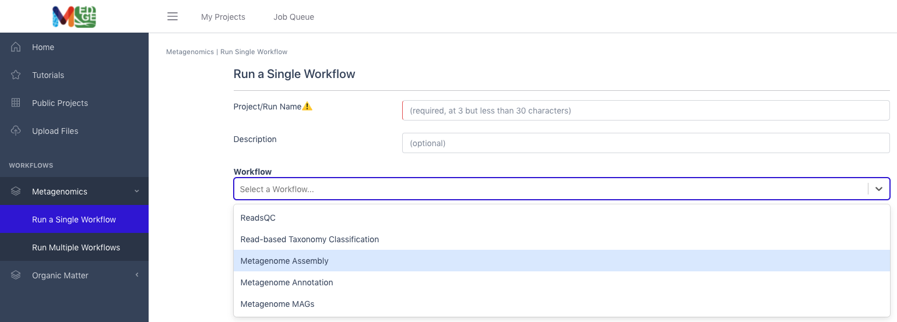

Input

This workflow accepts Illumina data in FASTQ format as the input; the
file can be interleaved and can be compressed. (It is highly recommended
to input clean data from the ReadsQC workflow.)

**Acceptable file formats:** .fastq, .fq, .fastq.gz, .fq.gz

5.  The default setting is for the raw data to be in an interleaved
    format (paired reads interleaved into one file). If the raw data is
    paired reads in separate files (forward and reverse), click 'No'.

6.  Additional data files (of the same type--interleaved or separate)
    can be added with the button below.

7.  Click the button to the right of the input blank for data to select
    the data file for the analysis. (If there are separate files, there
    will be two input blanks.) A box called 'Select a File' will open to
    allow the user to find the desired file(s) from previously run
    projects, the public data folder, or files uploaded by the user.

8.  Then click 'Submit'.

> 

Output

The General section of the output shows which workflow was run and the
run time information.

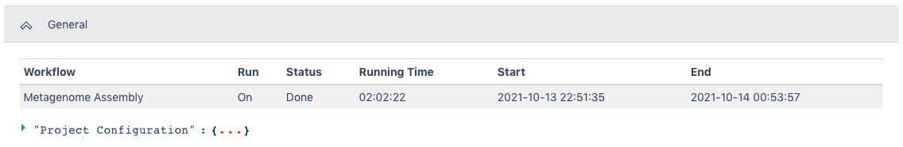

The Metagenome Assembly Result section has all of the statistics from
the assembly.

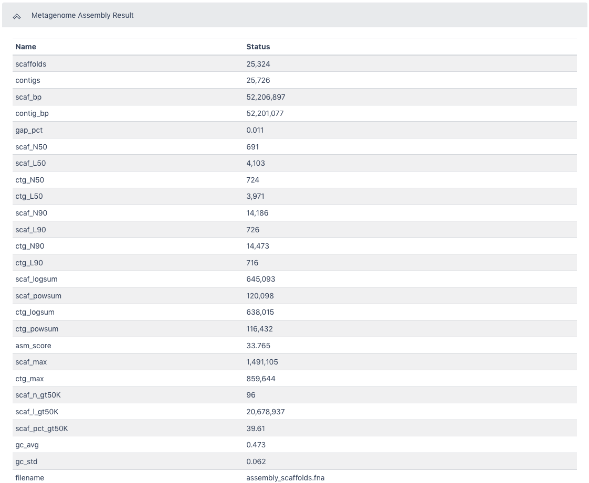

The Browser/Download Output section provides output files available to
download. The primary result is the assembly_contigs.fna file which can
also be the input for the Metagenome Annotation workflow. The
pairedMapped_sorted.bam file along with the assembled contigs file can
be the input for the MAGs Generation workflow.

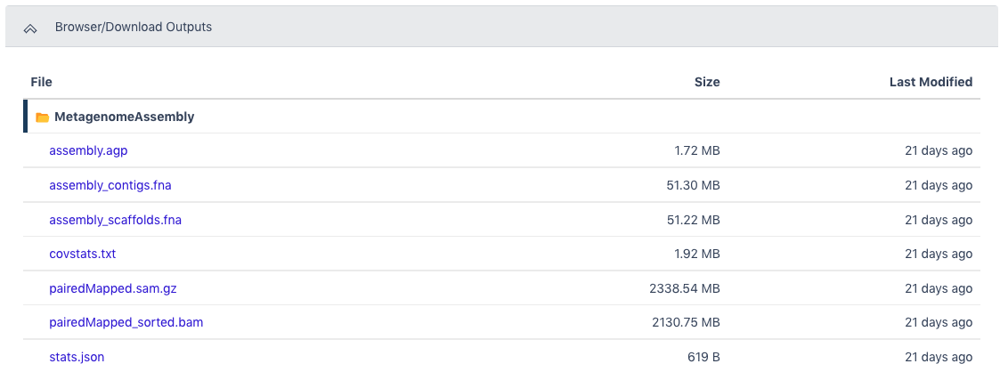

### Annotation

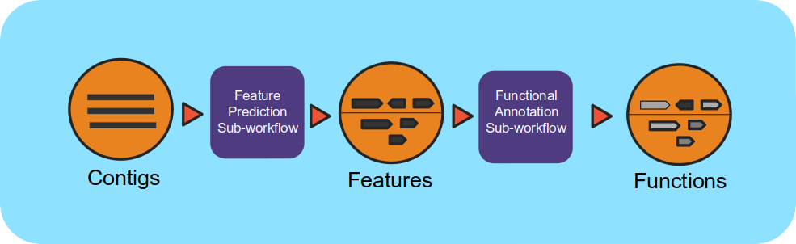

#### Overview

This workflow takes assembled metagenomes and generates structural and
functional annotations.

#### Running the Workflow

Currently, this workflow is available in
[GitHub](https://github.com/microbiomedata/mg_annotation/) and can be
run from the command line. (CLI instructions and requirements are found
[here](https://nmdc-workflow-documentation.readthedocs.io/en/latest/chapters/4_MetaGAnnotation_index.html).)
Alternatively, this workflow can be run in [NMDC
EDGE.](https://nmdc-edge.org/)

#### Input

Metagenome Annotation requires assembled contigs in a FASTA file. This
input can be the output from the Metagenome Assembly workflow and this
is recommended.

-   **Acceptable file formats:** .fasta, .fa, .fna, .fasta.gz, .fa.gz,
    .fna.gz

#### Details

The workflow uses a number of open-source tools and databases to
generate the structural and functional annotations. The input assembly
is first split into 10MB splits to be processed in parallel. Depending
on the workflow engine configuration, the split can be processed in
parallel. Each split is first structurally annotated, then those results
are used for the functional annotation. The structural annotation uses
tRNAscan_se, RFAM, CRT, Prodigal and GeneMarkS. These results are merged
to create a consensus structural annotation. The resulting GFF is the
input for functional annotation which uses multiple protein family
databases (SMART, COG, TIGRFAM, SUPERFAMILY, Pfam and Cath-FunFam) along
with custom HMM models. The functional predictions are created using
Last and HMM. These annotations are also merged into a consensus GFF
file. Finally, the respective split annotations are merged together to
generate a single structural annotation file and single functional
annotation file. In addition, several summary files are generated in TSV
format. Full documentation can be found in
[ReadtheDocs](https://nmdc-workflow-documentation.readthedocs.io/en/latest/chapters/4_MetaGAnnotation_index.html).

#### Software Versions 

-   Conda

-   tRNAscan-SE \>= 2.0

-   Infernal 1.1.2

-   CRT-CLI 1.8

-   Prodigal 2.6.3

-   GeneMarkS-2 \>= 1.07

-   Last \>= 983

-   HMMER 3.1b2

-   TMHMM 2.0

#### Output

Multiple output files are provided by the workflow; the primary files
are shown below. The full list of output files can be found in
[ReadtheDocs.](https://nmdc-workflow-documentation.readthedocs.io/en/latest/chapters/4_MetaGAnnotation_index.html)

<table border="1" class="docutils">
<thead>
<tr>
<th>Primary Output Files</th>
<th>Description</th>
</tr>
</thead>
<tbody>
<tr>
<td>Structural Annotation</td>
<td>Consensus structural annotation file from multiple tools (.gff)</td>
</tr>
<tr>
<td>Functional Annotation</td>
<td>Consensus functional annotation file from multiple tools (.gff)</td>
</tr>
<tr>
<td>KEGG summary</td>
<td>KEGG gene function tabular summary (.tsv)</td>
</tr>
<tr>
<td>EC summary</td>
<td>Enzyme Commission tabular summary (.tsv)</td>
</tr>
<tr>
<td>Gene phylogeny summary</td>
<td>Gene phylogeny tabular summary (.tsv)</td>
</tr>
</tbody>
</table>

#### Running the Metagenome Annotation Workflow in NMDC EDGE

Select a workflow

1.  From the Metagenomics category in the left menu bar, select 'Run a
    Single Workflow'.

2.  Enter a **unique** project name with no spaces
    (underscores are fine).

3.  A description is optional, but helpful.

4.  Select 'Metagenome Annotation' from the dropdown menu under
    Workflow.

>

Input

This workflow accepts assembled Illumina data in FASTA format as the
input; the file can be compressed. (It is highly recommended to input
the assembled contigs from the Metagenome Assembly workflow.)
**Acceptable file formats:** .fasta, .fa, .fna, .fasta.gz, .fa.gz,
.fna.gz.

5.  Click the button to the right of the input blank for data to select
    the data file for the analysis. (If there are separate files, there
    will be two input blanks.) A box called 'Select a File' will open to
    allow the user to find the desired file(s) from previously run
    projects, the public data folder, or files uploaded by the user.

6.  Then click 'Submit'.

> 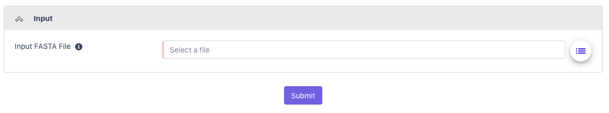

Output

The General section of the output shows which workflow was run and the
run time information.

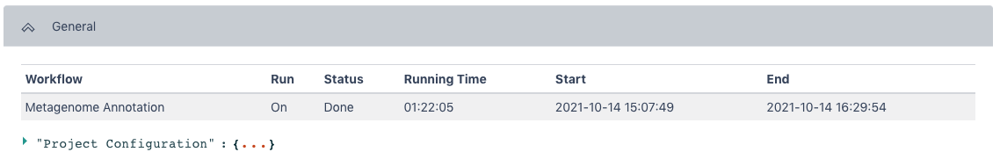

The Metagenome Annotation Result section has statistics for Processed
Sequences, Predicted Genes, and General Quality Information from the
workflow.

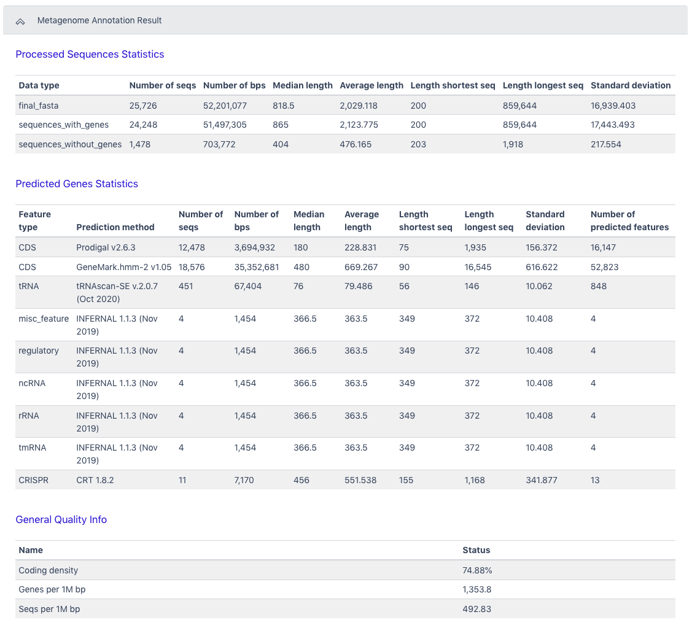

The Browser/Download Output section provides output files available to
download. The primary results are the functional annotation and the
structural annotation files (.gff). The functional annotation file is
required input for the MAGs Generation workflow along with the assembled
contigs. 

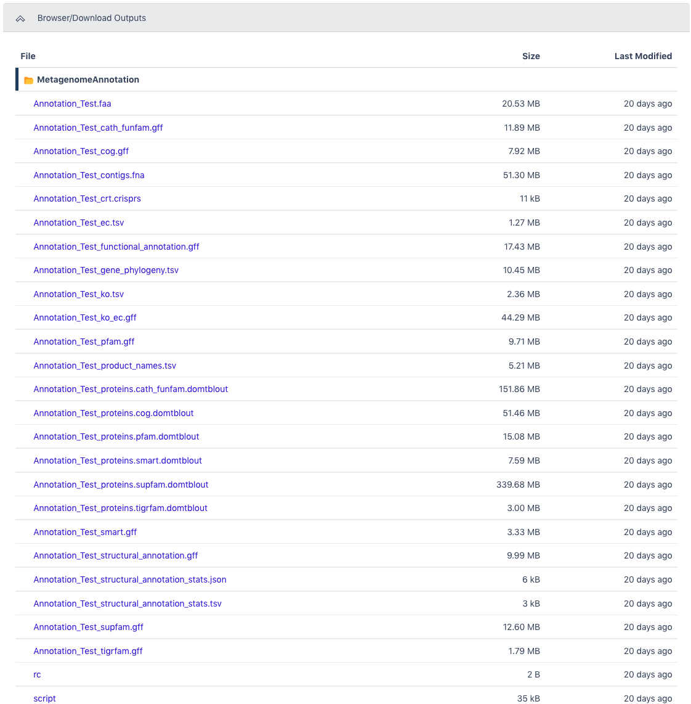

### MAGs Generation

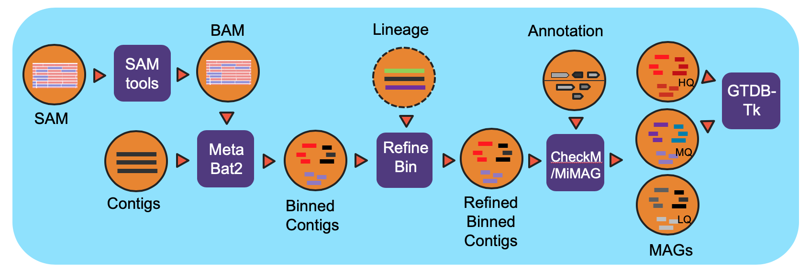

#### Overview

This workflow classifies contigs into bins and the resulting bins are
refined using the functional annotation file. The bins are evaluated for
completeness and contamination. The quality of the bins is determined
and a lineage is assigned to each bin of high or medium quality.

#### Running the Workflow

Currently, this workflow is available in
[GitHub](https://github.com/microbiomedata/metaMAGs) and can be run from
the command line. (CLI instructions and requirements are found
[here](https://nmdc-workflow-documentation.readthedocs.io/en/latest/chapters/5_MAG_index.html).)
Alternatively, this workflow can be run in [NMDC
EDGE.](https://nmdc-edge.org/)

#### Input

This workflow requires assembled contigs in a FASTA file, the read
mapping file from the assembly (SAM or BAM), a functional annotation of
the assembly in a GFF file.

-   **Acceptable file formats:** assembled contigs (.fasta, .fa, or
    .fna); read mapping to assembly (.sam.gz or .bam); Functional
    annotation (.gff)

#### Details

The workflow is based on IMG metagenome binning pipeline and has been
modified specifically for the NMDC project. For all processed
metagenomes, it classifies contigs into bins using MetaBat2. Next, the
bins are refined using the functional Annotation file (GFF) from the
Metagenome Annotation workflow and optional contig lineage information.
The completeness of and the contamination present in the bins are
evaluated by CheckM and bins are assigned a quality level (High Quality
(HQ), Medium Quality (MQ), Low Quality (LQ)) based on MiMAG standards.
In the end, GTDB-Tk is used to assign lineage for HQ and MQ bins. The
required GTDB-Tk database is incorporated into NMDC EDGE. Full
documentation can be found in
[ReadtheDocs](https://nmdc-workflow-documentation.readthedocs.io/en/latest/chapters/5_MAG_index.html).

#### Software Versions 

-   Biopython v1.74 

-   Sqlite 

-   Pymysql 

-   requests 

-   samtools \> v1.9 (License: MIT License)

-   Metabat2 v2.15 

-   CheckM v1.1.2

-   GTDB-TK v1.2.0

-   FastANI v1.3

-   FastTree v2.1.10 

#### Output

Multiple output files are provided by the workflow; the primary files
are shown below. The full list of output files can be found in
[ReadtheDocs.](https://nmdc-workflow-documentation.readthedocs.io/en/latest/chapters/5_MAG_index.html)

<table border="1" class="docutils">
<thead>
<tr>
<th>Primary Output Files</th>
<th>Description</th>
</tr>
</thead>
<tbody>
<tr>
<td>hqmq-metabat-bins.zip</td>
<td>Bins of contigs rated high or medium quality with an assigned lineage</td>
</tr>
</tbody>
</table>

#### Running the Metagenome Assembled Genomes (MAGs) Workflow in NMDC EDGE

Select a workflow

1.  From the Metagenomics category in the left menu bar, select 'Run a
    Single Workflow'.

2.  Enter a **unique** project name with no spaces
    (underscores are fine).

3.  A description is optional, but helpful.

4.  Select 'Metagenome MAGs' from the dropdown menu under Workflow.

> 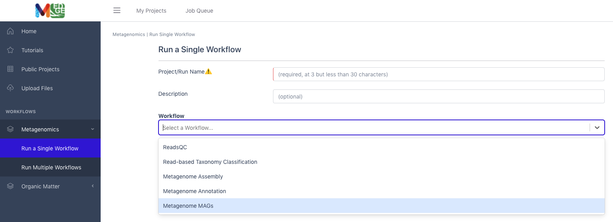

Input

Metagenome MAGs requires assembled contigs, the read mapping file of
reads to assembled contigs, and a functional annotation file. The
recommended input would be from the NMDC assembly and annotation
workflows. **Acceptable file formats:** assembled contigs (.fasta, .fa,
or .fna); read mapping to assembly (.sam.gz or .bam); functional
annotation (.gff)

5.  Click the button to the right of the blank for Input Contig File. A
    box called 'Select a File' will open to allow the user to find the
    desired file from a previously run assembly project, the public data
    folder, or a file uploaded by the user.

6.  Click the button to the right of the blank for Input Sam/Bam File. A
    box called 'Select a File' will open to allow the user to find the
    read mapping file from a previously run assembly project, the public
    data folder, or a file uploaded by the user.

7.  Click the button to the right of the blank for Input GFF File. A box
    called 'Select a File' will open to allow the user to find the
    desired file(s) from a previously run annotation project, the public
    data folder, or a file uploaded by the user.

8.  Then click 'Submit'.

> 

Output

The General section of the output shows which workflow was run and the
run time information.

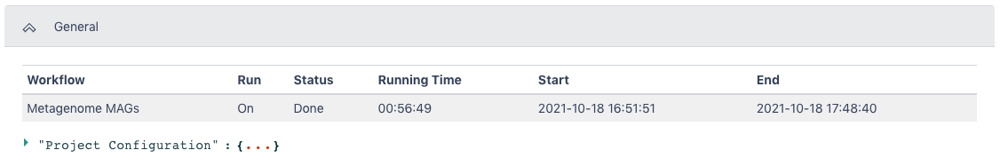

The Metagenome MAGs Result section provides a Summary section with
information on binned and unbinned contigs. The MAGs section provides
information such as the completeness of the genome, amount of
contamination, and number of genes present on all bins determined to be
high quality or medium quality.

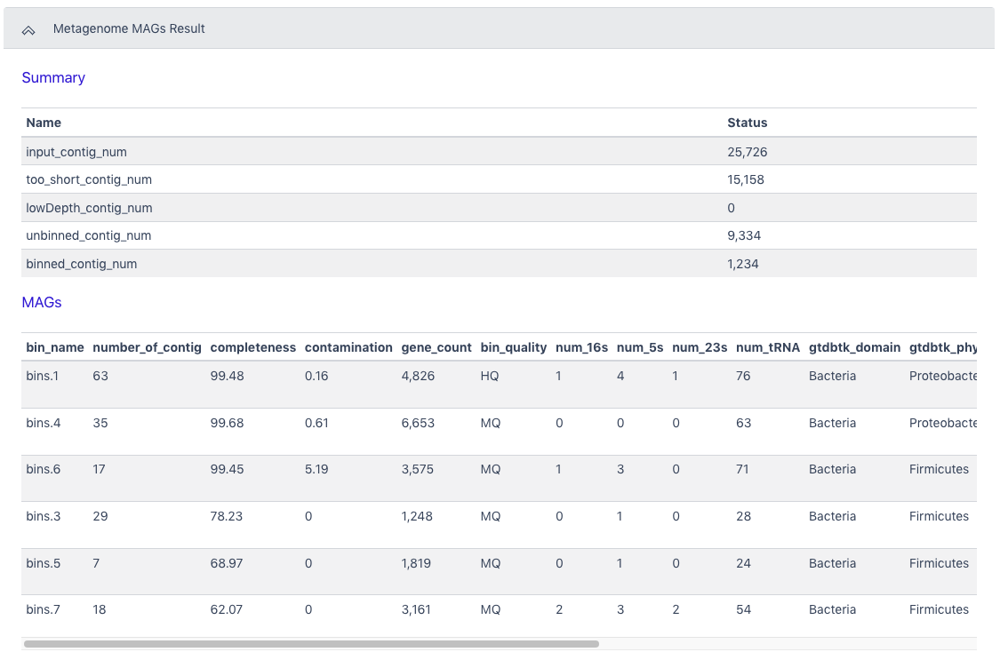

The Browser/Download Output section provides output files available to
download. The primary output file is the zipped file with all bins
determined to be high quality or medium quality (hqmq-metabat-bins.zip).

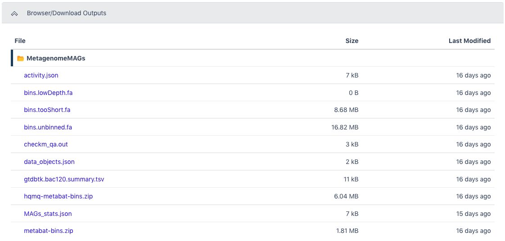

### Running multiple workflows or the full metagenomic pipeline with a single input

## Metatranscriptomics Workflow
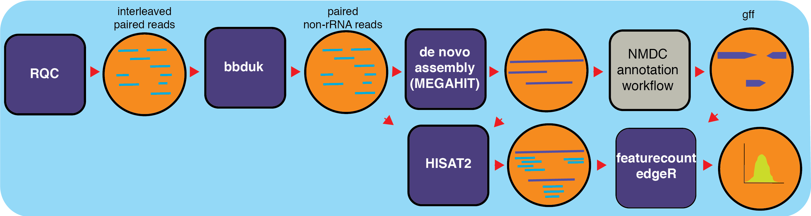

### Overview

The metatranscriptome (metaT) workflow takes in raw metatranscriptome
data, filters the data for quality, removes rRNA reads, then assembles
and annotates the transcripts. The data is mapped back to the genomic
features in the transcripts and RPKMs ((Reads Per Kilobase of transcript
per Million mapped reads) are calculated for each feature in the
functional annotation file.

### Running the Workflow

Currently, this workflow can be run in [NMDC
EDGE](https://nmdc-edge.org/home) or from the command line. (CLI
instructions and requirements are found
[here](https://nmdc-workflow-documentation.readthedocs.io/en/latest/chapters/6_MetaT_index.html).)

### Input

Metatranscriptomics requires paired-end Illumina data as an interleaved
file or as separate pairs of FASTQ files.

-   **Acceptable file formats:** .fastq, .fq, .fastq.gz, .fq.gz

### Details

MetaT is a workflow designed to analyze metatranscriptomes, and this
workflow builds upon other NMDC workflows for processing input
sequencing data. The metatranscriptomics workflow takes in raw RNA
sequencing data and quality filters the reads using the ReadsQC
workflow. Then the MetaT workflow filters out ribosomal RNA reads (using
the SILVA rRNA database) and separates interleaved files into separate
pairs of files using bbduk (BBTools). After the filtering steps, the
reads are assembled into transcripts using MEGAHIT and transcripts are
annotated using the [Metagenome Annotation NMDC
Workflow](https://github.com/microbiomedata/mg_annotation) which
produces GFF functional annotation files. Features are counted with
[Subread's featureCounts](http://subread.sourceforge.net/) which assigns
mapped reads to genomic features and generates RPKMs for each feature in
a GFF file for sense and antisense reads.

### Software Versions 

-   BBTools v38.44

-   hisat2 v2.1

-   Python v3.7.6.

-   featureCounts v2.0.1

-   R v3.6.0

-   edgeR v3.28.1

-   pandas v1.0.5

-   gffutils v0.10.1

### Output

The table below lists the primary output files. The main outputs are the
assembled transcripts and annotated features file. Several annotation
files are also available to download.

<table border="1" class="docutils">
<thead>
<tr>
<th>Primary Output Files</th>
<th>Description</th>
</tr>
</thead>
<tbody>
<tr>
<td>INPUT_NAME.contigs.fa</td>
<td>Assembled transcripts</td>
</tr>
<tr>
<td>rpkm_sorted_features.tsv</td>
<td>Feature table sorted by RPKM</td>
</tr>
</tbody>
</table>

### Running the Metatranscriptomics Workflow in NMDC EDGE

Select a workflow

1.  From the Metatranscriptomics category in the left menu bar, select
    'Run a Single Workflow'.

2.  Enter a **unique** project name with no spaces
    (underscores are fine).

3.  A description is optional, but helpful.

4.  Select 'Metatranscriptome' from the dropdown menu under Workflow.

> 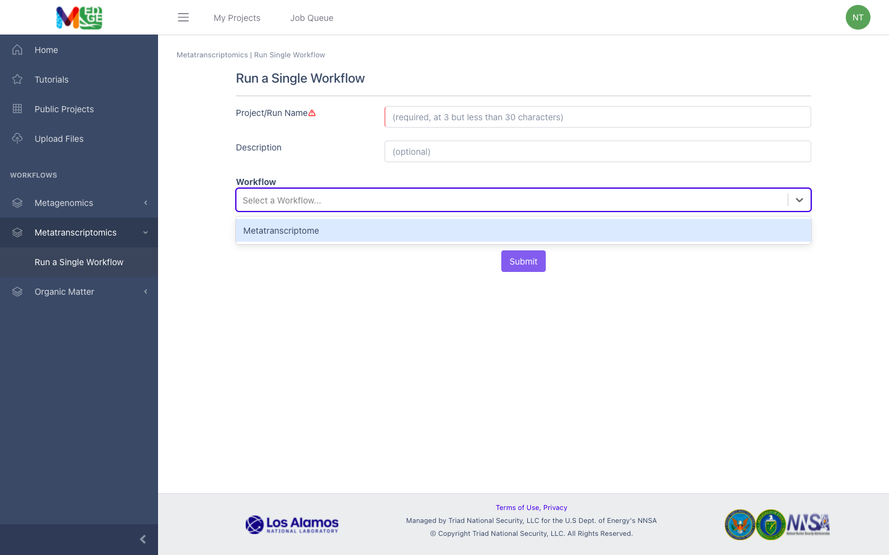

Input

The metatranscriptome workflow requires paired-end Illumina data in
FASTQ format as the input; the file can be interleaved and can be
compressed. **Acceptable file formats:** .fastq, .fq, .fastq.gz, .fq.gz

5.  The default setting is for the raw data to be in an interleaved
    format (paired reads interleaved into one file). If the raw data is
    paired reads in separate files (forward and reverse), click 'No'.

6.  Additional data files (of the same type--interleaved or separate)
    can be added with the button below.

7.  Click the button to the right of the input blank to select the data
    file for the analysis. (If there are separate files, there will be
    two input blanks.) A 'Select a File' box will open to allow the user
    to find the desired file(s) from previously run projects, the public
    data folder, or files uploaded by the user.

8.  Click 'Submit' when ready to run the workflow.

> 

Output

The General section of the output shows which workflow was run, the run
time information, and the Project Configuration

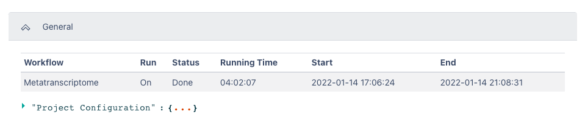

The Metatranscriptome Result section includes a table of the top 100
RPKM results from the overall metatranscriptome data file sorted by
RPKM. Selecting the header of each column will sort this data by that
column. This section also includes a button to quickly download a tsv
file of all detected features in the input dataset for further analysis.

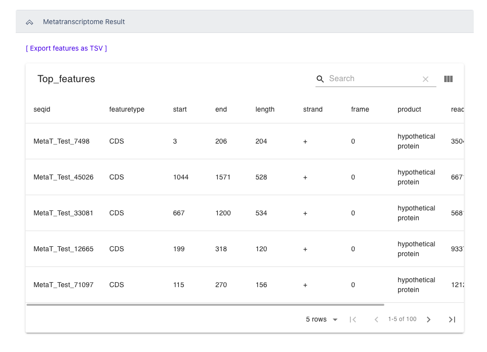

The Browser/Download Output section provides all output files available
to download. The output contigs can be found in the assembly folder and
the tsv file of all detected features sorted by RPKM is available under
the metat_output folder.

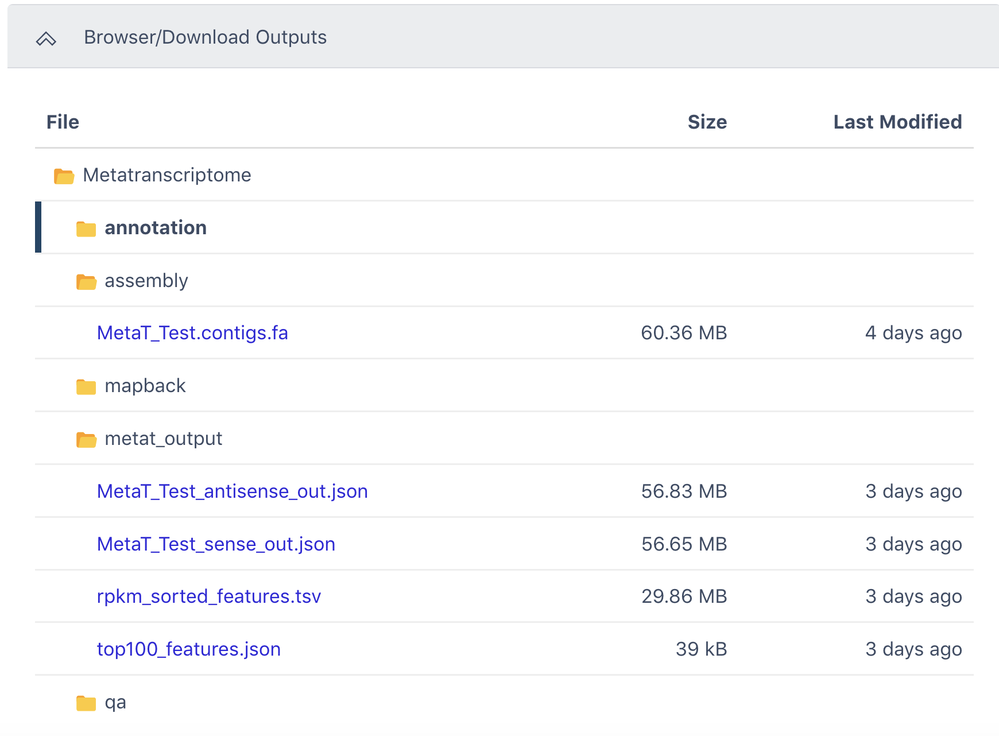

## Natural Organic Matter Workflow

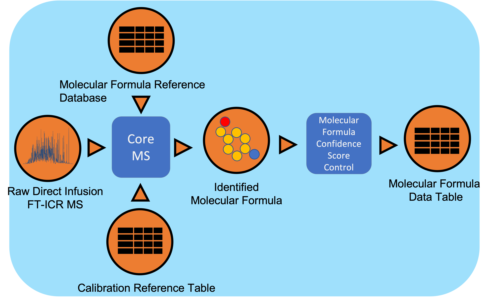

### Overview

This workflow takes FTICR mass spectrometry data collected from organic
extracts to determine the molecular formulas of natural organic
biomolecules in the input sample.

### Running the Workflow

Currently, this workflow can be run in [NMDC
EDGE](https://nmdc-edge.org/home) or from the command line. (CLI
instructions and requirements are found
[here](https://nmdc-workflow-documentation.readthedocs.io/en/latest/chapters/9_NOM_index.html).)

### Input

The input for this workflow is the output from a massSpec experiment (a
massSpec list) which includes a minimum of two columns of data: a
mass-to-charge ratio (m/z) and a signal intensity (Intensity) column for
every feature in the analysis. A calibration file of molecular formula
references is also required when running the workflow via command line.
(This calibration file is built into NMDC EDGE.)

**Acceptable file formats:** .raw, .tsv, .csv, .xlsx

### Details 

Direct Infusion Fourier Transform Ion Cyclotron Resonance mass
spectrometry (DI FTICR-MS) data undergoes signal processing and
molecular formula assignment leveraging EMSL's CoreMS framework. Raw
time domain data is transformed into the m/z domain using Fourier
Transform and Ledford equation. Data is denoised followed by peak
picking, recalibration using an external reference list of known
compounds, and searched against a dynamically generated molecular
formula library with a defined molecular search space. The confidence
scores for all the molecular formula candidates are calculated based on
the mass accuracy and fine isotopic structure, and the best candidate
assigned as the highest score. This workflow will not work as reliably
with Orbitrap mass spectrometry data.

### Software Versions 

-   CoreMS (2-clause BSD)

-   Click (BSD 3-Clause "New" or "Revised" License)

### Output

The primary output file is the Molecular Formula Data Table (in a .csv
file).

<table border="1" class="docutils">
<thead>
<tr>
<th>Primary Output Files</th>
<th>Description</th>
</tr>
</thead>
<tbody>
<tr>
<td>INPUT_NAME.csv</td>
<td>m/z, Peak height, Peak Area, Molecular Formula IDs, Confidence Score, etc.</td>
</tr>
</tbody>
</table>

### Running the Natural Organic Matter Workflow in NMDC EDGE

Select a workflow

1.  From the Organic Matter category in the left menu bar, select 'Run a
    Single Workflow'.

2.  Enter a **unique** project name with no spaces
    (underscores are fine).

3.  A description is optional, but helpful.

4.  Select 'EnviroMS' from the dropdown menu under Workflow.

> 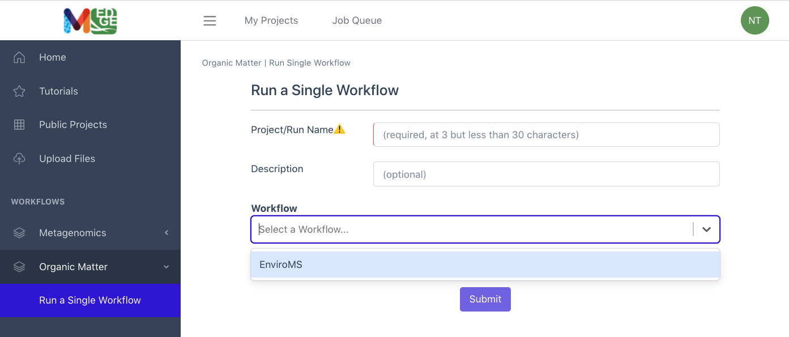

Input

The Natural Organic Matter workflow input is the output from a massSpec
experiment (a massSpec list) with a minimum of two columns of data: a
mass-to-charge ratio (m/z) and a signal intensity (Intensity) column for
every feature in the analysis. **Acceptable file formats:** .tsv, .csv,
.raw, .xlsx

5.  Click the button to the right of the input blank for data to select
    the data file for the analysis. (If there are separate files, there
    will be two input blanks.) A box called 'Select a File' will open to
    allow the user to find the desired file(s) from the public data
    folder or files uploaded by the user.

6.  Additional input files can be added by clicking the 'Add file'
    button to create additional input blanks.

7.  Once all the input files have been selected, click 'Submit'.

> 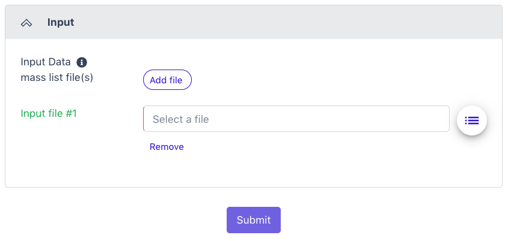

Output

The General section of the output shows which workflow was run and the
run time information. The Project Configuration can be seen by clicking
the three dots in the bracket.

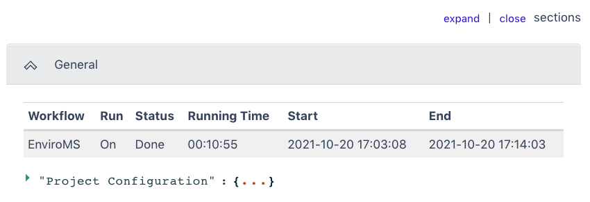

The Browser/Download Output section provides output files available to
download. The primary output files are: the Molecular Formula Data-Table
(.csv file) containing m/z measurements, Peak height, Peak Area,
Molecular Formula Identification, Ion Type, and Confidence Score.

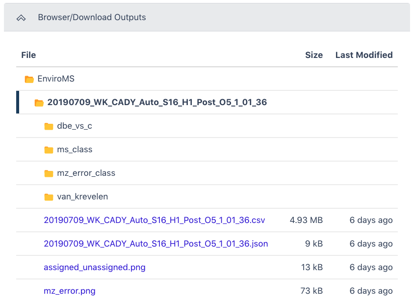
