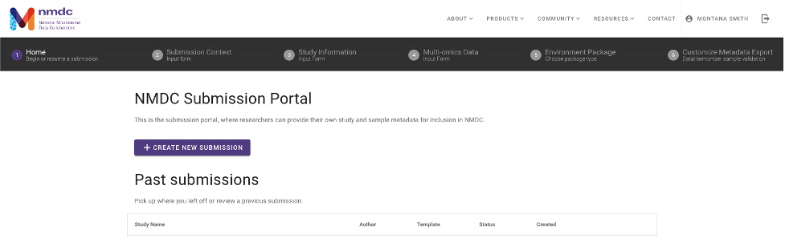
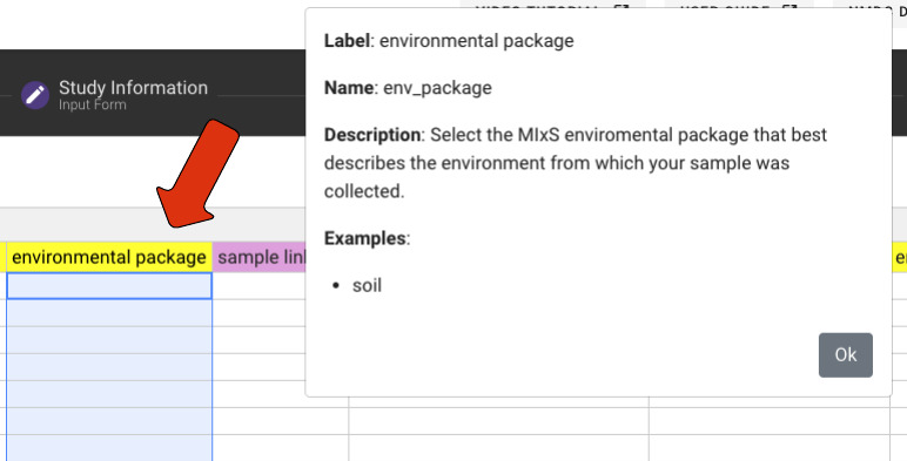

# Submitting to NMDC

## Introduction
The NMDC Submission Portal (https://data.microbiomedata.org/submission/home) was released in April 2022. It is designed to lower barriers to capture metadata and adhere to community standards, addressing the critical gap of collecting necessary metadata describing a study and its biosamples. The Submission Portal is designed using a flexible framework leveraging a new modeling approach called the Linked Data Modeling Language (LinkML) and the template-driven spreadsheet tool DataHarmonizer. It supports several different community standards, such as the Minimal Information about any (x) Sequence (MIxS) standard from the Genomic Standards Consortium (GSC), the PROV standard for provenance metadata, the Proteomics Standards Initiative (PSI) standards for metaproteomics, and the Metabolomics Standards Initiative (MSI) standards for metabolomics. The Submission Portal is an intuitive interface that allows researchers to provide information about their study, the metadata about the study’s biosamples, multi-omics data associated with the study, and whether Department of Energy (DOE) user facility proposals are associated with the data. Updates and new features are continually being implemented as user research provides new insights to improve usability, and as standards are updated and improved. 

### Collaboration to support Community Standards 
The Genomic Standards Consortium (GSC) is an open-membership working body formed nearly twenty years ago with the aim of supporting community-driven standards for sequence data. The GSC has defined a set of core descriptors for genomes, metagenomes and the samples thereof, with the intention to capture relevant environmental and other contextual data (e.g., metadata) to be made available in the International Nucleotide Sequence Database Collaboration (INSDC) primary repositories. The Minimal Information about any (x) Sequence (MIxS) was developed in 2011, and forms the basis for environmental packages that include terms describing specific environments from which a sample was collected (e.g., soil or water). Together with the GSC, the NMDC team has rendered the MIxS standards in LinkML as part of the latest version release. The NMDC has added computability to portions of the MIxS standard and validation can be applied in the NMDC Submission Portal. Through the GSC’s Compliance and Interoperability Group (CIG), the NMDC supports improvements to metadata elements that were unclear or missing, and makes updates to terminology and curation through the insights from numerous workshops hosted through the NMDC Ambassador Program. Specific issues are tracked using the NMDC tag in the GSC GitHub repository  (https://github.com/GenomicsStandardsConsortium/mixs/labels/NMDC). 

As the NMDC continues to develop and gain user feedback, future iterations of the NMDC Submission Portal will provide templates for describing the ways in which samples are processed in preparation for analysis and improve ecosystem description. This will be accomplished by leveraging and collaborating with many existing standards and ontologies. Beyond the GSC’s standards, the NMDC leverages standards and controlled vocabularies developed by the Proteomics Standards Initiative (PSI), the National Cancer Institute’s Proteomic Data Commons (https://pdc.cancer.gov/data-dictionary/dictionary.html), the IUPAC Gold Book, and the Metabolomics Standards Initiative (MSI) for mass spectrometry data types (e.g., ionization mode, mass resolution, scan rate, and so on). The NMDC team also collaborates heavily with the Environment Ontology (EnvO), which is a community-led ontology that represents environmental entities such as biomes, environmental features, and environmental materials. .

In addition to working across community standards groups, the NMDC also works closely with the Genomes OnLine Database (GOLD) hosted by the Department of Energy’s Joint Genome Institute (JGI). GOLD is an open-access repository of genome, metagenome, and metatranscriptome sequencing projects with their associated metadata. Samples are described using a five-level ecosystem classification path that goes from ecosystem down to the type of environmental material. The NMDC team supports this hierarchical classification system in the Submission Portal, along with enabling search capabilities in the Data Portal. Further, the NMDC and GOLD teams collaborate to curate, update, and make improvements to shared study and metadata information to support interoperability. 

### DataHarmonizer: A flexible template-driven tool
Developed by the Centre for Infectious Disease Genomics and One Health (CIDGOH) at Simon Fraser University, DataHarmonizer is a template-driven spreadsheet application for harmonizing, validating, and transforming sequence contextual data into submission-ready formats for public or private repositories. The tool’s web browser-based JavaScript environment enables real time validation of terms, enabling rapid quality checks within the interface directly. The NMDC has an ongoing open-source collaboration to leverage DataHarmonizer to support the NMDC Submission Portal. 

### User-Centered Design Process
The NMDC is a resource designed together with and for the scientific community. In 2022, the NMDC team conducted three rounds of user interviews (17 user interviews total) from three target groups: general microbiome researchers, potential data submitters, and metadata generators. The Submission Portal has been the subject of several rounds of user research and usability testing, and additional interviews and beta-testing rounds are scheduled to occur throughout the year. New features are continuously added and tested by the microbiome research community, and the NMDC team implements fixes, changes, and enhancements based on this community feedback. The NMDC team and the NMDC Ambassadors run several workshops throughout the year, and feedback from workshop participants is also incorporated into new Submission Portal improvements. The Submission Portal will continue to be shaped by our user-centered design approach.

### Support for DOE User Facilities
The DOE User Facilities JGI and EMSL are key partners for the NMDC because they support the environmental research community. The NMDC team collaborates closely with the JGI and EMSL to support integration of multi-omics data generated across these Facilities, and particularly as part of the Facilities Integrating Collaborations for User Science (FICUS) Program. The Submission Portal has been designed upfront to be compliant with both JGI and EMSL sample submission requirements, ensuring study and biosample information is consistently collected to support interoperability and data reuse. To demonstrate feasibility, several FICUS user projects have been submitted using the Submission Portal with feedback that has informed improvements and new features. Through the Submission Portal, study and biosample metadata is validated against the NMDC schema, with ‘realtime’ checks on data integrity (accuracy, completeness, and consistency). Further developments will also support data embargo information in accordance with the JGI and EMSL Data Policies.

## Portal Functionality

The NMDC Submission Portal is accessible from the ‘Products’ tab on the NMDC website, the NMDC Data Portal, and NMDC EDGE.

The Submission Portal requires ORCiD authentication to access. If you have already signed in via ORCID, you will not see this screen in the NMDC Submission Portal.

Once signed in with an ORCiD, you will see an option to ‘Create New Submission’ with subsequent guidance to provide information required for submission to NMDC. Details about each section are outlined below. Users can also return to existing submissions saved under the ORCiD account to resume their work at any point.    

### Submission Context

On the Submission Context screen, users are asked whether data has already been generated for their study.  If a user selects ‘Yes’ a DOI associated with the data can be entered. For data generated at either JGI or EMSL (DOE user facilities), the specific Award DOI (e.g., 10.46936/10.25585/60001289) should be entered, along with selecting the checkbox for this option. If the data was not generated at a DOE User Facility, a valid data DOI can be entered. A data DOI is not the same as a publication DOI, and would be issued through a separate resource as a unique persistent identifier (e.g., 10.48443/e4zf-b917). 

If a user selects ‘No’, a user will be asked whether samples will be submitted to JGI, EMSL, or both User Facilities. Selecting EMSL will further prompt the user to provide shipping information for EMSL, along with indicating what project type is associated with an active User proposal (e.g., CSP, BERSS, BRC, FICUS, MONet, or other).  

### Study

The Study Information page requires a valid ‘Study Name’ along with a valid email address. We highly recommend the use of standardized, informative study names as described by the GOLD team (Mukherjee et. al., 2023). Further information can be provided to include relevant links to webpages and a description of the study. Last, a user can include ‘Contributors’ to acknowledge members of a research team associated with the study. This includes listing Contributor names, ORCiDs, and associating role(s) based on the CRediT (Contributor Roles Taxonomy). A Contributor can have a single or multiple roles.  

### Multi-omics Data

The Multi-omics Data page will prompt users to specify what data types have either already been generated or are anticipated to be generated, depending on the previously entered data. There are no limits to the number of data combinations that can be selected. If any data type attributed to JGI or EMSL (or both) are selected, a user will be required to input the respective proposal number for tracking purposes. Importantly, these selections will be used to support coordinated submission of biosample information with multiple data types. For example, if a user plans to generate paired metagenome and metaproteome data from aliquots of the same physical experimental sample, this information will be captured on the subsequent customized metadata template.   

### Environmental Package

The Biosample metadata portion of the Submission Portal uses the GSC’s environmental packages to define data entry screens that are suitable for samples from a particular environment. The available environmental packages include: air, built environment, host-associated, hydrocarbon resources-core, hydrocarbon resources- fluids swab, microbial material biofilm, plant associated, sediment, soil, wastewater sludge, water, and miscellaneous natural or artificial environment. Incorporation of additional GSC packages will be completed upon further user research. A user will need to select a single package that best fits the sample environment. If multiple environment types are associated through a single Study (e.g., soil and plant-associated), a separate submission for each environment package will be needed. The selected package determines which metadata fields are required, recommended or optional for each interface. Additionally, curated EnvO and GOLD ecosystem classification terms and other enumerations that can be selected by dropdown menus are available for some packages. Additional packages will be curated as user research is continued..   

### Sample Metadata

The Biosample Metadata interface consists of a grid in which each row represents one sample and each column represents one attribute of a Biosample. Users are provided with numerous convenience and organizational features (described below) to assist in metadata completion.

NMDC uses sections for clarity, and to identify when MIxS specifications have been used as published by the GSC, or when NMDC has modified the description, examples, or validation rules for a MIxS attribute captured in their respective columns. These modifications are based on user research and feedback provided to the NMDC.

Biosample metadata can be entered manually (by typing each row), or the data can be entered in bulk by importing a Microsoft Excel XLSX file. The metadata is updated in a NMDC database each time the user navigates across the submission template. Upon completion, the study submission and metadata will be reviewed by a member of NMDC and once approved the submitting user will indicate when data are ready to be published to the Data Portal.
 
#### Metadata Sections
Detailed biosample metadata input is captured using a  curated metadata template. This page allows users to input biosample metadata into standardized fields based on the selected environmental template. The biosample metadata fields are split into 4 sections: Sample ID which consists of sample and environmental identification information; MIxS which are fields that are identical to those provided in MIxS templates, MIxS (modified) & Inspired which are similar to the MIxS fields, but have been altered in some way or were added based on user feedback. These updated and additional fields are meant to provide clearer context and expectations for the submitter to better capture information about their samples.

#### Download and Import

The NMDC Submission Portal allows users to enter sample metadata directly into the web interface. However, if a submitter prefers to work in other applications and programs, such as Microsoft Excel, the NMDC sample metadata template can be downloaded as a .xlsx file, opened via a separate application where users can add metadata, and imported back into the Submission Portal for completion and validation. 

#### Tools and Features 

##### Column Information

When column headers are double clicked, or when metadata validation is performed, a column help box will appear. This provides a description of the field, additional guidance, and examples of valid completion. 

##### Show/Hide 

Users are encouraged to populate as many of the columns as possible, but not all are required or relevant to all sample types or research. To accommodate such needs, the BIosample Metadata interface distinguishes between required, recommended, and optional columns. Which columns appear on the screen can be controlled with the show/hide menu.  This tool can be used to hide optional or optional + recommended columns, and the show sub-menu can be used to center a particular section on the user’s screen.

##### Jump to Column Search 

A ‘Jump to column’ feature is available for searching for specific metadata fields.  The columns in the ‘Jump to column’ menu are listed in the order they appear on the interface when no visibility constraint has been applied. Users can either scroll though the listed columns or type in any portion of a column's name. For example, as shown above, users can search for the term ‘carbon’ in order to find the ‘carbon/nitrogen ratio’ column. Many slots are available for sample metadata completion, but not all are required or relevant depending on your research questions. The ‘Jump to column’ feature allows the submitter to find the attributes they need and those relevant to their samples.

##### Real Time Validation  

The real-time validation tool allows submitters to check their filled-in metadata and overall progress as they submit values to ensure the submission will be valid and adhere to the NMDC schema. 

##### Color Legend

All fields in the metadata template innately fall into one of three color categories: Grey, Yellow, or Purple. Grey, or no highlighted color, indicates optional fields. Required columns are denoted with yellow. These yellow columns must be correctly completed or the submission will not validate. Recommended fields, highlighted purple, are required where applicable. If any of the purple columns provide information relevant to the study, they should be completed. For example, if samples are from a moisture manipulation study, the column ‘watering regimen’ should be filled in to provide context and information about the samples. 

After selecting the validate button, cells will become color coded to indicate invalid and incomplete metadata. Dark pink cells indicate a required cell has been left empty. Light pink indicates that there is an error in the formatting of the information entered into that cell. The ‘Column Information’ tool, described above, provides expected structure patterns and examples of valid metadata in order to help remedy errors and invalid inputs. 
)
