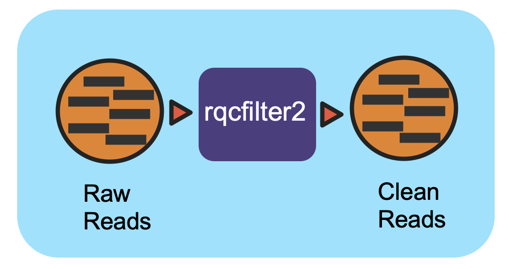

****************************
NMDC Workflow Documentations
****************************


Overview
==================

NMDC
----
The National Microbiome Data Collaborative (NMDC) is a new initiative, launched in July 2019 and funded by the Department of Energy’s (DOE) Office of Science, Biological and Environmental Research program, that aims to empower the research community to more effectively harness microbiome data. The NMDC is building an open-source, integrated data science ecosystem aimed at leveraging existing efforts in the microbiome research space, including data standards, quality, integration, and access, to create a linked data discovery portal. Read the `Nature Reviews Microbiology Comment <https://www.nature.com/articles/s41579-020-0377-0>`_ on the NMDC or visit the `NMDC website <https://microbiomedata.org/>`_.

Four national laboratories are working together to produce the NMDC:

 - Lawrence Berkeley National Laboratory
 - Los Alamos National Laboratory
 - Oak Ridge National Laboratory
 - Pacific Northwest National Laboratory


NMDC Workflows
--------------

General Guidelines
--------------------

NMDC aims to integrate existing open-source bioinformatics tools into standardized workflows for processing raw multi-omics data to produce interoperable and reusable annotated data products. Any commercial software are optional alternatives and not required.

Execution Evironment
--------------------

Two common ways to install and run the NMDC workflows:

 - Native installation
 - Containers

The NMDC workflows have been written in WDL and require a WDL-capable Workflow Execution Tool (i.e., Cromwell). To ease the native installation, Docker images have been created for the third-party tools for all of the workflows as well. The workflows use the corresponding Docker images to run the required third-party tools. Databases must be downloaded and installed for most of the workflows.
 

The NMDC workflows are also available as a web application called `NMDC EDGE <https://nmdc-edge.org/home>`_ . The application has only the NMDC workflows integrated into an updated framework for `EDGE Bioinformatics <https://edgebioinformatics.org/>`_ ; this provides the workflows, third-party software, and requisite databases within a platform with a user-friendly interface. NMDC EDGE is provided as a web application especially for users who are not comfortable with running command line tools or without the computational resources to run the command line/ Docker versions.


Reads QC Workflow (v1.0.2)
=============================




Workflow Overview
-----------------

This workflow utilizes the program “rqcfilter2” from BBTools to perform quality control on raw Illumina reads. The workflow performs quality trimming, artifact removal, linker trimming, adapter trimming, and spike-in removal (using BBDuk), and performs human/cat/dog/mouse/microbe removal (using BBMap).

The following parameters are used for "rqcfilter2" in this workflow::
 - qtrim=r     :  Quality-trim from right ends before mapping.
 - trimq=0     :  Trim quality threshold.
 - maxns=3     :  Reads with more Ns than this will be discarded.
 - maq=3       :  Reads with average quality (before trimming) below this will be discarded.
 - minlen=51   :  Reads shorter than this after trimming will be discarded.  Pairs will be discarded only if both are shorter.
 - mlf=0.33    :  Reads shorter than this fraction of original length after trimming will be discarded.
 - phix=true   :  Remove reads containing phiX kmers.
 - khist=true  :  Generate a kmer-frequency histogram of the output data.
 - kapa=true   :  Remove and quantify kapa tag
 - trimpolyg=5 :  Trim reads that start or end with a G polymer at least this long
 - clumpify=true       :  Run clumpify; all deduplication flags require this.
 - removehuman=true    :  Remove human reads via mapping.
 - removedog=true      :  Remove dog reads via mapping.
 - removecat=true      :  Remove cat reads via mapping.
 - removemouse=true    :  Remove mouse reads via mapping.
 - barcodefilter=false :  Disable improper barcodes filter
 - chastityfilter=false:  Remove illumina reads failing chastity filter.
 - trimfragadapter=true:  Trim all known Illumina adapter sequences, including TruSeq and Nextera.
 - removemicrobes=true :  Remove common contaminant microbial reads via mapping, and place them in a separate file.

 
Workflow Availability
---------------------

The workflow from GitHub uses all the listed docker images to run all third-party tools.
The workflow is available in GitHub: https://github.com/microbiomedata/ReadsQC; the corresponding
Docker image is available in DockerHub: https://hub.docker.com/r/microbiomedata/bbtools.

Requirements for Execution 
--------------------------

(recommendations are in **bold**) 

- WDL-capable Workflow Execution Tool (**Cromwell**)
- Container Runtime that can load Docker images (**Docker v2.1.0.3 or higher**) 

Hardware Requirements
---------------------

- Disk space: 106 GB for the RQCFilterData database 
- Memory: >40 GB RAM


Workflow Dependencies
---------------------

Third party software (This is included in the Docker image.)  
~~~~~~~~~~~~~~~~~~~~~~~~~~~~~~~~~~~~~~~~~~~~~~~~~~~~~~~~~~~~

- `BBTools v38.96 <https://jgi.doe.gov/data-and-tools/bbtools/>`_ (License: `BSD-3-Clause-LBNL <https://bitbucket.org/berkeleylab/jgi-bbtools/src/master/license.txt>`_)

Requisite database
~~~~~~~~~~~~~~~~~~

The RQCFilterData Database must be downloaded and installed. This is a 106 GB tar file which includes reference datasets of artifacts, adapters, contaminants, the phiX genome, and some host genomes.  

The following commands will download the database:: 

    mkdir refdata
    wget http://portal.nersc.gov/dna/microbial/assembly/bushnell/RQCFilterData.tar
    tar -xvf RQCFilterData.tar -C refdata
    rm RQCFilterData.tar	

Sample dataset(s)
-----------------

- small dataset: `Ecoli 10x <https://portal.nersc.gov/cfs/m3408/test_data/ReadsQC_small_test_data.tgz>`_ . You can find input/output in the downloaded tar gz file.

- large dataset: Zymobiomics mock-community DNA control (`SRR7877884 <https://www.ebi.ac.uk/ena/browser/view/SRR7877884>`_); the `original gzipped dataset <https://portal.nersc.gov/cfs/m3408/test_data/ReadsQC_large_test_data.tgz>`_ is ~5.7 GB.  You can find input/output in the downloaded tar gz file.


.. note::

    If the input data is paired-end data, it must be in interleaved format. The following command will interleave the files, using the above dataset as an example:
    
.. code-block:: bash    

    paste <(zcat SRR7877884_1.fastq.gz | paste - - - -) <(zcat SRR7877884_2.fastq.gz | paste - - - -) | tr '\t' '\n' | gzip -c > SRR7877884-int.fastq.gz
    
For testing purposes and for the following examples, we used a 10% sub-sampling of the above dataset: `SRR7877884-int-0.1.fastq.gz <https://portal.nersc.gov/cfs/m3408/test_data/SRR7877884-int-0.1.fastq.gz>`_. This dataset is already interleaved.

Inputs
------

A JSON file containing the following information: 

1.	the path to the database
2.	the path to the interleaved fastq file (input data) 
3.	the path to the output directory
4.      input_interleaved (boolean)
5.      forwards reads fastq file (when input_interleaved is false) 
6.      reverse reads fastq file (when input_interleaved is false)     
7.	(optional) parameters for memory 
8.	(optional) number of threads requested


An example input JSON file is shown below:

.. code-block:: JSON

    {
        "jgi_rqcfilter.database": "/path/to/refdata",
        "jgi_rqcfilter.input_files": [
            "/path/to/SRR7877884-int-0.1.fastq.gz "
        ],
        "jgi_rqcfilter.input_interleaved": true,
        "jgi_rqcfilter.input_fq1":[],
        "jgi_rqcfilter.input_fq2":[],
        "jgi_rqcfilter.outdir": "/path/to/rqcfiltered",
        "jgi_rqcfilter.memory": "35G",
        "jgi_rqcfilter.threads": "16"
    }

.. note::

    In an HPC environment, parallel processing allows for processing multiple samples. The "jgi_rqcfilter.input_files" parameter is an array data structure. It can be used for multiple samples as input separated by a comma (,).
    Ex: "jgi_rqcfilter.input_files":[“first-int.fastq”,”second-int.fastq”]


Output
------

A directory named with the prefix of the FASTQ input file will be created and multiple output files are generated; the main QC FASTQ output is named prefix.anqdpht.fastq.gz. Using the dataset above as an example, the main output would be named SRR7877884-int-0.1.anqdpht.fastq.gz. Other files include statistics on the quality of the data; what was trimmed, detected, and filtered in the data; a status log, and a shell script documenting the steps implemented so the workflow can be reproduced.

An example output JSON file (filterStats.json) is shown below:
   
.. code-block:: JSON 
    
	{
	  "inputReads": 331126,
	  "kfilteredBases": 138732,
	  "qfilteredReads": 0,
	  "ktrimmedReads": 478,
	  "outputBases": 1680724,
	  "ktrimmedBases": 25248,
	  "kfilteredReads": 926,
	  "qtrimmedBases": 0,
	  "outputReads": 11212,
	  "gcPolymerRatio": 0.182857,
	  "inputBases": 50000026,
	  "qtrimmedReads": 0,
	  "qfilteredBases": 0
	}


Below is an example of all the output directory files with descriptions to the right.

==================================== ============================================================================
FileName                              Description
==================================== ============================================================================
SRR7877884-int-0.1.anqdpht.fastq.gz   main output (clean data)       
adaptersDetected.fa                   adapters detected and removed        
bhist.txt                             base composition histogram by position 
cardinality.txt                       estimation of the number of unique kmers 
commonMicrobes.txt                    detected common microbes 
file-list.txt                         output file list for rqcfilter2.sh 
filterStats.txt                       summary statistics 
filterStats.json                      summary statistics in JSON format 
filterStats2.txt                      more detailed summary statistics 
gchist.txt                            GC content histogram 
human.fq.gz                           detected human sequence reads 
ihist_merge.txt                       insert size histogram 
khist.txt                             kmer-frequency histogram 
kmerStats1.txt                        synthetic molecule (phix, linker, lamda, pJET) filter run log  
kmerStats2.txt                        synthetic molecule (short contamination) filter run log 
ktrim_kmerStats1.txt                  detected adapters filter run log 
ktrim_scaffoldStats1.txt              detected adapters filter statistics 
microbes.fq.gz                        detected common microbes sequence reads 
microbesUsed.txt                      common microbes list for detection 
peaks.txt                             number of unique kmers in each peak on the histogram 
phist.txt                             polymer length histogram 
refStats.txt                          human reads filter statistics 
reproduce.sh                          the shell script to reproduce the run
scaffoldStats1.txt                    detected synthetic molecule (phix, linker, lamda, pJET) statistics 
scaffoldStats2.txt                    detected synthetic molecule (short contamination) statistics 
scaffoldStatsSpikein.txt              detected skipe-in kapa tag statistics 
sketch.txt                            mash type sketch scanned result against nt, refseq, silva database sketches.  
spikein.fq.gz                         detected skipe-in kapa tag sequence reads 
status.log                            rqcfilter2.sh running log 
synth1.fq.gz                          detected synthetic molecule (phix, linker, lamda, pJET) sequence reads 
synth2.fq.gz                          detected synthetic molecule (short contamination) sequence reads 
==================================== ============================================================================


Version History
---------------

- 1.0.2 (release date **04/09/2021**; previous versions: 1.0.1)


Point of contact
----------------

- Original author: Brian Bushnell <bbushnell@lbl.gov>

- Package maintainer: Chienchi Lo <chienchi@lanl.gov>


The Read-based Taxonomy Classification (v1.0.1)
================================================

.. image:: ../_static/images/reference/workflows/2_ReadAnalysis_readbased_analysis_workflow.png
   :align: center
   :scale: 50%

Workflow Overview
-----------------
The pipeline takes in sequencing files (single- or paired-end) and profiles them using multiple taxonomic classification tools with the Cromwell as the workflow manager.

Workflow Availability
---------------------
The workflow is available in GitHub: https://github.com/microbiomedata/ReadbasedAnalysis; the corresponding Docker image is available in DockerHub: https://hub.docker.com/r/microbiomedata/nmdc_taxa_profilers

Requirements for Execution:  
~~~~~~~~~~~~~~~~~~~~~~~~~~~

(recommendations are in **bold**)

- WDL-capable Workflow Execution Tool (**Cromwell**)
- Container Runtime that can load Docker images (**Docker v2.1.0.3 or higher**)

Hardware Requirements:
~~~~~~~~~~~~~~~~~~~~~~
- Disk space: 152 GB for databases (55 GB, 89 GB, and 8 GB for GOTTCHA2, Kraken2 and Centrifuge databases, respectively)
- 60 GB RAM

Workflow Dependencies
---------------------

Third party software:
~~~~~~~~~~~~~~~~~~~~~

(These are included in the Docker image.)

- `GOTTCHA2 v2.1.6 <https://github.com/poeli/GOTTCHA2>`_  (License: `BSD-3-Clause-LANL <https://github.com/poeli/GOTTCHA2/blob/master/LICENSE>`_)
- `Kraken2 v2.0.8 <http://ccb.jhu.edu/software/kraken2>`_ (License: `MIT <https://github.com/DerrickWood/kraken2/blob/master/LICENSE>`_)
- `Centrifuge v1.0.4 <http://www.ccb.jhu.edu/software/centrifuge>`_ (License: `GPL-3 <https://github.com/DaehwanKimLab/centrifuge/blob/master/LICENSE>`_)

Requisite databases:
~~~~~~~~~~~~~~~~~~~~

The database for each tool must be downloaded and installed. These databases total 152 GB.

- GOTTCHA2 database (gottcha2/):

The database RefSeqr90.cg.BacteriaArchaeaViruses.species.fna contains complete genomes of bacteria, archaea and viruses from RefSeq Release 90. The following commands will download the database:

::

    wget https://edge-dl.lanl.gov/GOTTCHA2/RefSeq-r90.cg.BacteriaArchaeaViruses.species.tar
    tar -xvf RefSeq-r90.cg.BacteriaArchaeaViruses.species.tar
    rm RefSeq-r90.cg.BacteriaArchaeaViruses.species.tar

- Kraken2 database (kraken2/):

This is a standard Kraken 2 database, built from NCBI RefSeq genomes. The following commands will download the database:

::

    mkdir kraken2
    wget https://genome-idx.s3.amazonaws.com/kraken/k2_standard_20201202.tar.gz
    tar -xzvf k2_standard_20201202.tar.gz -C kraken2
    rm k2_standard_20201202.tar.gz

- Centrifuge database (centrifuge/):

This is a compressed database built from RefSeq genomes of Bacteria and Archaea. The following commands will download the database:

::

    mkdir centrifuge
    wget https://genome-idx.s3.amazonaws.com/centrifuge/p_compressed_2018_4_15.tar.gz 
    tar -xzvf p_compressed_2018_4_15.tar.gz -C centrifuge
    rm p_compressed_2018_4_15.tar.gz


Sample dataset(s):
~~~~~~~~~~~~~~~~~~

Zymobiomics mock-community DNA control (SRR7877884); this dataset is ~7 GB.

Input: A JSON file containing the following information:
1. selection of profiling tools (set as true if selected)
2. the paths to the required database(s) for the tools selected 
3. the paths to the input fastq file(s) (paired-end data is shown; this can be the output of the Reads QC workflow in interleaved format which will be treated as single-end data.)
4. the prefix for the output file names
5. the path of the output directory
6. CPU number requested for the run.

.. code-block:: JSON

    {
        "ReadbasedAnalysis.enabled_tools": {
            "gottcha2": true,
            "kraken2": true,
            "centrifuge": true
        },
        "ReadbasedAnalysis.db": {
            "gottcha2": "/path/to/database/RefSeq-r90.cg.BacteriaArchaeaViruses.species.fna",
            "kraken2": " /path/to/kraken2",
            "centrifuge": "/path/to/centrifuge/p_compressed"
        },
        "ReadbasedAnalysis.reads": [
            "/path/to/SRR7877884.1.fastq.gz",
            "/path/to/SRR7877884.2.fastq.gz"
        ],
        "ReadbasedAnalysis.paired": true,
        "ReadbasedAnalysis.prefix": "SRR7877884",
        "ReadbasedAnalysis.outdir": "/path/to/ReadbasedAnalysis",
        "ReadbasedAnalysis.cpu": 4
    }

Output:
~~~~~~~

The workflow creates an output JSON file and individual output sub-directories for each tool which include tabular classification results, a tabular report, and a Krona plot (html).::

    ReadbasedAnalysis/
    |-- SRR7877884.json
    |-- centrifuge
    |   |-- SRR7877884.classification.tsv
    |   |-- SRR7877884.report.tsv
    |   `-- SRR7877884.krona.html
    |   
    |-- gottcha2
    |   |-- SRR7877884.full.tsv
    |   |-- SRR7877884.krona.html
    |   `-- SRR7877884.tsv
    |   
    `-- kraken2
        |-- SRR7877884.classification.tsv
        |-- SRR7877884.krona.html
        `-- SRR7877884.report.tsv


Below is an example of the output directory files with descriptions to the right.

========================================  ==============================================
FileName                                  Description
----------------------------------------  ----------------------------------------------
SRR7877884.json	                          ReadbasedAnalysis result JSON file
centrifuge/SRR7877884.classification.tsv  Centrifuge output read classification TSV file
centrifuge/SRR7877884.report.tsv          Centrifuge output report TSV file
centrifuge/SRR7877884.krona.html          Centrifuge krona plot HTML file
gottcha2/SRR7877884.full.tsv              GOTTCHA2 detail output TSV file
gottcha2/SRR7877884.tsv                   GOTTCHA2 output report TSV file
gottcha2/SRR7877884.krona.html            GOTTCHA2 krona plot HTML file
kraken2/SRR7877884.classification.tsv     Kraken2 output read classification TSV file
kraken2/SRR7877884.report.tsv             Kraken2 output report TSV file
kraken2/SRR7877884.krona.html             Kraken2 krona plot HTML file
========================================  ==============================================


Version History
---------------

1.0.1 (release date 01/14/2021; previous versions: 1.0.0)

Point of contact
----------------

Package maintainer: Po-E Li <po-e@lanl.gov>


Metagenome Assembly Workflow (v1.0.2)
========================================

.. image:: ../_static/images/reference/workflows/3_MetaGAssemly_workflow_assembly.png
   :scale: 60%
   :alt: Metagenome assembly workflow dependencies
   
Workflow Overview
-----------------

This workflow takes in paired-end Illumina reads in interleaved format and performs error correction, then reformats the interleaved file into two FASTQ files for downstream tasks using bbcms (BBTools). The corrected reads are assembled using metaSPAdes. After assembly, the reads are mapped back to contigs by bbmap (BBTools) for coverage information. The .wdl (Workflow Description Language) file includes five tasks, *bbcms*, *assy*, *create_agp*, *read_mapping_pairs*, and *make_output*.

1. The *bbcms* task takes in interleaved FASTQ inputs and performs error correction and reformats the interleaved fastq into two output FASTQ files for paired-end reads for the next tasks. 
2. The *assy* task performs metaSPAdes assembly
3. Contigs and Scaffolds (output of metaSPAdes) are consumed by the *create_agp* task to rename the FASTA header and generate an `AGP format <https://www.ncbi.nlm.nih.gov/assembly/agp/AGP_Specification/>`_ which describes the assembly
4. The *read_mapping_pairs* task maps reads back to the final assembly to generate coverage information.
5. The final *make_output* task adds all output files into the specified directory.

Workflow Availability
---------------------

The workflow from GitHub uses all the listed docker images to run all third-party tools.
The workflow is available in GitHub: https://github.com/microbiomedata/metaAssembly; the corresponding Docker images are available in DockerHub: https://hub.docker.com/r/microbiomedata/spades and https://hub.docker.com/r/microbiomedata/bbtools

Requirements for Execution
--------------------------

(recommendations are in **bold**)  

- WDL-capable Workflow Execution Tool (**Cromwell**)
- Container Runtime that can load Docker images (**Docker v2.1.0.3 or higher**) 

Hardware Requirements
---------------------

- Memory: >40 GB RAM

The memory requirement depends on the input complexity. Here is a simple estimation equation for the memory required based on kmers in the input file::

    predicted_mem = (kmers * 2.962e-08 + 1.630e+01) * 1.1 (in GB)

.. note::
    
    The kmers variable for the equation above can be obtained using the kmercountmulti.sh script from BBTools.

    kmercountmulti.sh -k=31 in=your.read.fq.gz


Workflow Dependencies
---------------------

Third party software:  (This is included in the Docker image.)
~~~~~~~~~~~~~~~~~~~~~~~~~~~~~~~~~~~~~~~~~~~~~~~~~~~~~~~~~~~~~~

- `metaSPades v3.15.0 <https://cab.spbu.ru/software/spades/>`_ (License: `GPLv2 <https://github.com/ablab/spades/blob/spades_3.15.0/assembler/GPLv2.txt>`_)
- `BBTools:38.94 <https://jgi.doe.gov/data-and-tools/bbtools/>`_ (License: `BSD-3-Clause-LBNL <https://bitbucket.org/berkeleylab/jgi-bbtools/src/master/license.txt>`_)

Sample dataset(s)
-----------------

- small dataset: `Ecoli 10x (287M) <https://portal.nersc.gov/cfs/m3408/test_data/metaAssembly_small_test_data.tgz>`_ . You can find input/output in the downloaded tar gz file.

- large dataset: `Zymobiomics mock-community DNA control (22G) <https://portal.nersc.gov/cfs/m3408/test_data/metaAssembly_large_test_data.tgz>`_ .  You can find input/output in the downloaded tar gz file.

Zymobiomics mock-community DNA control (`SRR7877884 <https://www.ebi.ac.uk/ena/browser/view/SRR7877884>`_); this original dataset is ~4 GB.

For testing purposes and for the following examples, we used a 10% sub-sampling of the above dataset: (`SRR7877884-int-0.1.fastq.gz <https://portal.nersc.gov/cfs/m3408/test_data/SRR7877884-int-0.1.fastq.gz>`_). This dataset is already interleaved. 


Input
-----

A JSON file containing the following information:

1. the path to the input FASTQ file (Illumina paired-end interleaved FASTQ) (recommended the output of the Reads QC workflow.)
2. the contig prefix for the FASTA header
3. the output path
4. input_interleaved (boolean)
5. forwards reads fastq file (required value when input_interleaved is false, otherwise use [] )
6. reverse reads fastq file (required value when input_interleaved is false, otherwise use [] )
7. memory (optional) ex: “jgi_metaASM.memory”: “105G”
8. threads (optional) ex: “jgi_metaASM.threads”: “16”

An example input JSON file is shown below::

    {
        "jgi_metaASM.input_file":["/path/to/SRR7877884-int-0.1.fastq.gz "],
        "jgi_metaASM.rename_contig_prefix":"projectID",
        "jgi_metaASM.outdir":"/path/to/ SRR7877884-int-0.1_assembly",
        "jgi_metaASM.input_interleaved":true,
        "jgi_metaASM.input_fq1":[],
        "jgi_metaASM.input_fq2":[],
        "jgi_metaASM.memory": "105G",
        "jgi_metaASM.threads": "16"
    }

Output
------

The output directory will contain following files::


    output/
    ├── assembly.agp
    ├── assembly_contigs.fna
    ├── assembly_scaffolds.fna
    ├── covstats.txt
    ├── pairedMapped.sam.gz
    ├── pairedMapped_sorted.bam
    └── stats.json

Part of an example output stats JSON file is shown below:

```
{
   "scaffolds": 58,
   "contigs": 58,
   "scaf_bp": 28406,
   "contig_bp": 28406,
   "gap_pct": 0.00000,
   "scaf_N50": 21,
   "scaf_L50": 536,
   "ctg_N50": 21,
   "ctg_L50": 536,
   "scaf_N90": 49,
   "scaf_L90": 317,
   "ctg_N90": 49,
   "ctg_L90": 317,
   "scaf_logsum": 22.158,
   "scaf_powsum": 2.245,
   "ctg_logsum": 22.158,
   "ctg_powsum": 2.245,
   "asm_score": 0.000,
   "scaf_max": 1117,
   "ctg_max": 1117,
   "scaf_n_gt50K": 0,
   "scaf_l_gt50K": 0,
   "scaf_pct_gt50K": 0.0,
   "gc_avg": 0.39129,
   "gc_std": 0.03033,
   "filename": "/global/cfs/cdirs/m3408/aim2/metagenome/assembly/cromwell-executions/jgi_metaASM/3342a6e8-7f78-40e6-a831-364dd2a47baa/call-create_agp/execution/assembly_scaffolds.fna"
}
```


The table provides all of the output directories, files, and their descriptions.

=================================================== ================================= ===============================================================
Directory                                           File Name                         Description
=================================================== ================================= ===============================================================
**bbcms**                                                                             Error correction result directory 
bbcms/berkeleylab-jgi-meta-60ade422cd4e                                               directory containing checking resource script
bbcms/                                              counts.metadata.json              bbcms commands and summary statistics in JSON format
bbcms/                                              input.corr.fastq.gz               error corrected reads in interleaved format.
bbcms/                                              input.corr.left.fastq.gz          error corrected forward reads 
bbcms/                                              input.corr.right.fastq.gz         error corrected reverse reads 
bbcms/                                              rc                                cromwell script sbumit return code
bbcms/                                              readlen.txt                       error corrected reads statistics
bbcms/                                              resources.log                     resource checking log
bbcms/                                              script                            Task run commands
bbcms/                                              script.background                 Bash script to run script.submit
bbcms/                                              script.submit                     cromwell submit commands
bbcms/                                              stderr                            standard error where task writes error message to
bbcms/                                              stderr.background                 standard error where bash script writes error message to
bbcms/                                              stderr.log                        standard error from bbcms command
bbcms/                                              stdout                            standard output where task writes error message to
bbcms/                                              stdout.background                 standard output where bash script writes error message(s)
bbcms/                                              stdout.log                        standard output from bbcms command
bbcms/                                              unique31mer.txt                   the count of unique kmer, K=31
**spades3**                                                                           metaSPAdes assembly result directory
spades3/K33                                                                           directory containing intermediate files from the run with K=33
spades3/K55                                                                           directory containing intermediate files from the run with K=55
spades3/K77                                                                           directory containing intermediate files from the run with K=77
spades3/K99                                                                           directory containing intermediate files from the run with K=99
spades3/K127                                                                          directory containing intermediate files from the run with K=127
spades3/misc                                                                          directory containing miscellaneous files
spades3/tmp                                                                           directory for temp files
spades3/                                            assembly_graph.fastg              metaSPAdes assembly graph in FASTG format
spades3/                                            assembly_graph_with_scaffolds.gfa metaSPAdes assembly graph and scaffolds paths in GFA 1.0 format
spades3/                                            before_rr.fasta                   contigs before repeat resolution
spades3/                                            contigs.fasta                     metaSPAdes resulting contigs
spades3/                                            contigs.paths                     paths in the assembly graph corresponding to contigs.fasta
spades3/                                            dataset.info                      internal configuration file
spades3/                                            first_pe_contigs.fasta            preliminary contigs of iterative kmers assembly
spades3/                                            input_dataset.yaml                internal YAML data set file
spades3/                                            params.txt                        information about SPAdes parameters in this run
spades3/                                            scaffolds.fasta                   metaSPAdes resulting scaffolds
spades3/                                            scaffolds.paths                   paths in the assembly graph corresponding to scaffolds.fasta
spades3/                                            spades.log                        metaSPAdes log
**final_assembly**                                                                    create_agp task result directory
final_assembly/berkeleylab-jgi-meta-60ade422cd4e                                      directory containing checking resource script
final_assembly/                                     assembly.agp                      an AGP format file describes the assembly
final_assembly/                                     assembly_contigs.fna              Final assembly contig fasta
final_assembly/                                     assembly_scaffolds.fna            Final assembly scaffolds fasta
final_assembly/                                     assembly_scaffolds.legend         name mapping file from spades node name to new name
final_assembly/                                     rc                                cromwell script sbumit return code
final_assembly/                                     resources.log                     resource checking log
final_assembly/                                     script                            Task run commands
final_assembly/                                     script.background                 Bash script to run script.submit
final_assembly/                                     script.submit                     cromwell submit commands
final_assembly/                                     stats.json                        assembly statistics in json format
final_assembly/                                     stderr                            standard error where task writes error message to
final_assembly/                                     stderr.background                 standard error where bash script writes error message to
final_assembly/                                     stdout                            standard output where task writes error message to
final_assembly/                                     stdout.background                 standard output where bash script writes error message to
**mapping**                                                                           maps reads back to the final assembly result directory
mapping/                                            covstats.txt                      contigs coverage informaiton 
mapping/                                            mapping_stats.txt                 contigs coverage informaiton (same as covstats.txt)
mapping/                                            pairedMapped.bam                  reads mapping back to the final assembly bam file
mapping/                                            pairedMapped.sam.gz               reads mapping back to the final assembly sam.gz file
mapping/                                            pairedMapped_sorted.bam           reads mapping back to the final assembly sorted bam file
mapping/                                            pairedMapped_sorted.bam.bai       reads mapping back to the final assembly sorted bam index file
mapping/                                            rc                                cromwell script sbumit return code
mapping/                                            resources.log                     resource checking log
mapping/                                            script                            Task run commands
mapping/                                            script.background                 Bash script to run script.submit
mapping/                                            script.submit                     cromwell submit commands
mapping/                                            stderr                            standard error where task writes error message to
mapping/                                            stderr.background                 standard error where bash script writes error message to
mapping/                                            stdout                            standard output where task writes error message to
mapping/                                            stdout.background                 standard output where bash script writes error message to
=================================================== ================================= ===============================================================

Version History
---------------

- 1.0.2 (release date **03/12/2021**; previous versions: 1.0.1)

Point of contact
----------------

- Original author: Brian Foster <bfoster@lbl.gov>

- Package maintainer: Chienchi Lo <chienchi@lanl.gov>


Metagenome Annotation Workflow (v1.0.0)
=======================================

.. image:: ../_static/images/reference/workflows/4_MetaGAnnotation_annotation.png

Workflow Overview
-----------------
This workflow takes assembled metagenomes and generates structural and functional annotations. The workflow uses a number of open-source tools and databases to generate the structural and functional annotations. 

The input assembly is first split into 10MB splits to be processed in parallel. Depending on the workflow engine configuration, the split can be processed in parallel. Each split is first structurally annotated, then those results are used for the functional annotation. The structural annotation uses tRNAscan_se, RFAM, CRT, Prodigal and GeneMarkS. These results are merged to create a consensus structural annotation. The resulting GFF is the input for functional annotation which uses multiple protein family databases (SMART, COG, TIGRFAM, SUPERFAMILY, Pfam and Cath-FunFam) along with custom HMM models. The functional predictions are created using Last and HMM. These annotations are also merged into a consensus GFF file. Finally, the respective split annotations are merged together to generate a single structural annotation file and single functional annotation file. In addition, several summary files are generated in TSV format.


Workflow Availability
---------------------
The workflow is available in GitHub: https://github.com/microbiomedata/mg_annotation/ and the corresponding Docker image is available in DockerHub: https://hub.docker.com/r/microbiomedata/mg-annotation.

Requirements for Execution (recommendations are in bold):  
---------------------------------------------------------

- WDL-capable Workflow Execution Tool **(Cromwell)**
- Container Runtime that can load Docker images **(Docker v2.1.0.3 or higher)**

Hardware Requirements: 
----------------------
- Disk space: 106 GB for the reference databases
- Memory: >100 GB RAM


Workflow Dependencies
---------------------

- Third party software (This is included in the Docker image.)  
   - Conda (3-clause BSD)
   - tRNAscan-SE >= 2.0 (GNU GPL v3)
   - Infernal 1.1.2 (BSD)
   - CRT-CLI 1.8 (Public domain software, last official version is 1.2)
   - Prodigal 2.6.3 (GNU GPL v3)
   - GeneMarkS-2 >= 1.07 (Academic license for GeneMark family software)
   - Last >= 983 (GNU GPL v3)
   - HMMER 3.1b2 (3-clause BSD)
   - TMHMM 2.0 (Academic)
- Requisite databases: The databases are available by request. Please contact NMDC (support@microbiomedata.org) for access.


Sample datasets
---------------
https://raw.githubusercontent.com/microbiomedata/mg_annotation/master/example.fasta


**Input:** A JSON file containing the following: 

1. The path to the assembled contigs fasta file 
2. The ID to associate with the result products (e.g. sample ID)

An example JSON file is shown below:

.. code-block:: JSON

   {
    "annotation.imgap_input_fasta": "/path/to/fasta.fna",
    "annotation.imgap_project_id": "samp_xyz123"}
   }


**Output:** The final structural and functional annotation files are in GFF format and the summary files are in TSV format.  The key outputs are listed below but additional files are available.

- GFF: Structural annotation
- GFF: Functional annotation
- TSV: KO Summary
- TSV: EC Summary
- TSV: Gene Phylogeny Summar

The output paths can be obtained from the output metadata file from the Cromwell Exectuion.  Here is a snippet from the outputs section
of the full metadata JSON file.

.. code-block:: JSON

   {
     "annotation.cath_funfam_gff": "/output/cromwell-executions/annotation/a67a5a0f-1ad7-4469-bb0c-780f4ef20307/call-merge_outputs/execution/samp_xyz123_cath_funfam.gff",
     "annotation.cog_gff": "/output/cromwell-executions/annotation/a67a5a0f-1ad7-4469-bb0c-780f4ef20307/call-merge_outputs/execution/samp_xyz123_cog.gff",
     "annotation.ko_ec_gff": "/output/cromwell-executions/annotation/a67a5a0f-1ad7-4469-bb0c-780f4ef20307/call-merge_outputs/execution/samp_xyz123_ko_ec.gff",
     "annotation.product_names_tsv": "/output/cromwell-executions/annotation/a67a5a0f-1ad7-4469-bb0c-780f4ef20307/call-merge_outputs/execution/samp_xyz123_product_names.tsv",
     "annotation.gene_phylogeny_tsv": "/output/cromwell-executions/annotation/a67a5a0f-1ad7-4469-bb0c-780f4ef20307/call-merge_outputs/execution/samp_xyz123_gene_phylogeny.tsv",
     "annotation.pfam_gff": "/output/cromwell-executions/annotation/a67a5a0f-1ad7-4469-bb0c-780f4ef20307/call-merge_outputs/execution/samp_xyz123_pfam.gff",
     "annotation.proteins_tigrfam_domtblout": "/output/cromwell-executions/annotation/a67a5a0f-1ad7-4469-bb0c-780f4ef20307/call-merge_outputs/execution/samp_xyz123_proteins.tigrfam.domtblout",
     "annotation.structural_gff": "/output/cromwell-executions/annotation/a67a5a0f-1ad7-4469-bb0c-780f4ef20307/call-merge_outputs/execution/samp_xyz123_structural_annotation.gff",
     "annotation.ec_tsv": "/output/cromwell-executions/annotation/a67a5a0f-1ad7-4469-bb0c-780f4ef20307/call-merge_outputs/execution/samp_xyz123_ec.tsv",
     "annotation.supfam_gff": "/output/cromwell-executions/annotation/a67a5a0f-1ad7-4469-bb0c-780f4ef20307/call-merge_outputs/execution/samp_xyz123_supfam.gff",
     "annotation.proteins_supfam_domtblout": "/output/cromwell-executions/annotation/a67a5a0f-1ad7-4469-bb0c-780f4ef20307/call-merge_outputs/execution/samp_xyz123_proteins.supfam.domtblout",
     "annotation.tigrfam_gff": "/output/cromwell-executions/annotation/a67a5a0f-1ad7-4469-bb0c-780f4ef20307/call-merge_outputs/execution/samp_xyz123_tigrfam.gff",
     "annotation.stats_tsv": "/output/cromwell-executions/annotation/a67a5a0f-1ad7-4469-bb0c-780f4ef20307/call-final_stats/execution/samp_xyz123_structural_annotation_stats.tsv",
     "annotation.proteins_cog_domtblout": "/output/cromwell-executions/annotation/a67a5a0f-1ad7-4469-bb0c-780f4ef20307/call-merge_outputs/execution/samp_xyz123_proteins.cog.domtblout",
     "annotation.ko_tsv": "/output/cromwell-executions/annotation/a67a5a0f-1ad7-4469-bb0c-780f4ef20307/call-merge_outputs/execution/samp_xyz123_ko.tsv",
     "annotation.proteins_pfam_domtblout": "/output/cromwell-executions/annotation/a67a5a0f-1ad7-4469-bb0c-780f4ef20307/call-merge_outputs/execution/samp_xyz123_proteins.pfam.domtblout",
     "annotation.proteins_smart_domtblout": "/output/cromwell-executions/annotation/a67a5a0f-1ad7-4469-bb0c-780f4ef20307/call-merge_outputs/execution/samp_xyz123_proteins.smart.domtblout",
     "annotation.crt_crisprs": "/output/cromwell-executions/annotation/a67a5a0f-1ad7-4469-bb0c-780f4ef20307/call-merge_outputs/execution/samp_xyz123_crt.crisprs",
     "annotation.functional_gff": "/output/cromwell-executions/annotation/a67a5a0f-1ad7-4469-bb0c-780f4ef20307/call-merge_outputs/execution/samp_xyz123_functional_annotation.gff",
     "annotation.proteins_faa": "/output/cromwell-executions/annotation/a67a5a0f-1ad7-4469-bb0c-780f4ef20307/call-merge_outputs/execution/samp_xyz123.faa",
     "annotation.smart_gff": "/output/cromwell-executions/annotation/a67a5a0f-1ad7-4469-bb0c-780f4ef20307/call-merge_outputs/execution/samp_xyz123_smart.gff",
     "annotation.proteins_cath_funfam_domtblout": "/output/cromwell-executions/annotation/a67a5a0f-1ad7-4469-bb0c-780f4ef20307/call-merge_outputs/execution/samp_xyz123_proteins.cath_funfam.domtblout"
   }


**Version History:** 1.0.0 (release data)

Point of contact
----------------

* Package maintainer: Shane Canon <scanon@lbl.gov>


Metagenome Assembled Genomes Workflow (v1.0.4)
=============================================


Workflow Overview
-----------------


The workflow is based on `IMG metagenome binning pipeline <https://www.ncbi.nlm.nih.gov/pmc/articles/PMC6323987/>`_ and has been modified specifically for the `NMDC project <https://www.nature.com/articles/s41579-020-0377-0>`_. For all processed metagenomes, it classifies contigs into bins using MetaBat2. Next, the bins are refined using the functional Annotation file (GFF) from the Metagenome Annotation workflow and optional contig lineage information. The completeness of and the contamination present in the bins are evaluated by CheckM and bins are assigned a quality level (High Quality (HQ), Medium Quality (MQ), Low Quality (LQ)) based on `MiMAG standards <https://www.nature.com/articles/nbt.3893#Tab1>`_.  In the end, GTDB-Tk is used to assign lineage for HQ and MQ bins.

Workflow Availability
---------------------

The workflow from GitHub uses all the listed docker images to run all third-party tools.
The workflow is available in GitHub: https://github.com/microbiomedata/metaMAGs 
The corresponding Docker image is available in DockerHub: https://hub.docker.com/r/microbiomedata/nmdc_mbin

Requirements for Execution
--------------------------

(recommendations are in **bold**):
  
- WDL-capable Workflow Execution Tool (**Cromwell**)
- Container Runtime that can load Docker images (**Docker v2.1.0.3 or higher**) 

Hardware Requirements
---------------------

- Disk space: > 33 GB for the CheckM and GTDB-Tk databases 
- Memory: ~150GB memory for GTDB-tk.

Workflow Dependencies
---------------------

Third party software (These are included in the Docker image.)
~~~~~~~~~~~~~~~~~~~~~~~~~~~~~~~~~~~~~~~~~~~~~~~~~~~~~~~~~~~~~~~~ 
 
- `Biopython v1.74 <https://biopython.org>`_ (License: `BSD-3-Clause <https://github.com/biopython/biopython/blob/master/LICENSE.rst>`_)
- `Sqlite <https://www.sqlite.org/index.html>`_ (License: `Public Domain <https://www.sqlite.org/copyright.html>`_)
- `Pymysql <https://github.com/PyMySQL/PyMySQL>`_ (License: `MIT License <https://github.com/PyMySQL/PyMySQL/blob/master/LICENSE>`_)
- `requests <https://github.com/psf/requests>`_ (License: `Apache 2.0 <https://github.com/psf/requests/blob/master/LICENSE>`_)
- `samtools > v1.9 <https://github.com/samtools/samtools>`_ (License: `MIT License <https://github.com/samtools/samtools/blob/develop/LICENSE>`_)
- `Metabat2 v2.15 <https://pubmed.ncbi.nlm.nih.gov/31388474/>`_ (License: `BSD-3-Clause <https://bitbucket.org/berkeleylab/metabat/src/master/license.txt>`_)
- `CheckM v1.1.2 <https://www.ncbi.nlm.nih.gov/pmc/articles/PMC4484387/>`_ (License: `GPLv3 <https://github.com/Ecogenomics/CheckM/blob/master/LICENSE>`_)
- `GTDB-TK v1.3.0 <https://doi.org/10.1093/bioinformatics/btz848>`_ (License: `GPLv3 <https://github.com/Ecogenomics/GTDBTk/blob/master/LICENSE>`_)
- `FastANI v1.3 <https://github.com/ParBLiSS/FastANI>`_ (License: `Apache 2.0 <https://github.com/ParBLiSS/FastANI/blob/master/LICENSE>`_)
- `FastTree v2.1.10 <http://www.microbesonline.org/fasttree/>`_ (License: `GPLv2 <http://www.microbesonline.org/fasttree/FastTree.c>`_)


Requisite databases
~~~~~~~~~~~~~~~~~~~~~

The GTDB-Tk database must be downloaded and installed. The CheckM database included in the Docker image is a 275MB file contains the databases used for the Metagenome Binned contig quality assessment. The GTDB-Tk (27GB) database is used to assign lineages to the binned contigs.

- The following commands will download and unarchive the GTDB-Tk database::

    wget https://data.gtdb.ecogenomic.org/releases/release95/95.0/auxillary_files/gtdbtk_r95_data.tar.gz
    tar -xvzf gtdbtk_r95_data.tar.gz
    mv release95 GTDBTK_DB
    rm gtdbtk_r95_data.tar.gz

Sample dataset(s)
-----------------


The following test datasets include an assembled contigs file, a BAM file, and a functional annotation file:

- small dataset: `LQ only (3.1G) <https://portal.nersc.gov/cfs/m3408/test_data/metaMAGs_small_test_data.tgz>`_ . You can find input/output in the downloaded tar gz file.

- large dataset: `with HQ and MQ bins (12G) <https://portal.nersc.gov/cfs/m3408/test_data/metaMAGs_large_test_data.tgz>`_ . You can find input/output in the downloaded tar gz file.


Input
----- 

A JSON file containing the following: 

1. the number of CPUs requested
2. The number of threads used by pplacer (Use lower number to reduce the memory usage)
3. the path to the output directory
4. the project name
5. the path to the Metagenome Assembled Contig fasta file (FNA)
6. the path to the Sam/Bam file from read mapping back to contigs (SAM.gz or BAM)
7. the path to contigs functional annotation result (GFF)
8. the path to the text file which contains mapping of headers between SAM or BAM and GFF (ID in SAM/FNA<tab>ID in GFF). A two column tab-delimited file. When the annotation and assembly are performed using different identifiers for contigs. The map file is to link the gff file content and mapping result bam file content to the assembled contigs ID.
9. the path to the database directory which includes *checkM_DB* and *GTDBTK_DB* subdirectories.
10. (optional) scratch_dir: use --scratch_dir for gtdbtk disk swap to reduce memory usage but longer runtime


An example JSON file is shown below::

    {
        "nmdc_mags.cpu":32,
        "nmdc_mags.pplacer_cpu":1,
        "nmdc_mags.outdir":"/path/to/output",
        "nmdc_mags.proj_name":" Ga0482263",
        "nmdc_mags.contig_file":"/path/to/Ga0482263_contigs.fna ",
        "nmdc_mags.sam_file":"/path/to/pairedMapped_sorted.bam ",
        "nmdc_mags.gff_file":"/path/to/Ga0482263_functional_annotation.gff",
        "nmdc_mags.map_file":"/path/to/Ga0482263_contig_names_mapping.tsv",
        "nmdc_mags.gtdbtk_database":"/path/to/GTDBTK_DB"
        "nmdc_mags.scratch_dir":"/path/to/scratch_dir"
    }


Output
------

The workflow creates several output directories with many files. The main output files, the binned contig files from HQ and MQ bins, are in the *hqmq-metabat-bins* directory; the corresponding lineage results for the HQ and MQ bins are in the *gtdbtk_output* directory.


A partial JSON output file is shown below::

    |-- MAGs_stats.json
    |-- 3300037552.bam.sorted
    |-- 3300037552.depth
    |-- 3300037552.depth.mapped
    |-- bins.lowDepth.fa
    |-- bins.tooShort.fa
    |-- bins.unbinned.fa
    |-- checkm-out
    |   |-- bins/
    |   |-- checkm.log
    |   |-- lineage.ms
    |   `-- storage
    |-- checkm_qa.out
    |-- gtdbtk_output
    |   |-- align/
    |   |-- classify/
    |   |-- identify/
    |   |-- gtdbtk.ar122.classify.tree -> classify/gtdbtk.ar122.classify.tree
    |   |-- gtdbtk.ar122.markers_summary.tsv -> identify/gtdbtk.ar122.markers_summary.tsv
    |   |-- gtdbtk.ar122.summary.tsv -> classify/gtdbtk.ar122.summary.tsv
    |   |-- gtdbtk.bac120.classify.tree -> classify/gtdbtk.bac120.classify.tree
    |   |-- gtdbtk.bac120.markers_summary.tsv -> identify/gtdbtk.bac120.markers_summary.tsv
    |   |-- gtdbtk.bac120.summary.tsv -> classify/gtdbtk.bac120.summary.tsv
    |   `-- ..etc 
    |-- hqmq-metabat-bins
    |   |-- bins.11.fa
    |   |-- bins.13.fa
    |   `-- ... etc 
    |-- mbin-2020-05-24.sqlite
    |-- mbin-nmdc.20200524.log
    |-- metabat-bins
    |   |-- bins.1.fa
    |   |-- bins.10.fa
    |   `-- ... etc 

Below is an example of all the output directory files with descriptions to the right.

=================================================== ====================================================================================
FileName/DirectoryName                              Description
=================================================== ====================================================================================
1781_86104.bam.sorted                               sorted input bam file
1781_86104.depth                                    the contig depth coverage
1781_86104.depth.mapped                             the name mapped contig depth coverage
MAGs_stats.json                                     MAGs statistics in json format
bins.lowDepth.fa                                    lowDepth (mean cov <1 )  filtered contigs fasta file by metaBat2
bins.tooShort.fa                                    tooShort (< 3kb) filtered contigs fasta file by metaBat2
bins.unbinned.fa                                    unbinned fasta file
metabat-bins/                                       initial metabat2 binning result fasta output directory
checkm-out/bins/                                    hmm and marker genes analysis result directory for each bin
checkm-out/checkm.log                               checkm run log file
checkm-out/lineage.ms                               lists the markers used to assign taxonomy and the taxonomic level to which the bin
checkm-out/storage/                                 intermediate file directory
checkm_qa.out                                       checkm statistics report
hqmq-metabat-bins/                                  HQ and MQ bins contigs fasta files directory
gtdbtk_output/identify/                             gtdbtk marker genes identify result directory
gtdbtk_output/align/                                gtdbtk genomes alignment result directory
gtdbtk_output/classify/                             gtdbtk genomes classification result directory
gtdbtk_output/gtdbtk.ar122.classify.tree            archaeal reference tree in Newick format containing analyzed genomes (bins)
gtdbtk_output/gtdbtk.ar122.markers_summary.tsv      summary tsv file for gtdbtk marker genes identify from the archaeal 122 marker set 
gtdbtk_output/gtdbtk.ar122.summary.tsv              summary tsv file for gtdbtk archaeal genomes (bins) classification 
gtdbtk_output/gtdbtk.bac120.classify.tree           bacterial reference tree in Newick format containing analyzed genomes (bins)
gtdbtk_output/gtdbtk.bac120.markers_summary.tsv     summary tsv file for gtdbtk marker genes identify from the bacterial 120 marker set 
gtdbtk_output/gtdbtk.bac120.summary.tsv             summary tsv file for gtdbtk bacterial genomes (bins) classification 
gtdbtk_output/gtdbtk.bac120.filtered.tsv            a list of genomes with an insufficient number of amino acids in MSA
gtdbtk_output/gtdbtk.bac120.msa.fasta               the MSA of the user genomes (bins) and the GTDB genomes
gtdbtk_output/gtdbtk.bac120.user_msa.fasta          the MSA of the user genomes (bins) only
gtdbtk_output/gtdbtk.translation_table_summary.tsv  the translation table determined for each sgenome (bins)
gtdbtk_output/gtdbtk.warnings.log                   gtdbtk warning message log
mbin-2021-01-31.sqlite                              sqlite db file stores MAGs metadata and statistics
mbin-nmdc.20210131.log                              the mbin-nmdc pipeline run log file
rc                                                  cromwell script sbumit return code
script                                              Task run commands
script.background                                   Bash script to run script.submit
script.submit                                       cromwell submit commands
stderr                                              standard error where task writes error message to
stderr.background                                   standard error where bash script writes error message to
stdout                                              standard output where task writes error message to
stdout.background                                   standard output where bash script writes error message to
complete.mbin                                       the dummy file to indicate the finish of the pipeline
=================================================== ====================================================================================


Version History
---------------

- 1.0.4 (release date **01/12/2022**; previous versions: b1.0.3)

Point of contact
----------------

- Original author: Neha Varghese <njvarghese@lbl.gov>

- Package maintainer: Chienchi Lo <chienchi@lanl.gov>


Metatranscriptome Workflow (v0.0.2)
=====================================

Summary
-------

MetaT is a workflow designed to analyze metatranscriptomes, building on top of already existing NMDC workflows for processing input. The metatranscriptoimics workflow takes in raw data and starts by quality filtering the reads using the `RQC worfklow <https://github.com/microbiomedata/ReadsQC>`__. With filtered reads, the workflow filters out rRNA reads (and separates the interleaved file into separate files for the pairs) using bbduk (BBTools). After the filtering steps, reads are assembled into transcripts and using MEGAHIT and annotated using the `Metagenome Anotation Workflow <https://github.com/microbiomedata/mg_annotation>`_; producing GFF funtional annotation files. Features are counted with `Subread's featureCounts <http://subread.sourceforge.net/>`_ which assigns mapped reads to genomic features and generating RPKMs for each feature in a GFF file for sense and antisense reads. 


Workflow Diagram
------------------

.. image:: ../_static/images/reference/workflows/6_MetaT_metaT_figure.png
   :scale: 25%
   :alt: Metatranscriptome workflow

Workflow Availability
---------------------
The workflow uses the listed docker images to run all third-party tools.
The workflow is available in GitHub: 
https://github.com/microbiomedata/metaT; and the corresponding Docker images that have all the required dependencies are available in following DockerHub (https://hub.docker.com/r/microbiomedata/bbtools, https://hub.docker.com/r/microbiomedata/meta_t, and https://hub.docker.com/r/intelliseqngs/hisat2)


Requirements for Execution (recommendations are in bold):  
--------------------------------------------------------
1. WDL-capable Workflow Execution Tool (**Cromwell**)
2. Container Runtime that can load Docker images (**Docker v2.1.0.3 or higher**)

Workflow Dependencies
---------------------
Third-party software (These are included in the Docker images.)
~~~~~~~~~~~~~~~~~~~~~~~~~~~~~~~~~~~~~~~~~~~~~~~~~~~~~~~~~~~~~~~~
1. `BBTools v38.94 <https://jgi.doe.gov/data-and-tools/bbtools/>`_. (License: `BSD-3-Clause-LBNL <https://bitbucket.org/berkeleylab/jgi-bbtools/src/master/license.txt>`_.)
2. `BBMap v38.94 <https://jgi.doe.gov/data-and-tools/bbtools/>`_. (License: `BSD-3-Clause-LBNL <https://bitbucket.org/berkeleylab/jgi-bbtools/src/master/license.txt>`_.)
3. `Python v3.7.6 <https://www.python.org/>`_.  (License: Python Software Foundation License)
4. `featureCounts v2.0.2 <http://subread.sourceforge.net/>`_. (License: GNU-GPL)
5. `R v3.6.0 <https://www.r-project.org/>`_. (License: GPL-2/GPL-3)
6. `edgeR v3.28.1 <https://bioconductor.org/packages/release/bioc/html/edgeR.html>`_. (R package) (License: GPL (>=2))
7. `pandas v1.0.5 <https://pandas.pydata.org/>`_. (python package) (License: BSD-3-Clause)
8. `gffutils v0.10.1 <https://pythonhosted.org/gffutils/>`_. (python package) (License: MIT)


Requisite database
~~~~~~~~~~~~~~~~~~
The RQCFilterData Database must be downloaded and installed. This is a 106 GB tar file which includes reference datasets of artifacts, adapters, contaminants, the phiX genome, rRNA kmers, and some host genomes.  The following commands will download the database: 

.. code-block:: bash

  wget http://portal.nersc.gov/dna/microbial/assembly/bushnell/RQCFilterData.tar
  tar -xvf RQCFilterData.tar
  rm RQCFilterData.tar	


Sample dataset(s)
------------------
The following files are provided with the GitHub download in the test_data folder:

1. Raw reads: test_data/test_interleave.fastq.gz (output from ReadsQC workflow)

2. Annotation file: test_functional_annotation.gff (output from mg_annotation workflow)

Input: A JSON file containing the following
~~~~~~~~~~~~~~~~~~~~~~~~~~~~~~~~~~~~~~~~~~~
1.	a name for the analysis
2.	the number of cpus requested 
3.	the path to the clean input interleaved fastq file (recommended: the output from the Reads QC workflow)
4.	the path to the rRNA_kmer database provided as part of RQCFilterData
5.	the path to the assembled transcripts (output of part 1)
6.	the paths to the reads with rRNA removed (paired-end files) (output of part 1)
7.	the path to the annotation file (from the Metagenome Annotation workflow) 

An example JSON file is shown below:

.. code-block:: JSON

  {
    "metat_omics.project_name": "test",
    "metat_omics.no_of_cpus": 1,
    "metat_omics.rqc_clean_reads": "test_data/test_interleave.fastq",
    "metat_omics.ribo_kmer_file": "/path/to/riboKmers20fused.fa.gz",
    "metat_omics.metat_contig_fn": "/path/to/megahit_assem.contigs.fa",
    "metat_omics.non_ribo_reads": [
      "/path/to/filtered_R1.fastq",
      "/path/to/filtered_R2.fastq"
    ],
    "metat_omics.ann_gff_fn": "test_data/test_functional_annotation.gff"
  }

Output
~~~~~~
Output is split up between steps of the workflow. The first half of the workflow will output rRNA-filtered reads and the assembled transcripts. After annotations and featureCount steps include a JSON file that contain RPKMs for both sense and antisense, reads, and information from annotation for each feature. An example of JSON outpus:

.. code-block:: JSON

 {
        "featuretype": "transcript",
        "seqid": "k123_15",
        "id": "STRG.2.1",
        "source": "StringTie",
        "start": 1,
        "end": 491,
        "length": 491,
        "strand": ".",
        "frame": ".",
        "extra": [],
        "cov": "5.928717",
        "FPKM": "76638.023438",
        "TPM": "146003.046875"
    }

Below is an example of the output directory files with descriptions to the right.

.. list-table:: Title
   :widths: 25 50
   :header-rows: 1

.. list-table:: Title
   :widths: 25 50
   :header-rows: 1

   * - Directory/File Name
     - Description
   * - metat_output/sense_out.json
     - RPKM for each feature on + strand
   * - metat_output/antisense_out.json
     - RPKM for each feature on - strand
   * - assembly/megahit_assem.contigs.fa
     - assembled transcripts
   * - mapback/mapped_sorted.bam
     - alignment of reads and transcripts
   * - qa/_interleaved.fastq
     - non-ribosomal reads 
   * - qa/filterStats.txt
     - summary statistics in JSON format
   * - qa/filterStats2.txt
     - more detailed summary statistics
   * - annotation/annotations.json
     - annotation information
   * - annotation/features.json
     - feature information
   * - annotation/_cath_funfam.gff
     - features from cath database
   * - annotation/_cog.gff
     - features from cog databse
   * - annotation/_ko_ec.gff
     - features from ko database
   * - annotation/_pfam.gff
     - features from pfam database
   * - annotation/_smart.gff
     - features from smart database
   * - annotation/_structural_annotation.gff
     - structural features
   * - annotation/_supfam.gff
     - features from supfam databse
   * - annotation/_tigrfam.gff
     - features from trigfam database
   * - annotation/_functional_annotation.gff
     - functional features
   * - annotation/_ec.tsv
     - ec terms tsv
   * - annotation/_ko.tsv
     - ko terms tsv
   * - annotation/proteins.faa  
     - fasta containing protiens 


Version History 
---------------
- 0.0.2 (release date 01/14/2021; previous versions: 0.0.1)
- 0.0.3 (release date 07/28/2021; previous versions: 0.0.2)
Points of contact
-----------------
- Author: Migun Shakya <migun@lanl.gov>


Metaproteomic Workflow (v1.0.0)
==============================

Summary
-------
The metaproteomics workflow/pipeline is an end-to-end data processing workflow for protein identification and characterization using MS/MS data. Briefly, mass spectrometry instrument generated data files(.RAW) are converted to mzML, an open data format, using MSConvert. Peptide identification is achieved using MSGF+ and the associated metagenomic information in the FASTA (protein sequences) file format. Intensity information for identified species is extracted using MASIC and combined with protein information.

Workflow Diagram
------------------

.. image:: ../_static/images/reference/workflows/7_Metaproteomics_workflow_diagram.png

Workflow Dependencies
---------------------

Third party software
~~~~~~~~~~~~~~~~~~~~
.. code-block:: bash

    |----------------------------|------------------------------------------|
    | MSGFPlus                   | v20190628                                |
    | Mzid-To-Tsv-Converter      | v1.3.3                                   |
    | PeptideHitResultsProcessor | v1.5.7130                                |
    | pwiz-bin-windows           | x86_64-vc141-release-3_0_20149_b73158966 |
    | MASIC                      | v3.0.7235                                |
    | sqlite-netFx-full-source   | 1.0.111.0                                |
    | Conda                      | (3-clause BSD)                           |
    |                            |                                          |


Workflow Availability
---------------------

The workflow is available in GitHub:
https://github.com/microbiomedata/metaPro

The container is available at Docker Hub (microbiomedata/mepro):
https://hub.docker.com/r/microbiomedata/mepro

Inputs
~~~~~~~~

- `.raw`, `metagenome`, `parameter files : MSGFplus & MASIC`, `contaminant_file`

Outputs
~~~~~~~~

1. Processing multiple datasets.

.. code-block:: bash

        .
        ├── Data/
        ├── FDR_table.csv
        ├── Plots/
        ├── dataset_job_map.csv
        ├── peak_area_crosstab_by_dataset_id.csv
        ├── protein_peptide_map.csv
        ├── specID_table.csv
        └── spectra_count_crosstab_by_dataset_id.csv

2. Processing single FICUS dataset.

- metadatafile, [Example](https://jsonblob.com/400362ef-c70c-11ea-bf3d-05dfba40675b)

.. code-block:: bash


    | Keys               | Values                                                                   |
    |--------------------|--------------------------------------------------------------------------|
    | id                 | str: "md5 hash of $github_url+$started_at_time+$ended_at_time"           |
    | name               | str: "Metagenome:$proposal_extid_$sample_extid:$sequencing_project_extid |
    | was_informed_by    | str: "GOLD_Project_ID"                                                   |
    | started_at_time    | str: "metaPro start-time"                                                |
    | ended_at_time      | str: "metaPro end-time"                                                  |
    | type               | str: tag: "nmdc:metaPro"                                                 |
    | execution_resource | str: infrastructure name to run metaPro                                  |
    | git_url            | str: "url to a release"                                                  |
    | dataset_id         | str: "dataset's unique-id at EMSL"                                       |
    | dataset_name       | str: "dataset's name at EMSL"                                            |
    | has_inputs         | json_obj                                                                 |
    | has_outputs        | json_obj                                                                 |
    | stats              | json_obj                                                                 |

    has_inputs :
    | MSMS_out         | str: file_name \|file_size \|checksum                                                                                     |
    | metagenome_file  | str: file_name \|file_size \|checksum \|
                         int: entry_count(#of gene sequences) \|
                         int: duplicate_count(#of duplicate gene sequences) |
    | parameter_files  | str: for_masic/for_msgfplus : file_name \|file_size \|checksum
                         parameter file used for peptide identification search
    | Contaminant_file | str: file_name \|file_size \|checksum
                         (FASTA containing common contaminants in proteomics)

    has_outputs:
    | collapsed_fasta_file | str: file_name \|file_size \|checksum                                           |
    | resultant_file       | str: file_name \|file_size \|checksum                                           |
    | data_out_table       | str: file_name \|file_size \|checksum                                           |

    stats:
    | from_collapsed_fasta | int: entry_count(#of unique gene sequences)                                                                                                                                                                                                                                                                                                                                                                                                                                                                  |
    | from_resultant_file  | int: total_protein_count                                                                                                                                                                                                                                                                                                                                                                                                                                                                                          |
    | from_data_out_table  | int: PSM(# of MS/MS spectra matched to a peptide sequence at 5% false discovery rate (FDR)
                             float: PSM_identification_rate(# of peptide matching MS/MS spectra divided by total spectra searched (5% FDR)
                             int: unique_peptide_seq_count(# of unique peptide sequences observed in pipeline analysis 5% FDR)
                             int: first_hit_protein_count(# of proteins observed assuming single peptide-to-protein relationships)
                             int: mean_peptide_count(Unique peptide sequences matching to each identified protein.)

- data_out_table

.. code-block:: bash

    | DatasetName | PeptideSequence | FirstHitProtein | SpectralCount | sum(MasicAbundance) | GeneCount | FullGeneList | FirstHitDescription | DescriptionList | min(Qvalue) |

- collapsed_fasta_file
- resultant_file

Requirements for Execution
--------------------------

- Docker or other Container Runtime

Version History
---------------

- 1.0.0

Point of contact
----------------

Package maintainer: Anubhav <anubhav@pnnl.gov>


Metabolomics Workflow
==============================

Summary
-------

The gas chromatography-mass spectrometry (GC-MS) based metabolomics workflow (metaMS) has been developed by leveraging PNNL's CoreMS software framework.
The current software design allows for the orchestration of the metabolite characterization pipeline, i.e., signal noise reduction, m/z based Chromatogram Peak Deconvolution,
abundance threshold calculation, peak picking, spectral similarity calculation and molecular search, similarity score calculation, and confidence filtering, all in a single step.


Workflow Diagram
------------------


Workflow Dependencies
---------------------

Third party software
~~~~~~~~~~~~~~~~~~~~

- CoreMS (2-clause BSD)
- Click (BSD 3-Clause "New" or "Revised" License)

Database 
~~~~~~~~~~~~~~~~
- PNNL Metabolomics GC-MS Spectral Database

Workflow Availability
---------------------

The workflow is available in GitHub:
https://github.com/microbiomedata/metaMS

The container is available at Docker Hub (microbiomedata/metaMS):
https://hub.docker.com/r/microbiomedata/metams

The python package is available on PyPi:
https://pypi.org/project/metaMS/

The databases are available by request.
Please contact NMDC (support@microbiomedata.org) for access.

Test datasets
-------------
https://github.com/microbiomedata/metaMS/blob/master/data/GCMS_FAMES_01_GCMS-01_20191023.cdf


Execution Details
---------------------

Please refer to: 

https://github.com/microbiomedata/metaMS#metams-installation

Inputs
~~~~~~~~

- Supported format for low resolution GC-MS data:  
   - ANDI NetCDF for GC-MS (.cdf)
- Fatty Acid Methyl Esters Calibration File:
   - ANDI NetCDF for GC-MS (.cdf) - C8 to C30
- Parameters:
    - CoreMS Parameter File (.json)
    - MetaMS Parameter File (.json)

Outputs
~~~~~~~~

- Metabolites data-table
    - CSV, TAB-SEPARATED TXT
    - HDF: CoreMS HDF5 format
    - XLSX : Microsoft Excel
- Workflow Metadata:
    - JSON

Requirements for Execution
--------------------------

- Docker Container Runtime
  
  or  
- Python Environment >= 3.6
- Python Dependencies are listed on requirements.txt


Version History
---------------

- 2.1.3

Point of contact
----------------

Package maintainer: Yuri E. Corilo <corilo@pnnl.gov>


Natural Organic Matter Workflow
================================

Summary
-------

Direct Infusion Fourier Transform mass spectrometry (DI FT-MS) data undergoes signal processing and molecular formula assignment leveraging EMSL’s CoreMS framework. Raw time domain data is transformed into the m/z domain using Fourier Transform and Ledford equation. Data is denoised followed by peak picking, recalibration using an external reference list of known compounds, and searched against a dynamically generated molecular formula library with a defined molecular search space. The confidence scores for all the molecular formula candidates are calculated based on the mass accuracy and fine isotopic structure, and the best candidate assigned as the highest score.

Workflow Diagram
------------------

.. image:: ../_static/images/reference/workflows/9_NOM_enviromsworkflow.png


Workflow Dependencies
---------------------

Third party software
~~~~~~~~~~~~~~~~~~~~

- CoreMS (2-clause BSD)
- Click (BSD 3-Clause "New" or "Revised" License)

Database 
~~~~~~~~~~~~~~~~
- CoreMS dynamic molecular database search and generator

Workflow Availability
---------------------

The workflow is available in GitHub:
https://github.com/microbiomedata/enviroMS

The container is available at Docker Hub (microbiomedata/metaMS):
https://hub.docker.com/r/microbiomedata/enviroms

The python package is available on PyPi:
https://pypi.org/project/enviroMS/

The databases are available by request.
Please contact NMDC (support@microbiomedata.org) for access.

Test datasets
-------------
https://github.com/microbiomedata/enviroMS/tree/master/data


Execution Details
---------------------

Please refer to: 

https://github.com/microbiomedata/enviroMS#enviroms-installation

Inputs
~~~~~~~~

- Supported format for Direct Infusion FT-MS data:  
   - Thermo raw file (.raw)  
   - Bruker raw file (.d)
   - Generic mass list in profile and/or centroid mode (inclusive of all delimiters types and Excel formats)
- Calibration File:
    - Molecular Formula Reference (.ref) 
- Parameters:
    - CoreMS Parameter File (.json)
    - EnviroMS Parameter File (.json)
  
Outputs
~~~~~~~~

- Molecular Formula Data-Table, containing m/z measuments, Peak height, Peak Area, Molecular Formula Identification, Ion Type, Confidence Score, etc.  
    - CSV, TAB-SEPARATED TXT
    - HDF: CoreMS HDF5 format
    - XLSX : Microsoft Excel
- Workflow Metadata:
    - JSON

Requirements for Execution
--------------------------

- Docker Container Runtime
  or 
- Python Environment >= 3.8
  and 
- Python Dependencies are listed on requirements.txt


Version History
---------------

- 4.1.5

Point of contact
----------------

Package maintainer: Yuri E. Corilo <corilo@pnnl.gov>


