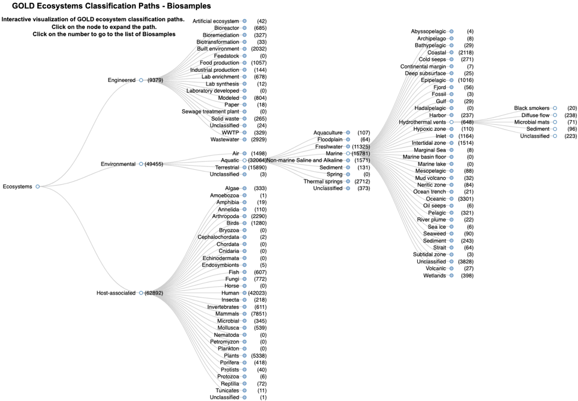

# NMDC Metadata Documentation


## NMDC Schema

The purpose of the NMDC Schema is to define metadata for the [National Microbiome Data Collaborative (NMDC)](https://microbiomedata.org/). The [NMDC](https://microbiomedata.org/) is a multi-organizational effort to enable integrated microbiome data across diverse areas in medicine, agriculture, bioenergy, and the environment. This integrated platform facilitates comprehensive discovery of and access to multidisciplinary microbiome data in order to unlock new possibilities with microbiome data science. 

The NMDC schema is used during the translation process to specify how metadata elements are related.


## NMDC


**metamodel version:** 1.7.0

**version:** 2.1.0


Schema for National Microbiome Data Collaborative (NMDC).
  
This schema is organized into distinct modules:
  
 * a set of core types for representing data values
 * the mixs schema (auto-translated from mixs excel)
 * annotation schema
 * the NMDC schema itself


#### Classes

 * [MAGBin](MAGBin.md)
 * [Activity](Activity.md) - a provence-generating activity
     * [WorkflowExecutionActivity](WorkflowExecutionActivity.md) - Represents an instance of an execution of a particular workflow
         * [MAGsAnalysisActivity](MAGsAnalysisActivity.md)
         * [MetabolomicsAnalysisActivity](MetabolomicsAnalysisActivity.md)
         * [MetagenomeAnnotationActivity](MetagenomeAnnotationActivity.md)
         * [MetagenomeAssembly](MetagenomeAssembly.md)
         * [MetaproteomicsAnalysisActivity](MetaproteomicsAnalysisActivity.md)
         * [MetatranscriptomeActivity](MetatranscriptomeActivity.md) - A metatranscriptome activity that e.g. pools assembly and annotation activity.
         * [MetatranscriptomeAnnotationActivity](MetatranscriptomeAnnotationActivity.md)
         * [MetatranscriptomeAssembly](MetatranscriptomeAssembly.md)
         * [NomAnalysisActivity](NomAnalysisActivity.md)
         * [ReadQCAnalysisActivity](ReadQCAnalysisActivity.md)
         * [ReadBasedAnalysisActivity](ReadBasedAnalysisActivity.md)
 * [Agent](Agent.md) - a provence-generating agent
 * [AttributeValue](AttributeValue.md) - The value for any value of a attribute for a sample. This object can hold both the un-normalized atomic value and the structured value
     * [BooleanValue](BooleanValue.md) - A value that is a boolean
     * [ControlledTermValue](ControlledTermValue.md) - A controlled term or class from an ontology
     * [GeolocationValue](GeolocationValue.md) - A normalized value for a location on the earth's surface
     * [ImageValue](ImageValue.md) - An attribute value representing an image.
     * [IntegerValue](IntegerValue.md) - A value that is an integer
     * [PersonValue](PersonValue.md) - An attribute value representing a person
     * [QuantityValue](QuantityValue.md) - A simple quantity, e.g. 2cm
     * [TextValue](TextValue.md) - A basic string value
     * [TimestampValue](TimestampValue.md) - A value that is a timestamp. The range should be ISO-8601
     * [UrlValue](UrlValue.md) - A value that is a string that conforms to URL syntax
 * [CreditAssociation](CreditAssociation.md) - This class supports binding associated researchers to studies. There will be at least a slot for a CRediT Contributor Role (https://casrai.org/credit/) and for a person value Specifically see the associated researchers tab on the NMDC_SampleMetadata-V4_CommentsForUpdates at https://docs.google.com/spreadsheets/d/1INlBo5eoqn2efn4H2P2i8rwRBtnbDVTqXrochJEAPko/edit#gid=0 
 * [Database](Database.md) - An abstract holder for any set of metadata and data. It does not need to correspond to an actual managed databse top level holder class. When translated to JSON-Schema this is the 'root' object. It should contain pointers to other objects of interest
 * [FunctionalAnnotation](FunctionalAnnotation.md) - An assignment of a function term (e.g. reaction or pathway) that is executed by a gene product, or which the gene product plays an active role in. Functional annotations can be assigned manually by curators, or automatically in workflows. In the context of NMDC, all function annotation is performed automatically, typically using HMM or Blast type methods
 * [GenomeFeature](GenomeFeature.md) - A feature localized to an interval along a genome
 * [MetaboliteQuantification](MetaboliteQuantification.md) - This is used to link a metabolomics analysis workflow to a specific metabolite
 * [NamedThing](NamedThing.md) - a databased entity or concept/class
     * [Biosample](Biosample.md) - A material sample. It may be environmental (encompassing many organisms) or isolate or tissue.   An environmental sample containing genetic material from multiple individuals is commonly referred to as a biosample.
     * [BiosampleProcessing](BiosampleProcessing.md) - A process that takes one or more biosamples as inputs and generates one or as outputs. Examples of outputs include samples cultivated from another sample or data objects created by instruments runs.
         * [OmicsProcessing](OmicsProcessing.md) - The methods and processes used to generate omics data from a biosample or organism.
     * [DataObject](DataObject.md) - An object that primarily consists of symbols that represent information.   Files, records, and omics data are examples of data objects. 
     * [GeneProduct](GeneProduct.md) - A molecule encoded by a gene that has an evolved function
     * [Instrument](Instrument.md) - A material entity that is designed to perform a function in a scientific investigation, but is not a reagent[OBI].
     * [OntologyClass](OntologyClass.md)
         * [ChemicalEntity](ChemicalEntity.md) - An atom or molecule that can be represented with a chemical formula. Include lipids, glycans, natural products, drugs. There may be different terms for distinct acid-base forms, protonation states
         * [EnvironmentalMaterialTerm](EnvironmentalMaterialTerm.md)
         * [FunctionalAnnotationTerm](FunctionalAnnotationTerm.md) - Abstract grouping class for any term/descriptor that can be applied to a functional unit of a genome (protein, ncRNA, complex).
             * [OrthologyGroup](OrthologyGroup.md) - A set of genes or gene products in which all members are orthologous
             * [Pathway](Pathway.md) - A pathway is a sequence of steps/reactions carried out by an organism or community of organisms
             * [Reaction](Reaction.md) - An individual biochemical transformation carried out by a functional unit of an organism, in which a collection of substrates are transformed into a collection of products. Can also represent transporters
     * [Person](Person.md) - represents a person, such as a researcher
     * [Study](Study.md) - A study summarizes the overall goal of a research initiative and outlines the key objective of its underlying projects.  
 * [PeptideQuantification](PeptideQuantification.md) - This is used to link a metaproteomics analysis workflow to a specific peptide sequence and related information
 * [ProteinQuantification](ProteinQuantification.md) - This is used to link a metaproteomics analysis workflow to a specific protein
 * [ReactionParticipant](ReactionParticipant.md) - Instances of this link a reaction to a chemical entity participant

#### Mixins


#### Slots

 * [GOLD identifiers](GOLD_identifiers.md)
 * [INSDC identifiers](INSDC_identifiers.md) - Any identifier covered by the International Nucleotide Sequence Database Collaboration
 * [MGnify identifiers](MGnify_identifiers.md)
 * [abstract](abstract.md) - The abstract of manuscript/grant associated with the entity; i.e., a summary of the resource.
 * [acted on behalf of](acted_on_behalf_of.md)
 * [activity set](activity_set.md) - This property links a database object to the set of workflow activities.
 * [add_date](add_date.md) - The date on which the information was added to the database.
 * [all proteins](all_proteins.md) - the list of protein identifiers that are associated with the peptide sequence
     * [peptide quantification➞all proteins](peptide_quantification_all_proteins.md)
     * [protein quantification➞all proteins](protein_quantification_all_proteins.md) - the grouped list of protein identifiers associated with the peptide sequences that were grouped to a best protein
 * [alternate emails](alternate_emails.md) - One or more other email addresses for an entity.
 * [alternative descriptions](alternative_descriptions.md) - A list of alternative descriptions for the entity. The distinction between desciption and alternative descriptions is application-specific.
 * [alternative identifiers](alternative_identifiers.md) - A list of alternative identifiers for the entity.
     * [external database identifiers](external_database_identifiers.md) - Link to corresponding identifier in external database
         * [GOLD sequencing project identifiers](GOLD_sequencing_project_identifiers.md) - identifiers for corresponding sequencing project in GOLD
         * [INSDC experiment identifiers](INSDC_experiment_identifiers.md)
         * [analysis identifiers](analysis_identifiers.md)
             * [GOLD analysis project identifiers](GOLD_analysis_project_identifiers.md) - identifiers for corresponding analysis project in GOLD
             * [INSDC analysis identifiers](INSDC_analysis_identifiers.md)
             * [MGnify analysis identifiers](MGnify_analysis_identifiers.md)
         * [omics processing identifiers](omics_processing_identifiers.md)
         * [sample identifiers](sample_identifiers.md)
             * [GOLD sample identifiers](GOLD_sample_identifiers.md) - identifiers for corresponding sample in GOLD
             * [INSDC biosample identifiers](INSDC_biosample_identifiers.md) - identifiers for corresponding sample in INSDC
             * [INSDC secondary sample identifiers](INSDC_secondary_sample_identifiers.md) - secondary identifiers for corresponding sample in INSDC
         * [study identifiers](study_identifiers.md)
             * [GOLD study identifiers](GOLD_study_identifiers.md) - identifiers for corresponding project in GOLD
             * [INSDC SRA ENA study identifiers](INSDC_SRA_ENA_study_identifiers.md) - identifiers for corresponding project in INSDC SRA / ENA
             * [INSDC bioproject identifiers](INSDC_bioproject_identifiers.md) - identifiers for corresponding project in INSDC Bioproject
             * [MGnify project identifiers](MGnify_project_identifiers.md) - identifiers for corresponding project in MGnify
 * [alternative names](alternative_names.md) - A list of alternative names used to refer to the entity. The distinction between name and alternative names is application-specific.
 * [alternative titles](alternative_titles.md) - A list of alternative titles for the entity. The distinction between title and alternative titles is application-specific.
 * [applied role](applied_role.md)
 * [applied roles](applied_roles.md)
 * [applies to person](applies_to_person.md)
 * [assembly identifiers](assembly_identifiers.md)
     * [INSDC assembly identifiers](INSDC_assembly_identifiers.md)
 * [attribute](attribute.md) - A attribute of a biosample. Examples: depth, habitat, material. For NMDC, attributes SHOULD be mapped to terms within a MIxS template
     * [_16s_recover](_16s_recover.md) - Can a 16S gene be recovered from the submitted SAG or MAG?
     * [_16s_recover_software](_16s_recover_software.md) - Tools used for 16S rRNA gene extraction
     * [abs_air_humidity](abs_air_humidity.md) - Actual mass of water vapor - mh20 - present in the air water vapor mixture
     * [adapters](adapters.md) - Adapters provide priming sequences for both amplification and sequencing of the sample-library fragments. Both adapters should be reported; in uppercase letters
     * [add_recov_method](add_recov_method.md) - Additional (i.e. Secondary, tertiary, etc.) recovery methods deployed for increase of hydrocarbon recovery from resource and start date for each one of them. If 'other' is specified, please propose entry in 'additional info' field
     * [additional_info](additional_info.md) - Information that doesn't fit anywhere else. Can also be used to propose new entries for fields with controlled vocabulary
     * [address](address.md) - The street name and building number where the sampling occurred.
     * [adj_room](adj_room.md) - List of rooms (room number, room name) immediately adjacent to the sampling room
     * [aero_struc](aero_struc.md) - Aerospace structures typically consist of thin plates with stiffeners for the external surfaces, bulkheads and frames to support the shape and fasteners such as welds, rivets, screws and bolts to hold the components together
     * [agrochem_addition](agrochem_addition.md) - Addition of fertilizers, pesticides, etc. - amount and time of applications
     * [air_temp](air_temp.md) - Temperature of the air at the time of sampling
     * [air_temp_regm](air_temp_regm.md) - Information about treatment involving an exposure to varying temperatures; should include the temperature, treatment regimen including how many times the treatment was repeated, how long each treatment lasted, and the start and end time of the entire treatment; can include different temperature regimens
     * [al_sat](al_sat.md) - Aluminum saturation (esp. For tropical soils)
     * [al_sat_meth](al_sat_meth.md) - Reference or method used in determining Al saturation
     * [alkalinity](alkalinity.md) - Alkalinity, the ability of a solution to neutralize acids to the equivalence point of carbonate or bicarbonate
     * [alkalinity_method](alkalinity_method.md) - Method used for alkalinity measurement
     * [alkyl_diethers](alkyl_diethers.md) - Concentration of alkyl diethers 
     * [alt](alt.md) - Altitude is a term used to identify heights of objects such as airplanes, space shuttles, rockets, atmospheric balloons and heights of places such as atmospheric layers and clouds. It is used to measure the height of an object which is above the earthbs surface. In this context, the altitude measurement is the vertical distance between the earth's surface above sea level and the sampled position in the air
     * [aminopept_act](aminopept_act.md) - Measurement of aminopeptidase activity
     * [ammonium](ammonium.md) - Concentration of ammonium in the sample
     * [amniotic_fluid_color](amniotic_fluid_color.md) - Specification of the color of the amniotic fluid sample
     * [amount_light](amount_light.md) - The unit of illuminance and luminous emittance, measuring luminous flux per unit area
     * [ances_data](ances_data.md) - Information about either pedigree or other ancestral information description (e.g. parental variety in case of mutant or selection), e.g. A/3*B (meaning [(A x B) x B] x B)
     * [annot](annot.md) - Tool used for annotation, or for cases where annotation was provided by a community jamboree or model organism database rather than by a specific submitter
     * [annual_precpt](annual_precpt.md) - The average of all annual precipitation values known, or an estimated equivalent value derived by such methods as regional indexes or Isohyetal maps.
     * [annual_temp](annual_temp.md) - Mean annual temperature
     * [antibiotic_regm](antibiotic_regm.md) - Information about treatment involving antibiotic administration; should include the name of antibiotic, amount administered, treatment regimen including how many times the treatment was repeated, how long each treatment lasted, and the start and end time of the entire treatment; can include multiple antibiotic regimens
     * [api](api.md) - API gravity is a measure of how heavy or light a petroleum liquid is compared to water (source: https://en.wikipedia.org/wiki/API_gravity) (e.g. 31.1B0 API) 
     * [arch_struc](arch_struc.md) - An architectural structure is a human-made, free-standing, immobile outdoor construction
     * [aromatics_pc](aromatics_pc.md) - Saturate, Aromatic, Resin and AsphalteneB (SARA) is an analysis method that dividesB crude oilB components according to their polarizability and polarity. There are three main methods to obtain SARA results. The most popular one is known as the Iatroscan TLC-FID and is referred to as IP-143 (source: https://en.wikipedia.org/wiki/Saturate,_aromatic,_resin_and_asphaltene)
     * [asphaltenes_pc](asphaltenes_pc.md) - Saturate, Aromatic, Resin and AsphalteneB (SARA) is an analysis method that dividesB crude oilB components according to their polarizability and polarity. There are three main methods to obtain SARA results. The most popular one is known as the Iatroscan TLC-FID and is referred to as IP-143 (source: https://en.wikipedia.org/wiki/Saturate,_aromatic,_resin_and_asphaltene)
     * [assembly_name](assembly_name.md) - Name/version of the assembly provided by the submitter that is used in the genome browsers and in the community
     * [assembly_qual](assembly_qual.md) - The assembly quality category is based on sets of criteria outlined for each assembly quality category. For MISAG/MIMAG; Finished: Single, validated, contiguous sequence per replicon without gaps or ambiguities with a consensus error rate equivalent to Q50 or better. High Quality Draft:Multiple fragments where gaps span repetitive regions. Presence of the 23S, 16S and 5S rRNA genes and at least 18 tRNAs. Medium Quality Draft:Many fragments with little to no review of assembly other than reporting of standard assembly statistics. Low Quality Draft:Many fragments with little to no review of assembly other than reporting of standard assembly statistics. Assembly statistics include, but are not limited to total assembly size, number of contigs, contig N50/L50, and maximum contig length. For MIUVIG; Finished: Single, validated, contiguous sequence per replicon without gaps or ambiguities, with extensive manual review and editing to annotate putative gene functions and transcriptional units. High-quality draft genome: One or multiple fragments, totaling 3 90% of the expected genome or replicon sequence or predicted complete. Genome fragment(s): One or multiple fragments, totalling < 90% of the expected genome or replicon sequence, or for which no genome size could be estimated
     * [assembly_software](assembly_software.md) - Tool(s) used for assembly, including version number and parameters
     * [atmospheric_data](atmospheric_data.md) - Measurement of atmospheric data; can include multiple data
     * [avg_dew_point](avg_dew_point.md) - The average of dew point measures taken at the beginning of every hour over a 24 hour period on the sampling day
     * [avg_occup](avg_occup.md) - Daily average  occupancy of room
     * [avg_temp](avg_temp.md) - The average of temperatures taken at the beginning of every hour over a 24 hour period on the sampling day
     * [bac_prod](bac_prod.md) - Bacterial production in the water column measured by isotope uptake
     * [bac_resp](bac_resp.md) - Measurement of bacterial respiration in the water column
     * [bacteria_carb_prod](bacteria_carb_prod.md) - Measurement of bacterial carbon production
     * [barometric_press](barometric_press.md) - Force per unit area exerted against a surface by the weight of air above that surface
     * [basin](basin.md) - Name of the basin (e.g. Campos)
     * [bathroom_count](bathroom_count.md) - The number of bathrooms in the building
     * [bedroom_count](bedroom_count.md) - The number of bedrooms in the building
     * [benzene](benzene.md) - Concentration of benzene in the sample
     * [bin_param](bin_param.md) - The parameters that have been applied during the extraction of genomes from metagenomic datasets
     * [bin_software](bin_software.md) - Tool(s) used for the extraction of genomes from metagenomic datasets
     * [biochem_oxygen_dem](biochem_oxygen_dem.md) - Amount of dissolved oxygen needed by aerobic biological organisms in a body of water to break down organic material present in a given water sample at certain temperature over a specific time period
     * [biocide](biocide.md) - List of biocides (commercial name of product and supplier) and date of administration
     * [biocide_admin_method](biocide_admin_method.md) - Method of biocide administration (dose, frequency, duration, time elapsed between last biociding and sampling) (e.g. 150 mg/l; weekly; 4 hr; 3 days)
     * [biol_stat](biol_stat.md) - The level of genome modification
     * [biomass](biomass.md) - Amount of biomass; should include the name for the part of biomass measured, e.g. Microbial, total. Can include multiple measurements
     * [biotic_regm](biotic_regm.md) - Information about treatment(s) involving use of biotic factors, such as bacteria, viruses or fungi.
     * [biotic_relationship](biotic_relationship.md) - Description of relationship(s) between the subject organism and other organism(s) it is associated with. E.g., parasite on species X; mutualist with species Y. The target organism is the subject of the relationship, and the other organism(s) is the object
     * [birth_control](birth_control.md) - Specification of birth control medication used
     * [bishomohopanol](bishomohopanol.md) - Concentration of bishomohopanol 
     * [blood_blood_disord](blood_blood_disord.md) - History of blood disorders; can include multiple disorders
     * [bromide](bromide.md) - Concentration of bromide 
     * [build_docs](build_docs.md) - The building design, construction and operation documents
     * [build_occup_type](build_occup_type.md) - The primary function for which a building or discrete part of a building is intended to be used
     * [building_setting](building_setting.md) - A location (geography) where a building is set
     * [built_struc_age](built_struc_age.md) - The age of the built structure since construction
     * [built_struc_set](built_struc_set.md) - The characterization of the location of the built structure as high or low human density
     * [built_struc_type](built_struc_type.md) - A physical structure that is a body or assemblage of bodies in space to form a system capable of supporting loads
     * [calcium](calcium.md) - Concentration of calcium in the sample
     * [carb_dioxide](carb_dioxide.md) - Carbon dioxide (gas) amount or concentration at the time of sampling
     * [carb_monoxide](carb_monoxide.md) - Carbon monoxide (gas) amount or concentration at the time of sampling
     * [carb_nitro_ratio](carb_nitro_ratio.md) - Ratio of amount or concentrations of carbon to nitrogen
     * [ceil_area](ceil_area.md) - The area of the ceiling space within the room
     * [ceil_cond](ceil_cond.md) - The physical condition of the ceiling at the time of sampling; photos or video preferred; use drawings to indicate location of damaged areas
     * [ceil_finish_mat](ceil_finish_mat.md) - The type of material used to finish a ceiling
     * [ceil_struc](ceil_struc.md) - The construction format of the ceiling
     * [ceil_texture](ceil_texture.md) - The feel, appearance, or consistency of a ceiling surface
     * [ceil_thermal_mass](ceil_thermal_mass.md) - The ability of the ceiling to provide inertia against temperature fluctuations. Generally this means concrete that is exposed. A metal deck that supports a concrete slab will act thermally as long as it is exposed to room air flow
     * [ceil_type](ceil_type.md) - The type of ceiling according to the ceiling's appearance or construction
     * [ceil_water_mold](ceil_water_mold.md) - Signs of the presence of mold or mildew on the ceiling
     * [chem_administration](chem_administration.md) - List of chemical compounds administered to the host or site where sampling occurred, and when (e.g. Antibiotics, n fertilizer, air filter); can include multiple compounds. For chemical entities of biological interest ontology (chebi) (v 163), http://purl.bioontology.org/ontology/chebi
     * [chem_mutagen](chem_mutagen.md) - Treatment involving use of mutagens; should include the name of mutagen, amount administered, treatment regimen including how many times the treatment was repeated, how long each treatment lasted, and the start and end time of the entire treatment; can include multiple mutagen regimens
     * [chem_oxygen_dem](chem_oxygen_dem.md) - A measure of the capacity of water to consume oxygen during the decomposition of organic matter and the oxidation of inorganic chemicals such as ammonia and nitrite
     * [chem_treatment](chem_treatment.md) - List of chemical compounds administered upstream the sampling location where sampling occurred (e.g. Glycols, H2S scavenger, corrosion and scale inhibitors, demulsifiers, and other production chemicals etc.). The commercial name of the product and name of the supplier should be provided.  The date of administration should also be included
     * [chem_treatment_method](chem_treatment_method.md) - Method of chemical administration(dose, frequency, duration, time elapsed between administration and sampling) (e.g. 50 mg/l; twice a week; 1 hr; 0 days)
     * [chimera_check](chimera_check.md) - A chimeric sequence, or chimera for short, is a sequence comprised of two or more phylogenetically distinct parent sequences. Chimeras are usually PCR artifacts thought to occur when a prematurely terminated amplicon reanneals to a foreign DNA strand and is copied to completion in the following PCR cycles. The point at which the chimeric sequence changes from one parent to the next is called the breakpoint or conversion point
     * [chloride](chloride.md) - Concentration of chloride in the sample
     * [chlorophyll](chlorophyll.md) - Concentration of chlorophyll
     * [climate_environment](climate_environment.md) - Treatment involving an exposure to a particular climate; treatment regimen including how many times the treatment was repeated, how long each treatment lasted, and the start and end time of the entire treatment; can include multiple climates
     * [collection_date](collection_date.md) - The time of sampling, either as an instance (single point in time) or interval. In case no exact time is available, the date/time can be right truncated i.e. all of these are valid times: 2008-01-23T19:23:10+00:00; 2008-01-23T19:23:10; 2008-01-23; 2008-01; 2008; Except: 2008-01; 2008 all are ISO8601 compliant
     * [compl_appr](compl_appr.md) - The approach used to determine the completeness of a given SAG or MAG, which would typically make use of a set of conserved marker genes or a closely related reference genome. For UViG completeness, include reference genome or group used, and contig feature suggesting a complete genome
     * [compl_score](compl_score.md) - Completeness score is typically based on either the fraction of markers found as compared to a database or the percent of a genome found as compared to a closely related reference genome. High Quality Draft: >90%, Medium Quality Draft: >50%, and Low Quality Draft: < 50% should have the indicated completeness scores
     * [compl_software](compl_software.md) - Tools used for completion estimate, i.e. checkm, anvi'o, busco
     * [conduc](conduc.md) - Electrical conductivity of water
     * [contam_score](contam_score.md) - The contamination score is based on the fraction of single-copy genes that are observed more than once in a query genome. The following scores are acceptable for; High Quality Draft: < 5%, Medium Quality Draft: < 10%, Low Quality Draft: < 10%. Contamination must be below 5% for a SAG or MAG to be deposited into any of the public databases
     * [contam_screen_input](contam_screen_input.md) - The type of sequence data used as input
     * [contam_screen_param](contam_screen_param.md) - Specific parameters used in the decontamination sofware, such as reference database, coverage, and kmers. Combinations of these parameters may also be used, i.e. kmer and coverage, or reference database and kmer
     * [cool_syst_id](cool_syst_id.md) - The cooling system identifier
     * [crop_rotation](crop_rotation.md) - Whether or not crop is rotated, and if yes, rotation schedule
     * [cult_root_med](cult_root_med.md) - Name or reference for the hydroponic or in vitro culture rooting medium; can be the name of a commonly used medium or reference to a specific medium, e.g. Murashige and Skoog medium. If the medium has not been formally published, use the rooting medium descriptors.
     * [cur_land_use](cur_land_use.md) - Present state of sample site
     * [cur_vegetation](cur_vegetation.md) - Vegetation classification from one or more standard classification systems, or agricultural crop
     * [cur_vegetation_meth](cur_vegetation_meth.md) - Reference or method used in vegetation classification 
     * [date_last_rain](date_last_rain.md) - The date of the last time it rained
     * [decontam_software](decontam_software.md) - Tool(s) used in contamination screening
     * [density](density.md) - Density of the sample, which is its mass per unit volume (aka volumetric mass density)
     * [depos_env](depos_env.md) - Main depositional environment (https://en.wikipedia.org/wiki/Depositional_environment). If 'other' is specified, please propose entry in 'additional info' field
     * [depth](depth.md) - Depth is defined as the vertical distance below local surface, e.g. For sediment or soil samples depth is measured from sediment or soil surface, respectively. Depth can be reported as an interval for subsurface samples
     * [dermatology_disord](dermatology_disord.md) - History of dermatology disorders; can include multiple disorders
     * [detec_type](detec_type.md) - Type of UViG detection
     * [dew_point](dew_point.md) - The temperature to which a given parcel of humid air must be cooled, at constant barometric pressure, for water vapor to condense into water.
     * [diet_last_six_month](diet_last_six_month.md) - Specification of major diet changes in the last six months, if yes the change should be specified
     * [diether_lipids](diether_lipids.md) - Concentration of diether lipids; can include multiple types of diether lipids
     * [display order](display_order.md) - When rendering information, this attribute to specify the order in which the information should be rendered.
     * [diss_carb_dioxide](diss_carb_dioxide.md) - Concentration of dissolved carbon dioxide in the sample or liquid portion of the sample
     * [diss_hydrogen](diss_hydrogen.md) - Concentration of dissolved hydrogen
     * [diss_inorg_carb](diss_inorg_carb.md) - Dissolved inorganic carbon concentration in the sample, typically measured after filtering the sample using a 0.45 micrometer filter
     * [diss_inorg_nitro](diss_inorg_nitro.md) - Concentration of dissolved inorganic nitrogen 
     * [diss_inorg_phosp](diss_inorg_phosp.md) - Concentration of dissolved inorganic phosphorus in the sample
     * [diss_iron](diss_iron.md) - Concentration of dissolved iron in the sample
     * [diss_org_carb](diss_org_carb.md) - Concentration of dissolved organic carbon in the sample, liquid portion of the sample, or aqueous phase of the fluid
     * [diss_org_nitro](diss_org_nitro.md) - Dissolved organic nitrogen concentration measured as; total dissolved nitrogen - NH4 - NO3 - NO2
     * [diss_oxygen](diss_oxygen.md) - Concentration of dissolved oxygen
     * [diss_oxygen_fluid](diss_oxygen_fluid.md) - Concentration of dissolved oxygen in the oil field produced fluids as it contributes to oxgen-corrosion and microbial activity (e.g. Mic).
     * [doi](doi.md)
         * [study➞doi](study_doi.md) - The dataset citation for this study
     * [dominant_hand](dominant_hand.md) - Dominant hand of the subject
     * [door_comp_type](door_comp_type.md) - The composite type of the door
     * [door_cond](door_cond.md) - The phsical condition of the door
     * [door_direct](door_direct.md) - The direction the door opens
     * [door_loc](door_loc.md) - The relative location of the door in the room
     * [door_mat](door_mat.md) - The material the door is composed of
     * [door_move](door_move.md) - The type of movement of the door
     * [door_size](door_size.md) - The size of the door
     * [door_type](door_type.md) - The type of door material
     * [door_type_metal](door_type_metal.md) - The type of metal door
     * [door_type_wood](door_type_wood.md) - The type of wood door
     * [door_water_mold](door_water_mold.md) - Signs of the presence of mold or mildew on a door
     * [douche](douche.md) - Date of most recent douche
     * [down_par](down_par.md) - Visible waveband radiance and irradiance measurements in the water column
     * [drainage_class](drainage_class.md) - Drainage classification from a standard system such as the USDA system
     * [drawings](drawings.md) - The buildings architectural drawings; if design is chosen, indicate phase-conceptual, schematic, design development, and construction documents
     * [drug_usage](drug_usage.md) - Any drug used by subject and the frequency of usage; can include multiple drugs used
     * [efficiency_percent](efficiency_percent.md) - Percentage of volatile solids removed from the anaerobic digestor
     * [elev](elev.md) - Elevation of the sampling site is its height above a fixed reference point, most commonly the mean sea level. Elevation is mainly used when referring to points on the earth's surface, while altitude is used for points above the surface, such as an aircraft in flight or a spacecraft in orbit
     * [elevator](elevator.md) - The number of elevators within the built structure
     * [emulsions](emulsions.md) - Amount or concentration of substances such as paints, adhesives, mayonnaise, hair colorants, emulsified oils, etc.; can include multiple emulsion types
     * [encoded_traits](encoded_traits.md) - Should include key traits like antibiotic resistance or xenobiotic degradation phenotypes for plasmids, converting genes for phage
     * [env_broad_scale](env_broad_scale.md) - In this field, report which major environmental system your sample or specimen came from. The systems identified should have a coarse spatial grain, to provide the general environmental context of where the sampling was done (e.g. were you in the desert or a rainforest?). We recommend using subclasses of ENVOUs biome class: http://purl.obolibrary.org/obo/ENVO_00000428. Format (one term): termLabel [termID], Format (multiple terms): termLabel [termID]|termLabel [termID]|termLabel [termID]. Example: Annotating a water sample from the photic zone in middle of the Atlantic Ocean, consider: oceanic epipelagic zone biome [ENVO:01000033]. Example: Annotating a sample from the Amazon rainforest consider: tropical moist broadleaf forest biome [ENVO:01000228]. If needed, request new terms on the ENVO tracker, identified here: http://www.obofoundry.org/ontology/envo.html
         * [biosample➞env_broad_scale](biosample_env_broad_scale.md)
     * [env_local_scale](env_local_scale.md) - In this field, report the entity or entities which are in your sample or specimenUs local vicinity and which you believe have significant causal influences on your sample or specimen. Please use terms that are present in ENVO and which are of smaller spatial grain than your entry for env_broad_scale. Format (one term): termLabel [termID]; Format (multiple terms): termLabel [termID]|termLabel [termID]|termLabel [termID]. Example: Annotating a pooled sample taken from various vegetation layers in a forest consider: canopy [ENVO:00000047]|herb and fern layer [ENVO:01000337]|litter layer [ENVO:01000338]|understory [01000335]|shrub layer [ENVO:01000336]. If needed, request new terms on the ENVO tracker, identified here: http://www.obofoundry.org/ontology/envo.html
         * [biosample➞env_local_scale](biosample_env_local_scale.md)
     * [env_medium](env_medium.md) - In this field, report which environmental material or materials (pipe separated) immediately surrounded your sample or specimen prior to sampling, using one or more subclasses of ENVOUs environmental material class: http://purl.obolibrary.org/obo/ENVO_00010483. Format (one term): termLabel [termID]; Format (multiple terms): termLabel [termID]|termLabel [termID]|termLabel [termID]. Example: Annotating a fish swimming in the upper 100 m of the Atlantic Ocean, consider: ocean water [ENVO:00002151]. Example: Annotating a duck on a pond consider: pond water [ENVO:00002228]|air ENVO_00002005. If needed, request new terms on the ENVO tracker, identified here: http://www.obofoundry.org/ontology/envo.html
         * [biosample➞env_medium](biosample_env_medium.md)
     * [env_package](env_package.md) - MIxS extension for reporting of measurements and observations obtained from one or more of the environments where the sample was obtained. All environmental packages listed here are further defined in separate subtables. By giving the name of the environmental package, a selection of fields can be made from the subtables and can be reported
     * [escalator](escalator.md) - The number of escalators within the built structure
     * [estimated_size](estimated_size.md) - The estimated size of the genome prior to sequencing. Of particular importance in the sequencing of (eukaryotic) genome which could remain in draft form for a long or unspecified period.
     * [ethylbenzene](ethylbenzene.md) - Concentration of ethylbenzene in the sample
     * [execution resource](execution_resource.md) - Example: NERSC-Cori
         * [workflow execution activity➞execution resource](workflow_execution_activity_execution_resource.md)
     * [exp_duct](exp_duct.md) - The amount of exposed ductwork in the room
     * [exp_pipe](exp_pipe.md) - The number of exposed pipes in the room
     * [experimental_factor](experimental_factor.md) - Experimental factors are essentially the variable aspects of an experiment design which can be used to describe an experiment, or set of experiments, in an increasingly detailed manner. This field accepts ontology terms from Experimental Factor Ontology (EFO) and/or Ontology for Biomedical Investigations (OBI). For a browser of EFO (v 2.95) terms, please see http://purl.bioontology.org/ontology/EFO; for a browser of OBI (v 2018-02-12) terms please see http://purl.bioontology.org/ontology/OBI
     * [ext_door](ext_door.md) - The number of exterior doors in the built structure
     * [ext_wall_orient](ext_wall_orient.md) - The orientation of the exterior wall
     * [ext_window_orient](ext_window_orient.md) - The compass direction the exterior window of the room is facing
     * [extrachrom_elements](extrachrom_elements.md) - Do plasmids exist of significant phenotypic consequence (e.g. ones that determine virulence or antibiotic resistance). Megaplasmids? Other plasmids (borrelia has 15+ plasmids)
     * [extreme_event](extreme_event.md) - Unusual physical events that may have affected microbial populations
     * [extreme_salinity](extreme_salinity.md) - Measured salinity 
     * [fao_class](fao_class.md) - Soil classification from the FAO World Reference Database for Soil Resources. The list can be found at http://www.fao.org/nr/land/sols/soil/wrb-soil-maps/reference-groups
     * [feat_pred](feat_pred.md) - Method used to predict UViGs features such as ORFs, integration site, etc.
     * [fertilizer_regm](fertilizer_regm.md) - Information about treatment involving the use of fertilizers; should include the name of fertilizer, amount administered, treatment regimen including how many times the treatment was repeated, how long each treatment lasted, and the start and end time of the entire treatment; can include multiple fertilizer regimens
     * [field](field.md) - Name of the hydrocarbon field (e.g. Albacora)
     * [file size bytes](file_size_bytes.md) - Size of the file in bytes
     * [filter_type](filter_type.md) - A device which removes solid particulates or airborne molecular contaminants
     * [fire](fire.md) - Historical and/or physical evidence of fire
     * [fireplace_type](fireplace_type.md) - A firebox with chimney
     * [flooding](flooding.md) - Historical and/or physical evidence of flooding
     * [floor_age](floor_age.md) - The time period since installment of the carpet or flooring
     * [floor_area](floor_area.md) - The area of the floor space within the room
     * [floor_cond](floor_cond.md) - The physical condition of the floor at the time of sampling; photos or video preferred; use drawings to indicate location of damaged areas
     * [floor_count](floor_count.md) - The number of floors in the building, including basements and mechanical penthouse
     * [floor_finish_mat](floor_finish_mat.md) - The floor covering type; the finished surface that is walked on
     * [floor_struc](floor_struc.md) - Refers to the structural elements and subfloor upon which the finish flooring is installed
     * [floor_thermal_mass](floor_thermal_mass.md) - The ability of the floor to provide inertia against temperature fluctuations
     * [floor_water_mold](floor_water_mold.md) - Signs of the presence of mold or mildew in a room
     * [fluor](fluor.md) - Raw or converted fluorescence of water
     * [foetal_health_stat](foetal_health_stat.md) - Specification of foetal health status, should also include abortion
     * [freq_clean](freq_clean.md) - The number of times the building is cleaned per week
     * [freq_cook](freq_cook.md) - The number of times a meal is cooked per week
     * [fungicide_regm](fungicide_regm.md) - Information about treatment involving use of fungicides; should include the name of fungicide, amount administered,  treatment regimen including how many times the treatment was repeated, how long each treatment lasted, and the start and end time of the entire treatment; can include multiple fungicide regimens
     * [furniture](furniture.md) - The types of furniture present in the sampled room
     * [gaseous_environment](gaseous_environment.md) - Use of conditions with differing gaseous environments; should include the name of gaseous compound, amount administered, treatment duration, interval and total experimental duration; can include multiple gaseous environment regimens
     * [gaseous_substances](gaseous_substances.md) - Amount or concentration of substances such as hydrogen sulfide, carbon dioxide, methane, etc.; can include multiple substances
     * [gastrointest_disord](gastrointest_disord.md) - History of gastrointestinal tract disorders; can include multiple disorders 
     * [gender_restroom](gender_restroom.md) - The gender type of the restroom
     * [genetic_mod](genetic_mod.md) - Genetic modifications of the genome of an organism, which may occur naturally by spontaneous mutation, or be introduced by some experimental means, e.g. specification of a transgene or the gene knocked-out or details of transient transfection
     * [geo_loc_name](geo_loc_name.md) - The geographical origin of the sample as defined by the country or sea name followed by specific region name. Country or sea names should be chosen from the INSDC country list (http://insdc.org/country.html), or the GAZ ontology (v 1.512) (http://purl.bioontology.org/ontology/GAZ)
     * [gestation_state](gestation_state.md) - Specification of the gestation state
     * [git url](git_url.md) - Example: https://github.com/microbiomedata/mg_annotation/releases/tag/0.1
         * [workflow execution activity➞git url](workflow_execution_activity_git_url.md)
     * [glucosidase_act](glucosidase_act.md) - Measurement of glucosidase activity
     * [gold_path_field](gold_path_field.md) - This is a grouping for any of the gold path fields          
         * [ecosystem](ecosystem.md) - An ecosystem is a combination of a physical environment (abiotic factors) and all the organisms (biotic factors) that interact with this environment. Ecosystem is in position 1/5 in a GOLD path.
         * [ecosystem_category](ecosystem_category.md) - Ecosystem categories represent divisions within the ecosystem based on specific characteristics of the environment from where an organism or sample is isolated. Ecosystem category is in position 2/5 in a GOLD path.
         * [ecosystem_subtype](ecosystem_subtype.md) - Ecosystem subtypes represent further subdivision of Ecosystem types into more distinct subtypes. Ecosystem subtype is in position 4/5 in a GOLD path.
         * [ecosystem_type](ecosystem_type.md) - Ecosystem types represent things having common characteristics within the Ecosystem Category. These common characteristics based grouping is still broad but specific to the characteristics of a given environment. Ecosystem type is in position 3/5 in a GOLD path.
         * [specific_ecosystem](specific_ecosystem.md) - Specific ecosystems represent specific features of the environment like aphotic zone in an ocean or gastric mucosa within a host digestive system. Specific ecosystem is in position 5/5 in a GOLD path.
     * [gravidity](gravidity.md) - Whether or not subject is gravid, and if yes date due or date post-conception, specifying which is used
     * [gravity](gravity.md) - Information about treatment involving use of gravity factor to study various types of responses in presence, absence or modified levels of gravity; treatment regimen including how many times the treatment was repeated, how long each treatment lasted, and the start and end time of the entire treatment; can include multiple treatments
     * [growth_facil](growth_facil.md) - Type of facility where the sampled plant was grown; controlled vocabulary: growth chamber, open top chamber, glasshouse, experimental garden, field. Alternatively use Crop Ontology (CO) terms, see http://www.cropontology.org/ontology/CO_715/Crop%20Research
     * [growth_habit](growth_habit.md) - Characteristic shape, appearance or growth form of a plant species
     * [growth_hormone_regm](growth_hormone_regm.md) - Information about treatment involving use of growth hormones; should include the name of growth hormone, amount administered, treatment regimen including how many times the treatment was repeated, how long each treatment lasted, and the start and end time of the entire treatment; can include multiple growth hormone regimens
     * [gynecologic_disord](gynecologic_disord.md) - History of gynecological disorders; can include multiple disorders
     * [hall_count](hall_count.md) - The total count of hallways and cooridors in the built structure
     * [handidness](handidness.md) - The handidness of the individual sampled
     * [hc_produced](hc_produced.md) - Main hydrocarbon type produced from resource (i.e. Oil, gas, condensate, etc). If 'other' is specified, please propose entry in 'additional info' field
     * [hcr](hcr.md) - Main Hydrocarbon Resource type. The term 'Hydrocarbon Resource' HCR defined as a natural environmental feature containing large amounts of hydrocarbons at high concentrations potentially suitable for commercial exploitation.  This term should not be confused with the Hydrocarbon Occurrence term which also includes hydrocarbon-rich environments with currently limited commercial interest such as seeps, outcrops, gas hydrates etc. If 'other' is specified, please propose entry in 'additional info' field
     * [hcr_fw_salinity](hcr_fw_salinity.md) - Original formation water salinity (prior to secondary recovery e.g. Waterflooding) expressed as TDS
     * [hcr_geol_age](hcr_geol_age.md) - Geological age of hydrocarbon resource (Additional info: https://en.wikipedia.org/wiki/Period_(geology)). If 'other' is specified, please propose entry in 'additional info' field
     * [hcr_pressure](hcr_pressure.md) - Original pressure of the hydrocarbon resource 
     * [hcr_temp](hcr_temp.md) - Original temperature of the hydrocarbon resource
     * [health_disease_stat](health_disease_stat.md) - Health or disease status of specific host at time of collection
     * [heat_cool_type](heat_cool_type.md) - Methods of conditioning or heating a room or building
     * [heat_deliv_loc](heat_deliv_loc.md) - The location of heat delivery within the room
     * [heat_system_deliv_meth](heat_system_deliv_meth.md) - The method by which the heat is delivered through the system
     * [heat_system_id](heat_system_id.md) - The heating system identifier
     * [heavy_metals](heavy_metals.md) - Heavy metals present and concentrationsany drug used by subject and the frequency of usage; can include multiple heavy metals and concentrations
     * [heavy_metals_meth](heavy_metals_meth.md) - Reference or method used in determining heavy metals
     * [height_carper_fiber](height_carper_fiber.md) - The average carpet fiber height in the indoor environment
     * [herbicide_regm](herbicide_regm.md) - Information about treatment involving use of herbicides; information about treatment involving use of growth hormones; should include the name of herbicide, amount administered, treatment regimen including how many times the treatment was repeated, how long each treatment lasted, and the start and end time of the entire treatment; can include multiple regimens
     * [horizon](horizon.md) - Specific layer in the land area which measures parallel to the soil surface and possesses physical characteristics which differ from the layers above and beneath
     * [horizon_meth](horizon_meth.md) - Reference or method used in determining the horizon
     * [host_age](host_age.md) - Age of host at the time of sampling; relevant scale depends on species and study, e.g. Could be seconds for amoebae or centuries for trees
     * [host_blood_press_diast](host_blood_press_diast.md) - Resting diastolic blood pressure, measured as mm mercury
     * [host_blood_press_syst](host_blood_press_syst.md) - Resting systolic blood pressure, measured as mm mercury
     * [host_body_habitat](host_body_habitat.md) - Original body habitat where the sample was obtained from
     * [host_body_mass_index](host_body_mass_index.md) - Body mass index, calculated as weight/(height)squared
     * [host_body_product](host_body_product.md) - Substance produced by the body, e.g. Stool, mucus, where the sample was obtained from. For foundational model of anatomy ontology (fma) or Uber-anatomy ontology (UBERON) terms, please see https://www.ebi.ac.uk/ols/ontologies/fma or https://www.ebi.ac.uk/ols/ontologies/uberon
     * [host_body_site](host_body_site.md) - Name of body site where the sample was obtained from, such as a specific organ or tissue (tongue, lung etc...). For foundational model of anatomy ontology (fma) (v 4.11.0) or Uber-anatomy ontology (UBERON) (v releases/2014-06-15) terms, please see http://purl.bioontology.org/ontology/FMA or http://purl.bioontology.org/ontology/UBERON
     * [host_body_temp](host_body_temp.md) - Core body temperature of the host when sample was collected
     * [host_color](host_color.md) - The color of host
     * [host_common_name](host_common_name.md) - Common name of the host, e.g. Human
     * [host_diet](host_diet.md) - Type of diet depending on the host, for animals omnivore, herbivore etc., for humans high-fat, meditteranean etc.; can include multiple diet types
     * [host_disease_stat](host_disease_stat.md) - List of diseases with which the host has been diagnosed; can include multiple diagnoses. The value of the field depends on host; for humans the terms should be chosen from do (disease ontology) at http://www.disease-ontology.org, other hosts are free text
     * [host_dry_mass](host_dry_mass.md) - Measurement of dry mass
     * [host_family_relationship](host_family_relationship.md) - Relationships to other hosts in the same study; can include multiple relationships
     * [host_genotype](host_genotype.md) - Observed genotype
     * [host_growth_cond](host_growth_cond.md) - Literature reference giving growth conditions of the host
     * [host_height](host_height.md) - The height of subject
     * [host_hiv_stat](host_hiv_stat.md) - HIV status of subject, if yes HAART initiation status should also be indicated as [YES or NO]
     * [host_infra_specific_name](host_infra_specific_name.md) - Taxonomic information about the host below subspecies level
     * [host_infra_specific_rank](host_infra_specific_rank.md) - Taxonomic rank information about the host below subspecies level, such as variety, form, rank etc.
     * [host_last_meal](host_last_meal.md) - Content of last meal and time since feeding; can include multiple values
     * [host_length](host_length.md) - The length of subject
     * [host_life_stage](host_life_stage.md) - Description of life stage of host
     * [host_occupation](host_occupation.md) - Most frequent job performed by subject
     * [host_phenotype](host_phenotype.md) - Phenotype of human or other host. For phenotypic quality ontology (pato) (v 2018-03-27) terms, please see http://purl.bioontology.org/ontology/pato. For Human Phenotype Ontology (HP) (v 2018-06-13) please see http://purl.bioontology.org/ontology/HP
     * [host_pred_appr](host_pred_appr.md) - Tool or approach used for host prediction
     * [host_pred_est_acc](host_pred_est_acc.md) - For each tool or approach used for host prediction, estimated false discovery rates should be included, either computed de novo or from the literature
     * [host_pulse](host_pulse.md) - Resting pulse, measured as beats per minute
     * [host_sex](host_sex.md) - Physical sex of the host
     * [host_shape](host_shape.md) - Morphological shape of host 
     * [host_spec_range](host_spec_range.md) - The NCBI taxonomy identifier of the specific host if it is known
     * [host_subject_id](host_subject_id.md) - A unique identifier by which each subject can be referred to, de-identified, e.g. #131
     * [host_substrate](host_substrate.md) - The growth substrate of the host 
     * [host_taxid](host_taxid.md) - NCBI taxon id of the host, e.g. 9606
     * [host_tot_mass](host_tot_mass.md) - Total mass of the host at collection, the unit depends on host
     * [host_wet_mass](host_wet_mass.md) - Measurement of wet mass
     * [hrt](hrt.md) - Whether subject had hormone replacement theraphy, and if yes start date
     * [humidity](humidity.md) - Amount of water vapour in the air, at the time of sampling
     * [humidity_regm](humidity_regm.md) - Information about treatment involving an exposure to varying degree of humidity; information about treatment involving use of growth hormones; should include amount of humidity administered, treatment regimen including how many times the treatment was repeated, how long each treatment lasted, and the start and end time of the entire treatment; can include multiple regimens
     * [hysterectomy](hysterectomy.md) - Specification of whether hysterectomy was performed
     * [ihmc_ethnicity](ihmc_ethnicity.md) - Ethnicity of the subject
     * [ihmc_medication_code](ihmc_medication_code.md) - Can include multiple medication codes
     * [indoor_space](indoor_space.md) - A distinguishable space within a structure, the purpose for which discrete areas of a building is used
     * [indoor_surf](indoor_surf.md) - Type of indoor surface
     * [indust_eff_percent](indust_eff_percent.md) - Percentage of industrial effluents received by wastewater treatment plant
     * [inorg_particles](inorg_particles.md) - Concentration of particles such as sand, grit, metal particles, ceramics, etc.; can include multiple particles
     * [inside_lux](inside_lux.md) - The recorded value at sampling time (power density)
     * [int_wall_cond](int_wall_cond.md) - The physical condition of the wall at the time of sampling; photos or video preferred; use drawings to indicate location of damaged areas
     * [investigation_type](investigation_type.md) - Nucleic Acid Sequence Report is the root element of all MIGS/MIMS compliant reports as standardized by Genomic Standards Consortium. This field is either eukaryote,bacteria,virus,plasmid,organelle, metagenome,mimarks-survey, mimarks-specimen, metatranscriptome, single amplified genome, metagenome-assembled genome, or uncultivated viral genome
     * [isol_growth_condt](isol_growth_condt.md) - Publication reference in the form of pubmed ID (pmid), digital object identifier (doi) or url for isolation and growth condition specifications of the organism/material
     * [iw_bt_date_well](iw_bt_date_well.md) - Injection water breakthrough date per well following a  secondary and/or tertiary recovery
     * [iwf](iwf.md) - Proportion of the produced fluids derived from injected water at the time of sampling. (e.g. 87%)
     * [kidney_disord](kidney_disord.md) - History of kidney disorders; can include multiple disorders
     * [last_clean](last_clean.md) - The last time the floor was cleaned (swept, mopped, vacuumed)
     * [lat_lon](lat_lon.md) - The geographical origin of the sample as defined by latitude and longitude. The values should be reported in decimal degrees and in WGS84 system
         * [biosample➞lat_lon](biosample_lat_lon.md) - This is currently a required field but it's not clear if this should be required for human hosts
     * [lib_layout](lib_layout.md) - Specify whether to expect single, paired, or other configuration of reads
     * [lib_reads_seqd](lib_reads_seqd.md) - Total number of clones sequenced from the library
     * [lib_screen](lib_screen.md) - Specific enrichment or screening methods applied before and/or after creating libraries
     * [lib_size](lib_size.md) - Total number of clones in the library prepared for the project
     * [lib_vector](lib_vector.md) - Cloning vector type(s) used in construction of libraries
     * [light_intensity](light_intensity.md) - Measurement of light intensity
     * [light_regm](light_regm.md) - Information about treatment(s) involving exposure to light, including both light intensity and quality.
     * [light_type](light_type.md) - Application of light to achieve some practical or aesthetic effect. Lighting includes the use of both artificial light sources such as lamps and light fixtures, as well as natural illumination by capturing daylight. Can also include absence of light
     * [link_addit_analys](link_addit_analys.md) - Link to additional analysis results performed on the sample
     * [link_class_info](link_class_info.md) - Link to digitized soil maps or other soil classification information
     * [link_climate_info](link_climate_info.md) - Link to climate resource
     * [lithology](lithology.md) - Hydrocarbon resource main lithology (Additional information: http://petrowiki.org/Lithology_and_rock_type_determination). If 'other' is specified, please propose entry in 'additional info' field
     * [liver_disord](liver_disord.md) - History of liver disorders; can include multiple disorders
     * [local_class](local_class.md) - Soil classification based on local soil classification system
     * [local_class_meth](local_class_meth.md) - Reference or method used in determining the local soil classification 
     * [mag_cov_software](mag_cov_software.md) - Tool(s) used to determine the genome coverage if coverage is used as a binning parameter in the extraction of genomes from metagenomic datasets
     * [magnesium](magnesium.md) - Concentration of magnesium in the sample
     * [maternal_health_stat](maternal_health_stat.md) - Specification of the maternal health status
     * [max_occup](max_occup.md) - The maximum amount of people allowed in the indoor environment
     * [md5 checksum](md5_checksum.md) - MD5 checksum of file (pre-compressed)
     * [mean_frict_vel](mean_frict_vel.md) - Measurement of mean friction velocity
     * [mean_peak_frict_vel](mean_peak_frict_vel.md) - Measurement of mean peak friction velocity
     * [mech_struc](mech_struc.md) - mechanical structure: a moving structure
     * [mechanical_damage](mechanical_damage.md) - Information about any mechanical damage exerted on the plant; can include multiple damages and sites
     * [medic_hist_perform](medic_hist_perform.md) - Whether full medical history was collected
     * [menarche](menarche.md) - Date of most recent menstruation
     * [menopause](menopause.md) - Date of onset of menopause
     * [methane](methane.md) - Methane (gas) amount or concentration at the time of sampling
     * [microbial_biomass](microbial_biomass.md) - The part of the organic matter in the soil that constitutes living microorganisms smaller than 5-10 micrometer. If you keep this, you would need to have correction factors used for conversion to the final units
     * [microbial_biomass_meth](microbial_biomass_meth.md) - Reference or method used in determining microbial biomass
     * [mid](mid.md) - Molecular barcodes, called Multiplex Identifiers (MIDs), that are used to specifically tag unique samples in a sequencing run. Sequence should be reported in uppercase letters
     * [mineral_nutr_regm](mineral_nutr_regm.md) - Information about treatment involving the use of mineral supplements; should include the name of mineral nutrient, amount administered, treatment regimen including how many times the treatment was repeated, how long each treatment lasted, and the start and end time of the entire treatment; can include multiple mineral nutrient regimens
     * [misc_param](misc_param.md) - Any other measurement performed or parameter collected, that is not listed here
     * [mixs_url](mixs_url.md)
     * [n_alkanes](n_alkanes.md) - Concentration of n-alkanes; can include multiple n-alkanes
     * [nitrate](nitrate.md) - Concentration of nitrate in the sample
     * [nitrite](nitrite.md) - Concentration of nitrite in the sample
     * [nitro](nitro.md) - Concentration of nitrogen (total)
     * [non_mineral_nutr_regm](non_mineral_nutr_regm.md) - Information about treatment involving the exposure of plant to non-mineral nutrient such as oxygen, hydrogen or carbon; should include the name of non-mineral nutrient, amount administered, treatment regimen including how many times the treatment was repeated, how long each treatment lasted, and the start and end time of the entire treatment; can include multiple non-mineral nutrient regimens
     * [nose_mouth_teeth_throat_disord](nose_mouth_teeth_throat_disord.md) - History of nose/mouth/teeth/throat disorders; can include multiple disorders
     * [nose_throat_disord](nose_throat_disord.md) - History of nose-throat disorders; can include multiple disorders
     * [nucl_acid_amp](nucl_acid_amp.md) - A link to a literature reference, electronic resource or a standard operating procedure (SOP), that describes the enzymatic amplification (PCR, TMA, NASBA) of specific nucleic acids
     * [nucl_acid_ext](nucl_acid_ext.md) - A link to a literature reference, electronic resource or a standard operating procedure (SOP), that describes the material separation to recover the nucleic acid fraction from a sample
     * [num_replicons](num_replicons.md) - Reports the number of replicons in a nuclear genome of eukaryotes, in the genome of a bacterium or archaea or the number of segments in a segmented virus. Always applied to the haploid chromosome count of a eukaryote
     * [number_contig](number_contig.md) - Total number of contigs in the cleaned/submitted assembly that makes up a given genome, SAG, MAG, or UViG
     * [number_pets](number_pets.md) - The number of pets residing in the sampled space
     * [number_plants](number_plants.md) - The number of plant(s) in the sampling space
     * [number_resident](number_resident.md) - The number of individuals currently occupying in the sampling location
     * [occup_density_samp](occup_density_samp.md) - Average number of occupants at time of sampling per square footage
     * [occup_document](occup_document.md) - The type of documentation of occupancy
     * [occup_samp](occup_samp.md) - Number of occupants present at time of sample within the given space
     * [org_carb](org_carb.md) - Concentration of organic carbon
     * [org_matter](org_matter.md) - Concentration of organic matter 
     * [org_nitro](org_nitro.md) - Concentration of organic nitrogen
     * [org_particles](org_particles.md) - Concentration of particles such as faeces, hairs, food, vomit, paper fibers, plant material, humus, etc.
     * [organism_count](organism_count.md) - Total cell count of any organism (or group of organisms) per gram, volume or area of sample, should include name of organism followed by count. The method that was used for the enumeration (e.g. qPCR, atp, mpn, etc.) Should also be provided. (example: total prokaryotes; 3.5e7 cells per ml; qpcr)
     * [organism_count_qpcr_info](organism_count_qpcr_info.md) - If qpcr was used for the cell count, the target gene name, the primer sequence and the cycling conditions should also be provided. (Example: 16S rrna; FWD:ACGTAGCTATGACGT REV:GTGCTAGTCGAGTAC; initial denaturation:90C_5min; denaturation:90C_2min; annealing:52C_30 sec; elongation:72C_30 sec; 90 C for 1 min; final elongation:72C_5min; 30 cycles)
     * [owc_tvdss](owc_tvdss.md) - Depth of the original oil water contact (OWC) zone (average) (m TVDSS)
     * [oxy_stat_samp](oxy_stat_samp.md) - Oxygenation status of sample
     * [oxygen](oxygen.md) - Oxygen (gas) amount or concentration at the time of sampling
     * [part_org_carb](part_org_carb.md) - Concentration of particulate organic carbon
     * [part_org_nitro](part_org_nitro.md) - Concentration of particulate organic nitrogen
     * [particle_class](particle_class.md) - Particles are classified, based on their size, into six general categories:clay, silt, sand, gravel, cobbles, and boulders; should include amount of particle preceded by the name of the particle type; can include multiple values
     * [pathogenicity](pathogenicity.md) - To what is the entity pathogenic
     * [pcr_cond](pcr_cond.md) - Description of reaction conditions and components of PCR in the form of  'initial denaturation:94degC_1.5min; annealing=...'
     * [pcr_primers](pcr_primers.md) - PCR primers that were used to amplify the sequence of the targeted gene, locus or subfragment. This field should contain all the primers used for a single PCR reaction if multiple forward or reverse primers are present in a single PCR reaction. The primer sequence should be reported in uppercase letters
     * [permeability](permeability.md) - Measure of the ability of a hydrocarbon resource to allow fluids to pass through it. (Additional information: https://en.wikipedia.org/wiki/Permeability_(earth_sciences))
     * [perturbation](perturbation.md) - Type of perturbation, e.g. chemical administration, physical disturbance, etc., coupled with perturbation regimen including how many times the perturbation was repeated, how long each perturbation lasted, and the start and end time of the entire perturbation period; can include multiple perturbation types
     * [pesticide_regm](pesticide_regm.md) - Information about treatment involving use of insecticides; should include the name of pesticide, amount administered, treatment regimen including how many times the treatment was repeated, how long each treatment lasted, and the start and end time of the entire treatment; can include multiple pesticide regimens
     * [pet_farm_animal](pet_farm_animal.md) - Specification of presence of pets or farm animals in the environment of subject, if yes the animals should be specified; can include multiple animals present
     * [petroleum_hydrocarb](petroleum_hydrocarb.md) - Concentration of petroleum hydrocarbon
     * [ph](ph.md) - Ph measurement of the sample, or liquid portion of sample, or aqueous phase of the fluid
     * [ph_meth](ph_meth.md) - Reference or method used in determining ph
     * [ph_regm](ph_regm.md) - Information about treatment involving exposure of plants to varying levels of ph of the growth media, treatment regimen including how many times the treatment was repeated, how long each treatment lasted, and the start and end time of the entire treatment; can include multiple regimen
     * [phaeopigments](phaeopigments.md) - Concentration of phaeopigments; can include multiple phaeopigments
     * [phosphate](phosphate.md) - Concentration of phosphate
     * [phosplipid_fatt_acid](phosplipid_fatt_acid.md) - Concentration of phospholipid fatty acids; can include multiple values
     * [photon_flux](photon_flux.md) - Measurement of photon flux
     * [plant_growth_med](plant_growth_med.md) - Specification of the media for growing the plants or tissue cultured samples, e.g. soil, aeroponic, hydroponic, in vitro solid culture medium, in vitro liquid culture medium. Recommended value is a specific value from EO:plant growth medium (follow this link for terms http://purl.obolibrary.org/obo/EO_0007147) or other controlled vocabulary
     * [plant_product](plant_product.md) - Substance produced by the plant, where the sample was obtained from
     * [plant_sex](plant_sex.md) - Sex of the reproductive parts on the whole plant, e.g. pistillate, staminate, monoecieous, hermaphrodite.
     * [plant_struc](plant_struc.md) - Name of plant structure the sample was obtained from; for Plant Ontology (PO) (v releases/2017-12-14) terms, see http://purl.bioontology.org/ontology/PO, e.g. petiole epidermis (PO_0000051). If an individual flower is sampled, the sex of it can be recorded here.
     * [ploidy](ploidy.md) - The ploidy level of the genome (e.g. allopolyploid, haploid, diploid, triploid, tetraploid). It has implications for the downstream study of duplicated gene and regions of the genomes (and perhaps for difficulties in assembly). For terms, please select terms listed under class ploidy (PATO:001374) of Phenotypic Quality Ontology (PATO), and for a browser of PATO (v 2018-03-27) please refer to http://purl.bioontology.org/ontology/PATO
     * [pollutants](pollutants.md) - Pollutant types and, amount or concentrations measured at the time of sampling; can report multiple pollutants by entering numeric values preceded by name of pollutant
     * [pool_dna_extracts](pool_dna_extracts.md) - Indicate whether multiple DNA extractions were mixed. If the answer yes, the number of extracts that were pooled should be given
     * [porosity](porosity.md) - Porosity of deposited sediment is volume of voids divided by the total volume of sample
     * [potassium](potassium.md) - Concentration of potassium in the sample
     * [pour_point](pour_point.md) - Temperature at which a liquid becomes semi solid and loses its flow characteristics. In crude oil a highB pour pointB is generally associated with a high paraffin content, typically found in crude deriving from a larger proportion of plant material.  (soure: https://en.wikipedia.org/wiki/pour_point)
     * [pre_treatment](pre_treatment.md) - The process of pre-treatment removes materials that can be easily collected from the raw wastewater
     * [pred_genome_struc](pred_genome_struc.md) - Expected structure of the viral genome
     * [pred_genome_type](pred_genome_type.md) - Type of genome predicted for the UViG
     * [pregnancy](pregnancy.md) - Date due of pregnancy
     * [pres_animal](pres_animal.md) - The number and type of animals present in the sampling space
     * [pressure](pressure.md) - Pressure to which the sample is subject to, in atmospheres
     * [previous_land_use](previous_land_use.md) - Previous land use and dates
     * [previous_land_use_meth](previous_land_use_meth.md) - Reference or method used in determining previous land use and dates
     * [primary_prod](primary_prod.md) - Measurement of primary production, generally measured as isotope uptake
     * [primary_treatment](primary_treatment.md) - The process to produce both a generally homogeneous liquid capable of being treated biologically and a sludge that can be separately treated or processed
     * [principal investigator](principal_investigator.md) - Principal Investigator who led the study and/or generated the dataset.
     * [prod_rate](prod_rate.md) - Oil and/or gas production rates per well (e.g. 524 m3 / day)
     * [prod_start_date](prod_start_date.md) - Date of field's first production
     * [profile_position](profile_position.md) - Cross-sectional position in the hillslope where sample was collected.sample area position in relation to surrounding areas
     * [project_name](project_name.md) - Name of the project within which the sequencing was organized
     * [propagation](propagation.md) - This field is specific to different taxa. For phages: lytic/lysogenic, for plasmids: incompatibility group, for eukaryotes: sexual/asexual (Note: there is the strong opinion to name phage propagation obligately lytic or temperate, therefore we also give this choice
     * [pulmonary_disord](pulmonary_disord.md) - History of pulmonary disorders; can include multiple disorders
     * [quad_pos](quad_pos.md) - The quadrant position of the sampling room within the building
     * [radiation_regm](radiation_regm.md) - Information about treatment involving exposure of plant or a plant part to a particular radiation regimen; should include the radiation type, amount or intensity administered, treatment regimen including how many times the treatment was repeated, how long each treatment lasted, and the start and end time of the entire treatment; can include multiple radiation regimens
     * [rainfall_regm](rainfall_regm.md) - Information about treatment involving an exposure to a given amount of rainfall, treatment regimen including how many times the treatment was repeated, how long each treatment lasted, and the start and end time of the entire treatment; can include multiple regimens
     * [reactor_type](reactor_type.md) - Anaerobic digesters can be designed and engineered to operate using a number of different process configurations, as batch or continuous, mesophilic, high solid or low solid, and single stage or multistage
     * [reassembly_bin](reassembly_bin.md) - Has an assembly been performed on a genome bin extracted from a metagenomic assembly?
     * [redox_potential](redox_potential.md) - Redox potential, measured relative to a hydrogen cell, indicating oxidation or reduction potential
     * [ref_biomaterial](ref_biomaterial.md) - Primary publication if isolated before genome publication; otherwise, primary genome report
     * [ref_db](ref_db.md) - List of database(s) used for ORF annotation, along with version number and reference to website or publication
     * [rel_air_humidity](rel_air_humidity.md) - Partial vapor and air pressure, density of the vapor and air, or by the actual mass of the vapor and air
     * [rel_humidity_out](rel_humidity_out.md) - The recorded outside relative humidity value at the time of sampling
     * [rel_samp_loc](rel_samp_loc.md) - The sampling location within the train car
     * [rel_to_oxygen](rel_to_oxygen.md) - Is this organism an aerobe, anaerobe? Please note that aerobic and anaerobic are valid descriptors for microbial environments
     * [reservoir](reservoir.md) - Name of the reservoir (e.g. Carapebus)
     * [resins_pc](resins_pc.md) - Saturate, Aromatic, Resin and AsphalteneB (SARA) is an analysis method that dividesB crude oilB components according to their polarizability and polarity. There are three main methods to obtain SARA results. The most popular one is known as the Iatroscan TLC-FID and is referred to as IP-143 (source: https://en.wikipedia.org/wiki/Saturate,_aromatic,_resin_and_asphaltene)
     * [resp_part_matter](resp_part_matter.md) - Concentration of substances that remain suspended in the air, and comprise mixtures of organic and inorganic substances (PM10 and PM2.5); can report multiple PM's by entering numeric values preceded by name of PM
     * [room_air_exch_rate](room_air_exch_rate.md) - The rate at which outside air replaces indoor air in a given space
     * [room_architec_element](room_architec_element.md) - The unique details and component parts that, together, form the architecture of a distinguisahable space within a built structure
     * [room_condt](room_condt.md) - The condition of the room at the time of sampling
     * [room_connected](room_connected.md) - List of rooms connected to the sampling room by a doorway
     * [room_count](room_count.md) - The total count of rooms in the built structure including all room types
     * [room_dim](room_dim.md) - The length, width and height of sampling room
     * [room_door_dist](room_door_dist.md) - Distance between doors (meters) in the hallway between the sampling room and adjacent rooms
     * [room_door_share](room_door_share.md) - List of room(s) (room number, room name) sharing a door with the sampling room
     * [room_hallway](room_hallway.md) - List of room(s) (room number, room name) located in the same hallway as sampling room
     * [room_loc](room_loc.md) - The position of the room within the building
     * [room_moist_damage_hist](room_moist_damage_hist.md) - The history of moisture damage or mold in the past 12 months. Number of events of moisture damage or mold observed
     * [room_net_area](room_net_area.md) - The net floor area of sampling room. Net area excludes wall thicknesses
     * [room_occup](room_occup.md) - Count of room occupancy at time of sampling
     * [room_samp_pos](room_samp_pos.md) - The horizontal sampling position in the room relative to architectural elements
     * [room_type](room_type.md) - The main purpose or activity of the sampling room. A room is any distinguishable space within a structure
     * [room_vol](room_vol.md) - Volume of sampling room
     * [room_wall_share](room_wall_share.md) - List of room(s) (room number, room name) sharing a wall with the sampling room
     * [room_window_count](room_window_count.md) - Number of windows in the room
     * [root_cond](root_cond.md) - Relevant rooting conditions such as field plot size, sowing density, container dimensions, number of plants per container.
     * [root_med_carbon](root_med_carbon.md) - Source of organic carbon in the culture rooting medium; e.g. sucrose.
     * [root_med_macronutr](root_med_macronutr.md) - Measurement of the culture rooting medium macronutrients (N,P, K, Ca, Mg, S); e.g. KH2PO4 (170B mg/L).
     * [root_med_micronutr](root_med_micronutr.md) - Measurement of the culture rooting medium micronutrients (Fe, Mn, Zn, B, Cu, Mo); e.g. H3BO3 (6.2B mg/L).
     * [root_med_ph](root_med_ph.md) - pH measurement of the culture rooting medium; e.g. 5.5.
     * [root_med_regl](root_med_regl.md) - Growth regulators in the culture rooting medium such as cytokinins, auxins, gybberellins, abscisic acid; e.g. 0.5B mg/L NAA.
     * [root_med_solid](root_med_solid.md) - Specification of the solidifying agent in the culture rooting medium; e.g. agar.
     * [root_med_suppl](root_med_suppl.md) - Organic supplements of the culture rooting medium, such as vitamins, amino acids, organic acids, antibiotics activated charcoal; e.g. nicotinic acid (0.5B mg/L).
     * [salinity](salinity.md) - Salinity is the total concentration of all dissolved salts in a water sample. While salinity can be measured by a complete chemical analysis, this method is difficult and time consuming. More often, it is instead derived from the conductivity measurement. This is known as practical salinity. These derivations compare the specific conductance of the sample to a salinity standard such as seawater
     * [salinity_meth](salinity_meth.md) - Reference or method used in determining salinity
     * [salt_regm](salt_regm.md) - Information about treatment involving use of salts as supplement to liquid and soil growth media; should include the name of salt, amount administered, treatment regimen including how many times the treatment was repeated, how long each treatment lasted, and the start and end time of the entire treatment; can include multiple salt regimens
     * [samp_capt_status](samp_capt_status.md) - Reason for the sample
     * [samp_collect_device](samp_collect_device.md) - The method or device employed for collecting the sample
     * [samp_collection_point](samp_collection_point.md) - Sampling  point on the asset were sample was collected (e.g. Wellhead, storage tank, separator, etc). If 'other' is specified, please propose entry in 'additional info' field
     * [samp_dis_stage](samp_dis_stage.md) - Stage of the disease at the time of sample collection, e.g. inoculation, penetration, infection, growth and reproduction, dissemination of pathogen.
     * [samp_floor](samp_floor.md) - The floor of the building, where the sampling room is located
     * [samp_loc_corr_rate](samp_loc_corr_rate.md) - Metal corrosion rate is the speed of metal deterioration due to environmental conditions. As environmental conditions change corrosion rates change accordingly. Therefore, long term corrosion rates are generally more informative than short term rates and for that reason they are preferred during reporting. In the case of suspected MIC, corrosion rate measurements at the time of sampling might provide insights into the involvement of certain microbial community members in MIC as well as potential microbial interplays
     * [samp_mat_process](samp_mat_process.md) - Any processing applied to the sample during or after retrieving the sample from environment. This field accepts OBI, for a browser of OBI (v 2018-02-12) terms please see http://purl.bioontology.org/ontology/OBI
     * [samp_md](samp_md.md) - In non deviated well, measured depth is equal to the true vertical depth, TVD (TVD=TVDSS plus the reference or datum it refers to). In deviated wells, the MD is the length of trajectory of the borehole measured from the same reference or datum. Common datums used are ground level (GL), drilling rig floor (DF), rotary table (RT), kelly bushing (KB) and mean sea level (MSL). If 'other' is specified, please propose entry in 'additional info' field
     * [samp_preserv](samp_preserv.md) - Preservative added to the sample (e.g. Rnalater, alcohol, formaldehyde, etc.). Where appropriate include volume added (e.g. Rnalater; 2 ml)
     * [samp_room_id](samp_room_id.md) - Sampling room number. This ID should be consistent with the designations on the building floor plans
     * [samp_salinity](samp_salinity.md) - Salinity is the total concentration of all dissolved salts in a liquid or solid (in the form of an extract obtained by centrifugation) sample. While salinity can be measured by a complete chemical analysis, this method is difficult and time consuming. More often, it is instead derived from the conductivity measurement. This is known as practical salinity. These derivations compare the specific conductance of the sample to a salinity standard such as seawater
     * [samp_size](samp_size.md) - Amount or size of sample (volume, mass or area) that was collected
     * [samp_sort_meth](samp_sort_meth.md) - Method by which samples are sorted; open face filter collecting total suspended particles, prefilter to remove particles larger than X micrometers in diameter, where common values of X would be 10 and 2.5 full size sorting in a cascade impactor.
     * [samp_store_dur](samp_store_dur.md) - Duration for which the sample was stored
     * [samp_store_loc](samp_store_loc.md) - Location at which sample was stored, usually name of a specific freezer/room
     * [samp_store_temp](samp_store_temp.md) - Temperature at which sample was stored, e.g. -80 degree Celsius
     * [samp_subtype](samp_subtype.md) - Name of sample sub-type. For example if 'sample type' is 'Produced Water' then subtype could be 'Oil Phase' or 'Water Phase'. If 'other' is specified, please propose entry in 'additional info' field
     * [samp_time_out](samp_time_out.md) - The recent and long term history of outside sampling
     * [samp_transport_cond](samp_transport_cond.md) - Sample transport duration (in days or hrs) and temperature the sample was exposed to (e.g. 5.5 days; 20 B0C)
     * [samp_tvdss](samp_tvdss.md) - Depth of the sample i.e. The vertical distance between the sea level and the sampled position in the subsurface. Depth can be reported as an interval for subsurface samples e.g. 1325.75-1362.25 m
     * [samp_type](samp_type.md) - Type of material (i.e. sample) collected. Includes types like core, rock trimmings, drill cuttings, piping section, coupon, pigging debris, solid deposit, produced fluid, produced water, injected water, swabs, etc. If 'other' is specified, please propose entry in 'additional info' field
     * [samp_vol_we_dna_ext](samp_vol_we_dna_ext.md) - Volume (ml), weight (g) of processed sample, or surface area swabbed from sample for DNA extraction
     * [samp_weather](samp_weather.md) - The weather on the sampling day
     * [samp_well_name](samp_well_name.md) - Name of the well (e.g. BXA1123) where sample was taken
     * [saturates_pc](saturates_pc.md) - Saturate, Aromatic, Resin and AsphalteneB (SARA) is an analysis method that dividesB crude oilB components according to their polarizability and polarity. There are three main methods to obtain SARA results. The most popular one is known as the Iatroscan TLC-FID and is referred to as IP-143 (source: https://en.wikipedia.org/wiki/Saturate,_aromatic,_resin_and_asphaltene)
     * [season](season.md) - The season when sampling occurred
     * [season_environment](season_environment.md) - Treatment involving an exposure to a particular season (e.g. Winter, summer, rabi, rainy etc.), treatment regimen including how many times the treatment was repeated, how long each treatment lasted, and the start and end time of the entire treatment
     * [season_precpt](season_precpt.md) - The average of all seasonal precipitation values known, or an estimated equivalent value derived by such methods as regional indexes or Isohyetal maps.
     * [season_temp](season_temp.md) - Mean seasonal temperature
     * [season_use](season_use.md) - The seasons the space is occupied
     * [secondary_treatment](secondary_treatment.md) - The process for substantially degrading the biological content of the sewage 
     * [sediment_type](sediment_type.md) - Information about the sediment type based on major constituents
     * [seq_meth](seq_meth.md) - Sequencing method used; e.g. Sanger, pyrosequencing, ABI-solid
     * [seq_quality_check](seq_quality_check.md) - Indicate if the sequence has been called by automatic systems (none) or undergone a manual editing procedure (e.g. by inspecting the raw data or chromatograms). Applied only for sequences that are not submitted to SRA,ENA or DRA
     * [sewage_type](sewage_type.md) - Type of wastewater treatment plant as municipial or industrial
     * [sexual_act](sexual_act.md) - Current sexual partner and frequency of sex
     * [shading_device_cond](shading_device_cond.md) - The physical condition of the shading device at the time of sampling
     * [shading_device_loc](shading_device_loc.md) - The location of the shading device in relation to the built structure
     * [shading_device_mat](shading_device_mat.md) - The material the shading device is composed of
     * [shading_device_type](shading_device_type.md) - The type of shading device
     * [shading_device_water_mold](shading_device_water_mold.md) - Signs of the presence of mold or mildew on the shading device
     * [sieving](sieving.md) - Collection design of pooled samples and/or sieve size and amount of sample sieved 
     * [silicate](silicate.md) - Concentration of silicate
     * [sim_search_meth](sim_search_meth.md) - Tool used to compare ORFs with database, along with version and cutoffs used
     * [single_cell_lysis_appr](single_cell_lysis_appr.md) - Method used to free DNA from interior of the cell(s) or particle(s)
     * [single_cell_lysis_prot](single_cell_lysis_prot.md) - Name of the kit or standard protocol used for cell(s) or particle(s) lysis
     * [size_frac](size_frac.md) - Filtering pore size used in sample preparation
     * [size_frac_low](size_frac_low.md) - Refers to the mesh/pore size used to pre-filter/pre-sort the sample. Materials larger than the size threshold are excluded from the sample
     * [size_frac_up](size_frac_up.md) - Refers to the mesh/pore size used to retain the sample. Materials smaller than the size threshold are excluded from the sample
     * [slope_aspect](slope_aspect.md) - The direction a slope faces. While looking down a slope use a compass to record the direction you are facing (direction or degrees); e.g., nw or 315 degrees. This measure provides an indication of sun and wind exposure that will influence soil temperature and evapotranspiration.
     * [slope_gradient](slope_gradient.md) - Commonly called 'slope'. The angle between ground surface and a horizontal line (in percent). This is the direction that overland water would flow. This measure is usually taken with a hand level meter or clinometer
     * [sludge_retent_time](sludge_retent_time.md) - The time activated sludge remains in reactor
     * [smoker](smoker.md) - Specification of smoking status
     * [sodium](sodium.md) - Sodium concentration in the sample
     * [soil_type](soil_type.md) - Soil series name or other lower-level classification
     * [soil_type_meth](soil_type_meth.md) - Reference or method used in determining soil series name or other lower-level classification
     * [solar_irradiance](solar_irradiance.md) - The amount of solar energy that arrives at a specific area of a surface during a specific time interval
     * [soluble_inorg_mat](soluble_inorg_mat.md) - Concentration of substances such as ammonia, road-salt, sea-salt, cyanide, hydrogen sulfide, thiocyanates, thiosulfates, etc.
     * [soluble_org_mat](soluble_org_mat.md) - Concentration of substances such as urea, fruit sugars, soluble proteins, drugs, pharmaceuticals, etc.
     * [soluble_react_phosp](soluble_react_phosp.md) - Concentration of soluble reactive phosphorus
     * [sop](sop.md) - Standard operating procedures used in assembly and/or annotation of genomes, metagenomes or environmental sequences
     * [sort_tech](sort_tech.md) - Method used to sort/isolate cells or particles of interest
     * [source_mat_id](source_mat_id.md) - A unique identifier assigned to a material sample (as defined by http://rs.tdwg.org/dwc/terms/materialSampleID, and as opposed to a particular digital record of a material sample) used for extracting nucleic acids, and subsequent sequencing. The identifier can refer either to the original material collected or to any derived sub-samples. The INSDC qualifiers /specimen_voucher, /bio_material, or /culture_collection may or may not share the same value as the source_mat_id field. For instance, the /specimen_voucher qualifier and source_mat_id may both contain 'UAM:Herps:14' , referring to both the specimen voucher and sampled tissue with the same identifier. However, the /culture_collection qualifier may refer to a value from an initial culture (e.g. ATCC:11775) while source_mat_id would refer to an identifier from some derived culture from which the nucleic acids were extracted (e.g. xatc123 or ark:/2154/R2).
     * [source_uvig](source_uvig.md) - Type of dataset from which the UViG was obtained
     * [space_typ_state](space_typ_state.md) - Customary or normal state of the space
     * [special_diet](special_diet.md) - Specification of special diet; can include multiple special diets
     * [specific](specific.md) - The building specifications. If design is chosen, indicate phase: conceptual, schematic, design development, construction documents
     * [specific_host](specific_host.md) - If there is a host involved, please provide its taxid (or environmental if not actually isolated from the dead or alive host - i.e. a pathogen could be isolated from a swipe of a bench etc) and report whether it is a laboratory or natural host)
     * [specific_humidity](specific_humidity.md) - The mass of water vapour in a unit mass of moist air, usually expressed as grams of vapour per kilogram of air, or, in air conditioning, as grains per pound.
     * [sr_dep_env](sr_dep_env.md) - Source rock depositional environment (https://en.wikipedia.org/wiki/Source_rock). If 'other' is specified, please propose entry in 'additional info' field
     * [sr_geol_age](sr_geol_age.md) - Geological age of source rock (Additional info: https://en.wikipedia.org/wiki/Period_(geology)). If 'other' is specified, please propose entry in 'additional info' field
     * [sr_kerog_type](sr_kerog_type.md) - Origin of kerogen. Type I: Algal (aquatic), Type II: planktonic and soft plant material (aquatic or terrestrial), Type III: terrestrial woody/ fibrous plant material (terrestrial), Type IV: oxidized recycled woody debris (terrestrial) (additional information: https://en.wikipedia.org/wiki/Kerogen). If 'other' is specified, please propose entry in 'additional info' field
     * [sr_lithology](sr_lithology.md) - Lithology of source rock (https://en.wikipedia.org/wiki/Source_rock). If 'other' is specified, please propose entry in 'additional info' field
     * [standing_water_regm](standing_water_regm.md) - Treatment involving an exposure to standing water during a plant's life span, types can be flood water or standing water, treatment regimen including how many times the treatment was repeated, how long each treatment lasted, and the start and end time of the entire treatment; can include multiple regimens
     * [store_cond](store_cond.md) - Explain how and for how long the soil sample was stored before DNA extraction
     * [study_complt_stat](study_complt_stat.md) - Specification of study completion status, if no the reason should be specified
     * [submitted_to_insdc](submitted_to_insdc.md) - Depending on the study (large-scale e.g. done with next generation sequencing technology, or small-scale) sequences have to be submitted to SRA (Sequence Read Archive), DRA (DDBJ Read Archive) or via the classical Webin/Sequin systems to Genbank, ENA and DDBJ. Although this field is mandatory, it is meant as a self-test field, therefore it is not necessary to include this field in contextual data submitted to databases
     * [subspecf_gen_lin](subspecf_gen_lin.md) - This should provide further information about the genetic distinctness of the sequenced organism by recording additional information e.g. serovar, serotype, biotype, ecotype, or any relevant genetic typing schemes like Group I plasmid. It can also contain alternative taxonomic information. It should contain both the lineage name, and the lineage rank, i.e. biovar:abc123
     * [substructure_type](substructure_type.md) - The substructure or under building is that largely hidden section of the building which is built off the foundations to the ground floor level
     * [sulfate](sulfate.md) - Concentration of sulfate in the sample
     * [sulfate_fw](sulfate_fw.md) - Original sulfate concentration in the hydrocarbon resource
     * [sulfide](sulfide.md) - Concentration of sulfide in the sample
     * [surf_air_cont](surf_air_cont.md) - Contaminant identified on surface
     * [surf_humidity](surf_humidity.md) - Surfaces: water activity as a function of air and material moisture
     * [surf_material](surf_material.md) - Surface materials at the point of sampling
     * [surf_moisture](surf_moisture.md) - Water held on a surface
     * [surf_moisture_ph](surf_moisture_ph.md) - ph measurement of surface
     * [surf_temp](surf_temp.md) - Temperature of the surface at the time of sampling
     * [suspend_part_matter](suspend_part_matter.md) - Concentration of suspended particulate matter
     * [suspend_solids](suspend_solids.md) - Concentration of substances including a wide variety of material, such as silt, decaying plant and animal matter; can include multiple substances
     * [tan](tan.md) - Total Acid NumberB (TAN) is a measurement of acidity that is determined by the amount ofB potassium hydroxideB in milligrams that is needed to neutralize the acids in one gram of oil.B It is an important quality measurement ofB crude oil. (source: https://en.wikipedia.org/wiki/Total_acid_number)
     * [target_gene](target_gene.md) - Targeted gene or locus name for marker gene studies
     * [target_subfragment](target_subfragment.md) - Name of subfragment of a gene or locus. Important to e.g. identify special regions on marker genes like V6 on 16S rRNA
     * [tax_class](tax_class.md) - Method used for taxonomic classification, along with reference database used, classification rank, and thresholds used to classify new genomes
     * [tax_ident](tax_ident.md) - The phylogenetic marker(s) used to assign an organism name to the SAG or MAG
     * [temp](temp.md) - Temperature of the sample at the time of sampling
     * [temp_out](temp_out.md) - The recorded temperature value at sampling time outside
     * [tertiary_treatment](tertiary_treatment.md) - The process providing a final treatment stage to raise the effluent quality before it is discharged to the receiving environment
     * [texture](texture.md) - The relative proportion of different grain sizes of mineral particles in a soil, as described using a standard system; express as % sand (50 um to 2 mm), silt (2 um to 50 um), and clay (<2 um) with textural name (e.g., silty clay loam) optional.
     * [texture_meth](texture_meth.md) - Reference or method used in determining soil texture
     * [tidal_stage](tidal_stage.md) - Stage of tide
     * [tillage](tillage.md) - Note method(s) used for tilling
     * [time_last_toothbrush](time_last_toothbrush.md) - Specification of the time since last toothbrushing
     * [time_since_last_wash](time_since_last_wash.md) - Specification of the time since last wash
     * [tiss_cult_growth_med](tiss_cult_growth_med.md) - Description of plant tissue culture growth media used
     * [toluene](toluene.md) - Concentration of toluene in the sample
     * [tot_carb](tot_carb.md) - Total carbon content
     * [tot_depth_water_col](tot_depth_water_col.md) - Measurement of total depth of water column
     * [tot_diss_nitro](tot_diss_nitro.md) - Total dissolved nitrogen concentration, reported as nitrogen, measured by: total dissolved nitrogen = NH4 + NO3NO2 + dissolved organic nitrogen
     * [tot_inorg_nitro](tot_inorg_nitro.md) - Total inorganic nitrogen content
     * [tot_iron](tot_iron.md) - Concentration of total iron in the sample
     * [tot_nitro](tot_nitro.md) - Total nitrogen concentration of water samples, calculated by: total nitrogen = total dissolved nitrogen + particulate nitrogen. Can also be measured without filtering, reported as nitrogen
     * [tot_nitro_content](tot_nitro_content.md) - Total nitrogen content of the sample
     * [tot_nitro_content_meth](tot_nitro_content_meth.md) - Reference or method used in determining the total nitrogen
     * [tot_org_c_meth](tot_org_c_meth.md) - Reference or method used in determining total organic carbon
     * [tot_org_carb](tot_org_carb.md) - Definition for soil: total organic carbon content of the soil, definition otherwise: total organic carbon content
     * [tot_part_carb](tot_part_carb.md) - Total particulate carbon content
     * [tot_phosp](tot_phosp.md) - Total phosphorus concentration in the sample, calculated by: total phosphorus = total dissolved phosphorus + particulate phosphorus
     * [tot_phosphate](tot_phosphate.md) - Total amount or concentration of phosphate
     * [tot_sulfur](tot_sulfur.md) - Concentration of total sulfur in the sample
     * [train_line](train_line.md) - The subway line name
     * [train_stat_loc](train_stat_loc.md) - The train station collection location
     * [train_stop_loc](train_stop_loc.md) - The train stop collection location
     * [travel_out_six_month](travel_out_six_month.md) - Specification of the countries travelled in the last six months; can include multiple travels
     * [trna_ext_software](trna_ext_software.md) - Tools used for tRNA identification
     * [trnas](trnas.md) - The total number of tRNAs identified from the SAG or MAG
     * [trophic_level](trophic_level.md) - Trophic levels are the feeding position in a food chain. Microbes can be a range of producers (e.g. chemolithotroph)
     * [turbidity](turbidity.md) - Measure of the amount of cloudiness or haziness in water caused by individual particles
     * [tvdss_of_hcr_pressure](tvdss_of_hcr_pressure.md) - True vertical depth subsea (TVDSS) of the hydrocarbon resource where the original pressure was measured (e.g. 1578 m )
     * [tvdss_of_hcr_temp](tvdss_of_hcr_temp.md) - True vertical depth subsea (TVDSS) of the hydrocarbon resource where the original temperature was measured (e.g. 1345 m)
     * [twin_sibling](twin_sibling.md) - Specification of twin sibling presence
     * [typ_occup_density](typ_occup_density.md) - Customary or normal density of occupants
     * [urine_collect_meth](urine_collect_meth.md) - Specification of urine collection method
     * [url](url.md)
     * [urogenit_disord](urogenit_disord.md) - History of urogenital disorders, can include multiple disorders
     * [urogenit_tract_disor](urogenit_tract_disor.md) - History of urogenitaltract disorders; can include multiple disorders
     * [ventilation_rate](ventilation_rate.md) - Ventilation rate of the system in the sampled premises
     * [ventilation_type](ventilation_type.md) - Ventilation system used in the sampled premises
     * [vfa](vfa.md) - Concentration of Volatile Fatty Acids in the sample
     * [vfa_fw](vfa_fw.md) - Original volatile fatty acid concentration in the hydrocarbon resource
     * [vir_ident_software](vir_ident_software.md) - Tool(s) used for the identification of UViG as a viral genome, software or protocol name  including version number, parameters, and cutoffs used
     * [virus_enrich_appr](virus_enrich_appr.md) - List of approaches used to enrich the sample for viruses, if any
     * [vis_media](vis_media.md) - The building visual media
     * [viscosity](viscosity.md) - A measure of oil's resistanceB to gradual deformation byB shear stressB orB tensile stress (e.g. 3.5 cp;  100 B0C)
     * [volatile_org_comp](volatile_org_comp.md) - Concentration of carbon-based chemicals that easily evaporate at room temperature; can report multiple volatile organic compounds by entering numeric values preceded by name of compound
     * [votu_class_appr](votu_class_appr.md) - Cutoffs and approach used when clustering new UViGs in Rspecies-levelS vOTUs. Note that results from standard 95% ANI / 85% AF clustering should be provided alongside vOTUS defined from another set of thresholds, even if the latter are the ones primarily used during the analysis
     * [votu_db](votu_db.md) - Reference database (i.e. sequences not generated as part of the current study) used to cluster new genomes in 'species-level' vOTUs, if any
     * [votu_seq_comp_appr](votu_seq_comp_appr.md) - Tool and thresholds used to compare sequences when computing 'species-level' vOTUs
     * [wall_area](wall_area.md) - The total area of the sampled room's walls
     * [wall_const_type](wall_const_type.md) - The building class of the wall defined by the composition of the building elements and fire-resistance rating.
     * [wall_finish_mat](wall_finish_mat.md) - The material utilized to finish the outer most layer of the wall 
     * [wall_height](wall_height.md) - The average height of the walls in the sampled room
     * [wall_loc](wall_loc.md) - The relative location of the wall within the room
     * [wall_surf_treatment](wall_surf_treatment.md) - The surface treatment of interior wall
     * [wall_texture](wall_texture.md) - The feel, appearance, or consistency of a wall surface
     * [wall_thermal_mass](wall_thermal_mass.md) - The ability of the wall to provide inertia against temperature fluctuations. Generally this means concrete or concrete block that is either exposed or covered only with paint
     * [wall_water_mold](wall_water_mold.md) - Signs of the presence of mold or mildew on a wall
     * [wastewater_type](wastewater_type.md) - The origin of wastewater such as human waste, rainfall, storm drains, etc.
     * [water_content](water_content.md) - Water content measurement
     * [water_content_soil_meth](water_content_soil_meth.md) - Reference or method used in determining the water content of soil
     * [water_current](water_current.md) - Measurement of magnitude and direction of flow within a fluid
     * [water_cut](water_cut.md) - Current amount of water (%) in a produced fluid stream; or the average of the combined streams
     * [water_feat_size](water_feat_size.md) - The size of the water feature
     * [water_feat_type](water_feat_type.md) - The type of water feature present within the building being sampled
     * [water_production_rate](water_production_rate.md) - Water production rates per well (e.g. 987 m3 / day)
     * [water_temp_regm](water_temp_regm.md) - Information about treatment involving an exposure to water with varying degree of temperature, treatment regimen including how many times the treatment was repeated, how long each treatment lasted, and the start and end time of the entire treatment; can include multiple regimens
     * [watering_regm](watering_regm.md) - Information about treatment involving an exposure to watering frequencies, treatment regimen including how many times the treatment was repeated, how long each treatment lasted, and the start and end time of the entire treatment; can include multiple regimens
     * [weekday](weekday.md) - The day of the week when sampling occurred
     * [weight_loss_3_month](weight_loss_3_month.md) - Specification of weight loss in the last three months, if yes should be further specified to include amount of weight loss
     * [wga_amp_appr](wga_amp_appr.md) - Method used to amplify genomic DNA in preparation for sequencing
     * [wga_amp_kit](wga_amp_kit.md) - Kit used to amplify genomic DNA in preparation for sequencing
     * [win](win.md) - A unique identifier of a well or wellbore. This is part of the Global Framework for Well Identification initiative which is compiled by the Professional Petroleum Data Management Association (PPDM) in an effort to improve well identification systems. (Supporting information: https://ppdm.org/ and http://dl.ppdm.org/dl/690)
     * [wind_direction](wind_direction.md) - Wind direction is the direction from which a wind originates
     * [wind_speed](wind_speed.md) - Speed of wind measured at the time of sampling
     * [window_cond](window_cond.md) - The physical condition of the window at the time of sampling
     * [window_cover](window_cover.md) - The type of window covering
     * [window_horiz_pos](window_horiz_pos.md) - The horizontal position of the window on the wall
     * [window_loc](window_loc.md) - The relative location of the window within the room
     * [window_mat](window_mat.md) - The type of material used to finish a window
     * [window_open_freq](window_open_freq.md) - The number of times windows are opened per week
     * [window_size](window_size.md) - The window's length and width
     * [window_status](window_status.md) - Defines whether the windows were open or closed during environmental testing
     * [window_type](window_type.md) - The type of windows
     * [window_vert_pos](window_vert_pos.md) - The vertical position of the window on the wall
     * [window_water_mold](window_water_mold.md) - Signs of the presence of mold or mildew on the window.
     * [xylene](xylene.md) - Concentration of xylene in the sample
 * [best protein](best_protein.md) - the specific protein identifier most correctly associated with the peptide sequence
     * [peptide quantification➞best protein](peptide_quantification_best_protein.md)
     * [protein quantification➞best protein](protein_quantification_best_protein.md) - the specific protein identifier most correctly grouped to its associated peptide sequences
 * [binned contig num](binned_contig_num.md)
 * [biogas_retention_time](biogas_retention_time.md)
 * [biogas_temperature](biogas_temperature.md)
 * [biosample set](biosample_set.md) - This property links a database object to the set of samples within it.
 * [chemical](chemical.md)
     * [reaction participant➞chemical](reaction_participant_chemical.md)
 * [chemical formula](chemical_formula.md) - A generic grouping for miolecular formulae and empirican formulae
     * [chemical entity➞chemical formula](chemical_entity_chemical_formula.md)
 * [community](community.md)
 * [completion_date](completion_date.md)
 * [compression type](compression_type.md) - If provided, specifies the compression type
 * [data object set](data_object_set.md) - This property links a database object to the set of data objects within it.
 * [data object type](data_object_type.md) - The type of file represented by the data object.
 * [date created](date_created.md) - TODO
     * [database➞date created](database_date_created.md)
 * [depth2](depth2.md)
 * [description](description.md) - a human-readable description of a thing
     * [data object➞description](data_object_description.md)
 * [direction](direction.md) - One of l->r, r->l, bidirectional, neutral
     * [reaction➞direction](reaction_direction.md)
 * [ecosystem_path_id](ecosystem_path_id.md) - A unique id representing the GOLD classifers associated with a sample.
 * [email](email.md) - An email address for an entity such as a person. This should be the primarly email address used.
 * [encodes](encodes.md) - The gene product encoded by this feature. Typically this is used for a CDS feature or gene feature which will encode a protein. It can also be used by a nc transcript ot gene feature that encoded a ncRNA
     * [genome feature➞encodes](genome_feature_encodes.md)
 * [ended at time](ended_at_time.md)
     * [workflow execution activity➞ended at time](workflow_execution_activity_ended_at_time.md)
 * [ess dive datasets](ess_dive_datasets.md) - List of ESS-DIVE dataset DOIs
 * [etl software version](etl_software_version.md) - TODO
     * [database➞etl software version](database_etl_software_version.md)
 * [feature type](feature_type.md) - TODO: Yuri to write
     * [genome feature➞feature type](genome_feature_feature_type.md)
 * [functional annotation set](functional_annotation_set.md) - This property links a database object to the set of all functional annotations
 * [funding sources](funding_sources.md)
 * [genome feature set](genome_feature_set.md) - This property links a database object to the set of all features
 * [gff coordinate](gff_coordinate.md) - A positive 1-based integer coordinate indicating start or end
     * [end](end.md) - The end of the feature in positive 1-based integer coordinates
     * [genome feature➞end](genome_feature_end.md) - The end of the feature in positive 1-based integer coordinates
     * [genome feature➞start](genome_feature_start.md) - The start of the feature in positive 1-based integer coordinates
     * [start](start.md) - The start of the feature in positive 1-based integer coordinates
 * [habitat](habitat.md)
 * [has boolean value](has_boolean_value.md) - Links a quantity value to a boolean
 * [has calibration](has_calibration.md) - TODO: Yuri to fill in
     * [metabolomics analysis activity➞has calibration](metabolomics_analysis_activity_has_calibration.md)
     * [nom analysis activity➞has calibration](nom_analysis_activity_has_calibration.md) - A reference to a file that holds calibration information.
 * [has credit associations](has_credit_associations.md) - This slot links a study to a credit association.  The credit association will be linked to a person value and to a CRediT Contributor Roles term. Overall semantics: person should get credit X for their participation in the study
 * [has function](has_function.md)
     * [functional annotation➞has function](functional_annotation_has_function.md)
 * [has input](has_input.md) - An input to a process.
     * [biosample processing➞has input](biosample_processing_has_input.md)
         * [omics processing➞has input](omics_processing_has_input.md)
     * [workflow execution activity➞has input](workflow_execution_activity_has_input.md)
         * [read QC analysis activity➞has input](read_QC_analysis_activity_has_input.md)
 * [has metabolite quantifications](has_metabolite_quantifications.md)
     * [metabolomics analysis activity➞has metabolite quantifications](metabolomics_analysis_activity_has_metabolite_quantifications.md)
 * [has numeric value](has_numeric_value.md) - Links a quantity value to a number
     * [has maximum numeric value](has_maximum_numeric_value.md) - The maximum value part, expressed as number, of the quantity value when the value covers a range.
     * [has minimum numeric value](has_minimum_numeric_value.md) - The minimum value part, expressed as number, of the quantity value when the value covers a range.
     * [quantity value➞has numeric value](quantity_value_has_numeric_value.md) - The number part of the quantity
 * [has output](has_output.md) - An output biosample to a processing step
     * [workflow execution activity➞has output](workflow_execution_activity_has_output.md)
         * [read QC analysis activity➞has output](read_QC_analysis_activity_has_output.md)
 * [has participants](has_participants.md)
     * [left participants](left_participants.md)
     * [reaction➞left participants](reaction_left_participants.md)
     * [reaction➞right participants](reaction_right_participants.md)
     * [right participants](right_participants.md)
 * [has peptide quantifications](has_peptide_quantifications.md)
     * [metaproteomics analysis activity➞has peptide quantifications](metaproteomics_analysis_activity_has_peptide_quantifications.md)
 * [has raw value](has_raw_value.md) - The value that was specified for an annotation in raw form, i.e. a string. E.g. "2 cm" or "2-4 cm"
     * [geolocation value➞has raw value](geolocation_value_has_raw_value.md) - The raw value for a  geolocation should follow {lat} {long}
     * [person value➞has raw value](person_value_has_raw_value.md) - The full name of the Investgator in format FIRST LAST.
     * [quantity value➞has raw value](quantity_value_has_raw_value.md) - Unnormalized atomic string representation, should in syntax {number} {unit}
 * [has unit](has_unit.md) - Links a quantity value to a unit
     * [quantity value➞has unit](quantity_value_has_unit.md) - The unit of the quantity
 * [has_part](has_part.md) - A pathway can be broken down to a series of reaction step
     * [pathway➞has_part](pathway_has_part.md)
 * [highest similarity score](highest_similarity_score.md) - TODO: Yuri to fill in
     * [metabolite quantification➞highest similarity score](metabolite_quantification_highest_similarity_score.md)
 * [host_name](host_name.md)
 * [id](id.md) - A unique identifier for a thing. Must be either a CURIE shorthand for a URI or a complete URI
     * [person➞id](person_id.md) - Should be an ORCID. Specify in CURIE format. E.g ORCID:0000-1111-...
 * [identifier](identifier.md)
 * [inchi](inchi.md)
     * [chemical entity➞inchi](chemical_entity_inchi.md)
 * [inchi key](inchi_key.md)
     * [chemical entity➞inchi key](chemical_entity_inchi_key.md)
 * [input contig num](input_contig_num.md)
 * [input_read_bases](input_read_bases.md) - TODO
     * [read QC analysis activity➞input_read_bases](read_QC_analysis_activity_input_read_bases.md)
 * [instrument_name](instrument_name.md) - The name of the instrument that was used for processing the sample.
 * [is balanced](is_balanced.md)
     * [reaction➞is balanced](reaction_is_balanced.md)
 * [is diastereoselective](is_diastereoselective.md)
     * [reaction➞is diastereoselective](reaction_is_diastereoselective.md)
 * [is fully characterized](is_fully_characterized.md) - False if includes R-groups
     * [reaction➞is fully characterized](reaction_is_fully_characterized.md)
 * [is stereo](is_stereo.md)
     * [reaction➞is stereo](reaction_is_stereo.md)
 * [is transport](is_transport.md)
     * [reaction➞is transport](reaction_is_transport.md)
 * [keywords](keywords.md) - A list of keywords that used to associate the entity. Keywords SHOULD come from controlled vocabularies, including MESH, ENVO.
 * [language](language.md) - Should use ISO 639-1 code e.g. "en", "fr"
 * [latitude](latitude.md) - latitude
 * [location](location.md)
 * [longitude](longitude.md) - longitude
 * [lowDepth contig num](lowDepth_contig_num.md)
 * [➞bin name](mAGBin__bin_name.md)
 * [➞bin quality](mAGBin__bin_quality.md)
 * [➞completeness](mAGBin__completeness.md)
 * [➞contamination](mAGBin__contamination.md)
 * [➞gene count](mAGBin__gene_count.md)
 * [➞gtdbtk class](mAGBin__gtdbtk_class.md)
 * [➞gtdbtk domain](mAGBin__gtdbtk_domain.md)
 * [➞gtdbtk family](mAGBin__gtdbtk_family.md)
 * [➞gtdbtk genus](mAGBin__gtdbtk_genus.md)
 * [➞gtdbtk order](mAGBin__gtdbtk_order.md)
 * [➞gtdbtk phylum](mAGBin__gtdbtk_phylum.md)
 * [➞gtdbtk species](mAGBin__gtdbtk_species.md)
 * [➞num 16s](mAGBin__num_16s.md)
 * [➞num 23s](mAGBin__num_23s.md)
 * [➞num 5s](mAGBin__num_5s.md)
 * [➞num tRNA](mAGBin__num_tRNA.md)
 * [➞number of contig](mAGBin__number_of_contig.md)
 * [mags activity set](mags_activity_set.md) - This property links a database object to the set of MAGs analysis activities.
 * [mags list](mags_list.md)
 * [metabolite quantified](metabolite_quantified.md) - the specific metabolite identifier
     * [metabolite quantification➞metabolite quantified](metabolite_quantification_metabolite_quantified.md)
 * [metabolomics analysis activity set](metabolomics_analysis_activity_set.md) - This property links a database object to the set of metabolomics analysis activities.
 * [metagenome annotation activity set](metagenome_annotation_activity_set.md) - This property links a database object to the set of metagenome annotation activities.
 * [metagenome assembly parameter](metagenome_assembly_parameter.md)
     * [asm_score](asm_score.md) - A score for comparing metagenomic assembly quality from same sample.
     * [contig_bp](contig_bp.md) - Total size in bp of all contigs.
     * [contigs](contigs.md) - The sum of the (length*log(length)) of all contigs, times some constant.  Increase the contiguity, the score will increase
     * [ctg_L50](ctg_L50.md) - Given a set of contigs, the L50 is defined as the sequence length of the shortest contig at 50% of the total genome length.
     * [ctg_L90](ctg_L90.md) - The L90 statistic is less than or equal to the L50 statistic; it is the length for which the collection of all contigs of that length or longer contains at least 90% of the sum of the lengths of all contigs.
     * [ctg_N50](ctg_N50.md) - Given a set of contigs, each with its own length, the N50 count is defined as the smallest number of contigs whose length sum makes up half of genome size.
     * [ctg_N90](ctg_N90.md) - Given a set of contigs, each with its own length, the N90 count is defined as the smallest number of contigs whose length sum makes up 90% of genome size.
     * [ctg_logsum](ctg_logsum.md) - Maximum contig length.
     * [ctg_max](ctg_max.md) - Maximum contig length.
     * [ctg_powsum](ctg_powsum.md) - Powersum of all contigs is the same as logsum except that it uses the sum of (length*(length^P)) for some power P (default P=0.25).
     * [gap_pct](gap_pct.md) - The gap size percentage of all scaffolds.
     * [gc_avg](gc_avg.md) - Average of GC content of all contigs.
     * [gc_std](gc_std.md) - Standard deviation of GC content of all contigs.
     * [num_aligned_reads](num_aligned_reads.md) - The sequence count number of input reads aligned to assembled contigs.
     * [num_input_reads](num_input_reads.md) - The sequence count number of input reads for assembly.
     * [scaf_L50](scaf_L50.md) - Given a set of scaffolds, the L50 is defined as the sequence length of the shortest scaffold at 50% of the total genome length.
     * [scaf_L90](scaf_L90.md) - The L90 statistic is less than or equal to the L50 statistic; it is the length for which the collection of all scaffolds of that length or longer contains at least 90% of the sum of the lengths of all scaffolds.
     * [scaf_N50](scaf_N50.md) - Given a set of scaffolds, each with its own length, the N50 count is defined as the smallest number of scaffolds whose length sum makes up half of genome size.
     * [scaf_N90](scaf_N90.md) - Given a set of scaffolds, each with its own length, the N90 count is defined as the smallest number of scaffolds whose length sum makes up 90% of genome size.
     * [scaf_bp](scaf_bp.md) - Total size in bp of all scaffolds.
     * [scaf_l_gt50K](scaf_l_gt50K.md) - Total size in bp of all scaffolds greater than 50 KB.
     * [scaf_logsum](scaf_logsum.md) - The sum of the (length*log(length)) of all scaffolds, times some constant.  Increase the contiguity, the score will increase
     * [scaf_max](scaf_max.md) - Maximum scaffold length.
     * [scaf_n_gt50K](scaf_n_gt50K.md) - Total sequence count of scaffolds greater than 50 KB.
     * [scaf_pct_gt50K](scaf_pct_gt50K.md) - Total sequence size percentage of scaffolds greater than 50 KB.
     * [scaf_powsum](scaf_powsum.md) - Powersum of all scaffolds is the same as logsum except that it uses the sum of (length*(length^P)) for some power P (default P=0.25).
     * [scaffolds](scaffolds.md) - Total sequence count of all scaffolds.
 * [metagenome assembly set](metagenome_assembly_set.md) - This property links a database object to the set of metagenome assembly activities.
 * [metaproteomics analysis activity set](metaproteomics_analysis_activity_set.md) - This property links a database object to the set of metaproteomics analysis activities.
 * [metatranscriptome activity set](metatranscriptome_activity_set.md) - This property links a database object to the set of metatranscriptome analysis activities.
 * [min_q_value](min_q_value.md) - smallest Q-Value associated with the peptide sequence as provided by MSGFPlus tool
     * [peptide quantification➞min_q_value](peptide_quantification_min_q_value.md)
 * [mod_date](mod_date.md) - The last date on which the database information was modified.
 * [name](name.md) - A human readable label for an entity
     * [data object➞name](data_object_name.md)
     * [person value➞name](person_value_name.md) - The full name of the Investgator. It should follow the format FIRST [MIDDLE NAME| MIDDLE INITIAL] LAST, where MIDDLE NAME| MIDDLE INITIAL is optional.
 * [ncbi_project_name](ncbi_project_name.md)
 * [ncbi_taxonomy_name](ncbi_taxonomy_name.md)
 * [nmdc schema version](nmdc_schema_version.md) - TODO
     * [database➞nmdc schema version](database_nmdc_schema_version.md)
 * [nom analysis activity set](nom_analysis_activity_set.md) - This property links a database object to the set of natural organic matter (NOM) analysis activities.
 * [object set](object_set.md) - Applies to a property that links a database object to a set of objects. This is necessary in a json document to provide context for a list, and to allow for a single json object that combines multiple object types
 * [objective](objective.md) - The scientific objectives associated with the entity. It SHOULD correspond to scientific norms for objectives field in a structured abstract.
 * [omics processing set](omics_processing_set.md) - This property links a database object to the set of omics processings within it.
 * [omics type](omics_type.md) - The type of omics data
 * [omics_type](omics_type.md)
 * [orcid](orcid.md) - The ORICD of a person.
 * [output_read_bases](output_read_bases.md) - TODO
     * [read QC analysis activity➞output_read_bases](read_QC_analysis_activity_output_read_bases.md)
 * [part of](part_of.md) - Links a resource to another resource that either logically or physically includes it.
     * [biosample➞part of](biosample_part_of.md)
 * [peptide sequence](peptide_sequence.md)
     * [peptide quantification➞peptide sequence](peptide_quantification_peptide_sequence.md)
 * [peptide_sequence_count](peptide_sequence_count.md) - count of peptide sequences grouped to the best_protein
     * [protein quantification➞peptide_sequence_count](protein_quantification_peptide_sequence_count.md)
 * [peptide_spectral_count](peptide_spectral_count.md) - sum of filter passing MS2 spectra associated with the peptide sequence within a given LC-MS/MS data file
     * [peptide quantification➞peptide_spectral_count](peptide_quantification_peptide_spectral_count.md)
 * [peptide_sum_masic_abundance](peptide_sum_masic_abundance.md) - combined MS1 extracted ion chromatograms derived from MS2 spectra associated with the peptide sequence from a given LC-MS/MS data file using the MASIC tool
     * [peptide quantification➞peptide_sum_masic_abundance](peptide_quantification_peptide_sum_masic_abundance.md)
 * [phase](phase.md) - The phase for a coding sequence entity. For example, phase of a CDS as represented in a GFF3 with a value of 0, 1 or 2.
     * [genome feature➞phase](genome_feature_phase.md)
 * [processing_institution](processing_institution.md) - The organization that processed the sample.
 * [profile image url](profile_image_url.md) - A url that points to an image of a person.
 * [proport_woa_temperature](proport_woa_temperature.md)
 * [protein_spectral_count](protein_spectral_count.md) - sum of filter passing MS2 spectra associated with the best protein within a given LC-MS/MS data file
     * [protein quantification➞protein_spectral_count](protein_quantification_protein_spectral_count.md)
 * [protein_sum_masic_abundance](protein_sum_masic_abundance.md) - combined MS1 extracted ion chromatograms derived from MS2 spectra associated with the best protein from a given LC-MS/MS data file using the MASIC tool
     * [protein quantification➞protein_sum_masic_abundance](protein_quantification_protein_sum_masic_abundance.md)
 * [publications](publications.md) - A list of publications that are assocatiated with the entity. The publicatons SHOULD be given using an identifier, such as a DOI or Pubmed ID, if possible.
 * [read QC analysis activity set](read_QC_analysis_activity_set.md) - This property links a database object to the set of read QC analysis activities.
 * [read QC analysis statistic](read_QC_analysis_statistic.md)
     * [input base count](input_base_count.md) - The nucleotide base count number of input reads for QC analysis.
     * [input read count](input_read_count.md) - The sequence count number of input reads for QC analysis.
     * [output base count](output_base_count.md) - After QC analysis nucleotide base count number.
     * [output read count](output_read_count.md) - After QC analysis sequence count number. 
 * [read based analysis activity set](read_based_analysis_activity_set.md) - This property links a database object to the set of read based analysis activities.
 * [relevant protocols](relevant_protocols.md)
 * [salinity_category](salinity_category.md) - Categorcial description of the sample's salinity. Examples: halophile, halotolerant, hypersaline, huryhaline
 * [sample_collection_day](sample_collection_day.md)
 * [sample_collection_hour](sample_collection_hour.md)
 * [sample_collection_minute](sample_collection_minute.md)
 * [sample_collection_month](sample_collection_month.md)
 * [sample_collection_site](sample_collection_site.md)
 * [sample_collection_year](sample_collection_year.md)
 * [seqid](seqid.md) - The ID of the landmark used to establish the coordinate system for the current feature.
     * [genome feature➞seqid](genome_feature_seqid.md)
 * [smarts string](smarts_string.md)
     * [reaction➞smarts string](reaction_smarts_string.md)
 * [smiles](smiles.md) - A string encoding of a molecular graph, no chiral or isotopic information. There are usually a large number of valid SMILES which represent a given structure. For example, CCO, OCC and C(O)C all specify the structure of ethanol.
     * [chemical entity➞smiles](chemical_entity_smiles.md)
 * [soil_annual_season_temp](soil_annual_season_temp.md)
 * [soluble_iron_micromol](soluble_iron_micromol.md)
 * [started at time](started_at_time.md)
     * [workflow execution activity➞started at time](workflow_execution_activity_started_at_time.md)
 * [stoichiometry](stoichiometry.md)
     * [reaction participant➞stoichiometry](reaction_participant_stoichiometry.md)
 * [strand](strand.md) - The strand on which a feature is located. Has a value of '+' (sense strand or forward strand) or '-' (anti-sense strand or reverse strand).
     * [genome feature➞strand](genome_feature_strand.md)
 * [study image](study_image.md) - Links a study to one or more images.
 * [study set](study_set.md) - This property links a database object to the set of studies within it.
 * [subject](subject.md)
 * [subsurface_depth](subsurface_depth.md)
 * [subsurface_depth2](subsurface_depth2.md)
 * [term](term.md) - pointer to an ontology class
 * [title](title.md) - A name given to the entity that differs from the name/label programatically assigned to it. For example, when extracting study information for GOLD, the GOLD system has assigned a name/label. However, for display purposes, we may also wish the capture the title of the proposal that was used to fund the study.
 * [too short contig num](too_short_contig_num.md)
 * [type](type.md) - An optional string that specifies the type object.  This is used to allow for searches for different kinds of objects.
     * [attribute value➞type](attribute_value_type.md) - An optional string that specified the type of object.
     * [functional annotation➞type](functional_annotation_type.md) - TODO
     * [genome feature➞type](genome_feature_type.md) - A type from the sequence ontology
     * [workflow execution activity➞type](workflow_execution_activity_type.md)
 * [unbinned contig num](unbinned_contig_num.md)
 * [used](used.md)
     * [metabolomics analysis activity➞used](metabolomics_analysis_activity_used.md) - The instrument used to collect the data used in the analysis
     * [metaproteomics analysis activity➞used](metaproteomics_analysis_activity_used.md) - The instrument used to collect the data used in the analysis
     * [nom analysis activity➞used](nom_analysis_activity_used.md) - The instrument used to collect the data used in the analysis
 * [was associated with](was_associated_with.md)
     * [workflow execution activity➞was associated with](workflow_execution_activity_was_associated_with.md) - the agent/entity associated with the generation of the file
 * [was generated by](was_generated_by.md)
     * [functional annotation➞was generated by](functional_annotation_was_generated_by.md) - provenance for the annotation.
 * [was informed by](was_informed_by.md)
     * [workflow execution activity➞was informed by](workflow_execution_activity_was_informed_by.md)
 * [websites](websites.md) - A list of websites that are assocatiated with the entity.

#### Enums

 * [credit enum](credit enum.md)
 * [file type enum](file type enum.md)

#### Subsets

 * [DataObjectSubset](DataObjectSubset.md) - Subset consisting of the data objects that either inputs or outputs of processes or workflows.
 * [Environment](Environment.md)
 * [Investigation](Investigation.md)
 * [MixsExtension](MixsExtension.md)
 * [NucleicAcidSequenceSource](NucleicAcidSequenceSource.md)
 * [SampleSubset](SampleSubset.md) - Subset consisting of entities linked to the processing of samples.  Currently, this subset consists of study, omics process, and biosample.
 * [Sequencing](Sequencing.md)
 * [Soil](Soil.md)
 * [WorkflowSubset](WorkflowSubset.md) - Subset consisting of just the workflow exectution activities

#### Types


##### Built in

 * **Bool**
 * **Decimal**
 * **ElementIdentifier**
 * **NCName**
 * **NodeIdentifier**
 * **URI**
 * **URIorCURIE**
 * **XSDDate**
 * **XSDDateTime**
 * **XSDTime**
 * **float**
 * **int**
 * **str**

##### Defined

 * [Boolean](types/Boolean.md)  (**Bool**)  - A binary (true or false) value
 * [Bytes](types/Bytes.md)  (**int**)  - An integer value that corresponds to a size in bytes
 * [Date](types/Date.md)  (**XSDDate**)  - a date (year, month and day) in an idealized calendar
 * [Datetime](types/Datetime.md)  (**XSDDateTime**)  - The combination of a date and time
 * [Decimal](types/Decimal.md)  (**Decimal**)  - A real number with arbitrary precision that conforms to the xsd:decimal specification
 * [DecimalDegree](types/DecimalDegree.md)  (**float**)  - A decimal degree expresses latitude or longitude as decimal fractions.
 * [Double](types/Double.md)  (**float**)  - A real number that conforms to the xsd:double specification
 * [ExternalIdentifier](types/ExternalIdentifier.md)  ([Uriorcurie](types/Uriorcurie.md))  - A CURIE representing an external identifier
 * [Float](types/Float.md)  (**float**)  - A real number that conforms to the xsd:float specification
 * [Integer](types/Integer.md)  (**int**)  - An integer
 * [LanguageCode](types/LanguageCode.md)  (**str**)  - A language code conforming to ISO_639-1
 * [Ncname](types/Ncname.md)  (**NCName**)  - Prefix part of CURIE
 * [Nodeidentifier](types/Nodeidentifier.md)  (**NodeIdentifier**)  - A URI, CURIE or BNODE that represents a node in a model.
 * [Objectidentifier](types/Objectidentifier.md)  (**ElementIdentifier**)  - A URI or CURIE that represents an object in the model.
 * [String](types/String.md)  (**str**)  - A character string
 * [Time](types/Time.md)  (**XSDTime**)  - A time object represents a (local) time of day, independent of any particular day
 * [Unit](types/Unit.md)  (**str**) 
 * [Uri](types/Uri.md)  (**URI**)  - a complete URI
 * [Uriorcurie](types/Uriorcurie.md)  (**URIorCURIE**)  - a URI or a CURIE


## The NMDC Metadata Standards Documentation
### Introduction

This documentation provides details on the National Microbiome Data
Collaborative’s ([<u>NMDC</u>](http://microbiomedata.org)) approach to
sample and data processing metadata. These are key features that drive
the data search and discovery aspect of the NMDC data portal
([<u>https://microbiomedata.org/data/</u>](https://microbiomedata.org/data/)).
If you are unfamiliar with these types of metadata (Figure 1), we
recommend you begin with an *Introduction to Metadata and Ontologies:
Everything You Always Wanted to Know About Metadata and Ontologies (But
Were Afraid to Ask)*
([<u>https://doi.org/10.25979/1607365</u>](https://doi.org/10.25979/1607365)).

<div align="center">
	
</div>

Figure 1: Microbiome metadata types: Information that contextualizes
sample including its geographic location and collection date, sample
preparation, data processing methods, and data products produced from a
biological sample (Luke et al., 2020. Introduction to Metadata and
Ontologies: Everything You Always Wanted to Know About Metadata and
Ontologies (But Were Afraid to Ask). DOI: 10.25979/1607365).

All data integrated into the NMDC data portal must adhere to existing
metadata standards for proper indexing and display, and to ensure
accurate search results are returned. This documentation outlines the
standards and ontologies that were included in the NMDC data schema, a
framework that defines how data were defined and linked. For the
2019-2022 pilot initiative, the NMDC Metadata Standards Team (see the
[<u>NMDC Team page</u>](https://microbiomedata.org/team/)) leveraged
existing community-driven standards developed by the [<u>Genomics
Standards Consortium</u>](https://gensc.org/) (GSC), the Joint Genome
Institute (JGI) [<u>Genomes Online
Database</u>](https://gold.jgi.doe.gov/) (GOLD), and OBO Foundry’s
[<u>Environmental
Ontology</u>](http://www.obofoundry.org/ontology/envo.html) (EnvO). In
collaboration with these organizations, the NMDC has created a framework
for mapping these standards into an interoperable framework that can be
expanded to include additional standards and ontologies in the future.

Additional information on the activities by the NMDC Metadata Standards
team can be found on the NMDC website at:
[<u>https://microbiomedata.org/metadata/</u>](https://microbiomedata.org/metadata/)

### Standards and Ontologies used by the NMDC

#### Sample Metadata

##### GSC Minimum Information about any (x) Sequence (MIxS)

The GSC has developed standards for describing genomic and metagenomic
sequences, including the “minimum information about a genome sequence”
([<u>MIGS</u>](https://pubmed.ncbi.nlm.nih.gov/18464787/)), the “minimum
information about a metagenome sequence”
([<u>MIMS</u>](https://pubmed.ncbi.nlm.nih.gov/18464787/)), and the
“minimum information about a marker gene sequence”
([<u>MIMARKS</u>](https://pubmed.ncbi.nlm.nih.gov/21552244/)). To
complement this community-driven standard effort, the GSC has also
developed a system for describing the environment from which a
biological sample originates, as “environmental packages” and
established a unified standard set of checklists through the minimum
information about any (x) sequence (<u>MIxS</u>). MIxS provides a
standardized data dictionary of sample descriptors (e.g., location,
environment, elevation, altitude, depth, etc.) organized into different
packages for 17 different sample environments.

To standardize how physical samples are described (i.e., sample
metadata, Figure 1), the NMDC schema includes environmental descriptors
from the GSC MIxS standards.

*Explore how to create a MIxS-compliant sample metadata spreadsheet*

-   Review our example spreadsheet with sample metadata that has been
    converted to be compliant with the MIxS Soil environment package.
    Note that not all non-mandatory terms from the MIxs Soil package
    were relevant for these example samples, and hence were omitted for
    clarity.

    -   [<u>Basic sample
        spreadsheet</u>](https://docs.google.com/spreadsheets/d/1i2w2CEEHiMJZesi984LyU-ayaHKNFOCCN0TcPmKFda0/edit?usp=sharing)
        (Tab 1 - before conversion to MIxS)

    -   [<u>MIxS-compliant soil
        spreadsheet</u>](https://docs.google.com/spreadsheets/d/1i2w2CEEHiMJZesi984LyU-ayaHKNFOCCN0TcPmKFda0/edit?usp=sharing)
        (Tab 2 - converted to MIxS Soil)

-   Explore the mandatory, unique, and shared descriptors from the
    [<u>MIxS Soil
    package</u>](https://docs.google.com/document/d/1oNlMNQySuCoEeqhf1Qou8D-BV5bE76TkjrJLya8Ehw4/edit)

-   Searchable descriptors from ***all*** MIxS environmental packages *-
    coming soon!*

-   Learn more about all of the [<u>17 MIxS environmental
    packages</u>](https://gensc.org/mixs)

##### Genomes Online Database (GOLD)

The JGI [<u>Genomes OnLine Database</u>](https://gold.jgi.doe.gov/)
(GOLD, [<u>Mukherjee
2021</u>](https://pubmed.ncbi.nlm.nih.gov/33152092/)) is an open-access
repository of genome, metagenome, and metatranscriptome sequencing
projects with their associated metadata. GOLD data are organized based
on Study, Biosample/Organism, Sequencing Project and Analysis Project
([<u>Mukherjee 2017</u>](https://pubmed.ncbi.nlm.nih.gov/30357420/)).
Biosamples (defined as the physical material collected from an
environment) are described using a five-level ecosystem classification
[path (Figure 2)](https://pubmed.ncbi.nlm.nih.gov/20653767/); the NMDC
schema also uses this ecosystem classification to describe sample
environments.

<div align="center">

</div>

Figure 2. The GOLD five-level ecosystem classification paths
([<u>Mukherjee 2019</u>](https://pubmed.ncbi.nlm.nih.gov/33152092/)).

*Overview of the GOLD ecosystem paths*

-   ***Ecosystem*** describes biosamples using three different broadest
    contexts, namely environmental, engineered, and host-associated.

-   ***Ecosystem category*** subdivides the ecosystem into categories,
    such as aquatic or terrestrial.

-   ***Ecosystem type*** classifies those categories into types, such as
    freshwater or marine, cave, desert, soil, etc.

-   ***Ecosystem subtype*** allows for additional environmental context
    or boundaries.

-   ***Specific ecosystem*** that describes the environment that
    directly influences the sample or the environmental material itself.

*Explore how to map sample environments using the GOLD ecosystem
classification*

-   Learn more about the GOLD ecosystem paths using an [<u>interactive
    visualization tool</u>](https://gold.jgi.doe.gov/ecosystemtree).

-   Review a
    [<u>step-by-step</u>](https://drive.google.com/file/d/1h-FVY26G_Q_OazkZrYmlTg4QhQUZTRFY/view?usp=sharing)
    example of how to assign the GOLD ecosystem classification to a lake
    sediment sample.

##### Environmental Ontology (EnvO)

The Environment Ontology (<u>EnvO</u>, [<u>Buttigieg
2016</u>](https://pubmed.ncbi.nlm.nih.gov/27664130/)) is a community-led
ontology that represents environmental entities such as biomes,
environmental features, and environmental materials. Each EnvO term is
identified using a unique *resource identifier* (e.g.,
[<u>CURIE</u>](https://en.wikipedia.org/wiki/CURIE) or
[<u>IRI</u>](https://en.wikipedia.org/wiki/Internationalized_Resource_Identifier))
that resolves in a web browser. This ensures that EnvO’s terms (and
their definitions) are easy to find, reference, and share amongst
collaborators. It also ensures that datasets described using EnvO terms
can be more easily integrated and analyzed in a reproducible manner. And
since the meanings of the terms are precisely defined and accessible,
humans and computers can easily connect EnvO terms across datasets.

EnvO terms are the recommended values for several of the mandatory terms
in the MIxS packages, often referred to as the "MIxS triad”.

-   **MIxS: env\_broad\_scale** (a.k.a. Biome): The major environmental
    system that the sample or specimen came from. Often, the value for
    this term comes from EnvO’s
    [<u>biome</u>](http://www.ontobee.org/ontology/ENVO?iri=http://purl.obolibrary.org/obo/ENVO_00000428)
    hierarchy, and is similar to GOLD’s *Ecosystem category.*

    -   <u>Examples:</u> forest biome, tropical biome, and oceanic
        pelagic zone biome

-   **MIxS: env\_local\_scale** (a.k.a. Feature): A more direct
    expression of the sample or specimen’s local vicinity, which likely
    has a significant influence on the sample or specimen. Possible
    values are listed in EnvO’s [<u>astronomical body
    part</u>](http://www.ontobee.org/ontology/ENVO?iri=http://purl.obolibrary.org/obo/ENVO_01000813)
    hierarchy, which is similar to GOLD’s *Ecosystem type/subtype.*

    -   <u>Examples</u>: mountain, pond, whale fall, and karst

-   **MIxS: env\_medium** (a.k.a. material): The environmental
    material(s) immediately surrounding your sample or specimen prior to
    sampling. Examples of this are found in EnvO’s [<u>environmental
    material</u>](http://www.ontobee.org/ontology/ENVO?iri=http://purl.obolibrary.org/obo/ENVO_00010483)
    hierarchy, and is similar to GOLD’s *Specific ecosystem.*

    -   <u>Examples:</u> sediment, soil, water, and air

*Explore how to map sample environments using the EnvO ecosystem
classification*

Review a step-by-step example of how to assign EnvO terms to an
oligotrophic lake sediment sample below.


<table>
 <tbody>
	<tr class="odd">
	 <td width="35%"  valign="top">
		<p><strong>env_broad_scale (Biome)</strong></p>
		<p>Using <a href="http://www.ontobee.org/ontology/ENVO?iri=http://purl.obolibrary.org/obo/ENVO_00000428"><u>EnvO biome</u></a> categories, <em>aquatic</em> is appropriate. However, since the EnvO is a hierarchical system, the aquatic biome has two sub-categories: freshwater and marine biomes. The freshwater biome is further divided into freshwater lake biome and freshwater river biome. Therefore, for a lake sediment sample, <em>freshwater lake biome</em> is the appropriate EnvO biome category.</p>
	 </td>
	 <td>
		
	 </td>
	</tr>
	<tr class="even">
	<td valign="top">
	 <p><strong>env_local_scale (Feature)</strong></p>
	 <p>Next, we describe the local environmental feature in the vicinity of and likely having a strong causal influence on the sample. Using the <a href="http://www.ontobee.org/ontology/ENVO?iri=http://purl.obolibrary.org/obo/ENVO_01000813"><u>EnvO astronomical body part</u></a> categories, we step through the relevant categories (see figure on the right) until we reach the EnvO term <em>oligotrophic lake</em>.</p></td>
	<td>
		
	</td>
	</tr>
	<tr class="odd">
	<td valign="top">
	 <p><strong>env_medium (Material)</strong></p>
	 <p>Finally, since the sample is <em>oligotrophic lake sediment</em>, the <a href="http://www.ontobee.org/ontology/ENVO?iri=http://purl.obolibrary.org/obo/ENVO_00002007"><u>EnvO environmental material</u></a> could be assigned <em>sediment</em>. But because the EnvO hierarchy provides sub-categories within <em>sediment</em>, the environmenta material will be assigned <em>lake sediment</em>.</p></td>
	 <td>
		 
	 </td>
	</tr>
 </tbody>
</table>


Therefore, the EnvO triad for *oligotrophic lake sediment* is:

> **Env\_broad\_scale**: freshwater lake biome \[ENVO\_01000252\]
>
> **Env\_local\_scale**: oligotrophic lake \[ENVO\_01000774\]
>
> **Env\_medium**: lake sediment \[ENVO\_00000546\]

##### Classifying samples with GOLD and MIxS/EnvO

The five-level GOLD ecosystem classification path and EnvO triad each
have unique advantages in describing the environmental context of a
biosample. The NMDC leverages the strengths of both the GOLD ecosystem
classification path and MIxS/EnvO triad. The assignment of MIxS/EnvO
triad for the biosamples currently in the NMDC data portal was achieved
through a manual curation process using various metadata fields of GOLD
biosamples fields, such as name, description, habitat, sample collection
site, identifier, ecosystem classification path, and study description.
The NMDC team is currently working on exploring solutions for automated
mapping between GOLD and MIxS/EnvO.

<div align="center">
	
</div>

Figure 3: Mapping between the MIxS/EnvO triad and the GOLD ecosystem
classification enables integration of sample environments defined with
GOLD and MIxS/EnvO.

#### Data Processing Metadata

In addition, the NMDC is adopting the MIxS standards for sequence data
types (e.g., sequencing method, pcr primers and conditions, etc.), and
are building on previous efforts by the [<u>Proteomics Standards
Initiative</u>](http://www.psidev.info/groups/mass-spectrometry) and
[<u>Metabolomics Standards
Initiative</u>](https://github.com/MSI-Metabolomics-Standards-Initiative/CIMR)
to develop standards and controlled vocabularies for mass spectrometry
data types (e.g., ionization mode, mass resolution, scan rate, etc.).
*Additional details on the processing metadata are coming soon.*

### Overview of the NMDC Data Schema

The NMDC has developed a normalized metadata
[<u>schema</u>](https://github.com/microbiomedata/nmdc-metadata)
(available in the NMDC GitHub) for representing studies, samples,
relationships between samples, and associated data objects. The schema
is organized into object classes, which act as nodes. Each class has
associated slots, which are fields that contain metadata that describe
the object. For more in-depth information, full documentation of the
NMDC schema can be found
[<u>here</u>](https://microbiomedata.github.io/nmdc-metadata/#classes).

For the NMDC pilot, a python
[<u>toolkit</u>](https://github.com/microbiomedata/nmdc-metadata) for
generating NMDC-compliant JavaScript Object Notation (JSON) objects was
developed to create ETL (Extract-Transform-Load) software to ingest
metadata from the DOE User Facilities. Read more about the data in the
NMDC pilot [<u>here</u>](https://microbiomedata.org/data/).


## Validating json objects against the NMDC schema

This document assumes knowledge of
[JSON](https://www.json.org/json-en.html). It also assumes rudimentary
familiarity with [JSON-Schema](https://json-schema.org/) but don't
worry if you are not an expert on this.

We can conceive of validation of a piece of JSON at two levels

 1. The JSON should be syntactically correct JSON
 2. The JSON should conform to the NMDC schema

### Syntactically correct JSON

It is crucial that the JSON is syntactically valid, otherwise it can't even be schema-validated.

There are a variety of ways to check for this. We recommend using jsonschema to validate this, see below.

NOTE: all NMDC JSON-producing tools, libraries, or scripts SHOULD use a standard json library. If you are using a robust standard json library, your output is practically guaranteed to be syntactically valid JSON.

It is strongly recommended that you do NOT generate JSON by methods such as directly manipulating json strings or printing directly. This is guaranteed to be fragile/non-robust. Even if your code works now, it is certain it will fail later and produce incorrect JSON.

For Python, there is only one choice:

https://docs.python.org/3/library/json.html

If you are not using this, you should

### Schema validation

The JSON-Schema for NMDC is maintained in this github repo, under [jsonschema/nmdc.schema.json](../_static/jsonschema/nmdc.schema.json)

Note that the JSON-Schema is generated from a higher level YAML
representation, using a modeling framework called linkML. See the
README for details. For understanding the schema, you may be better
looking at the auto-generated docs. However, for computational
conformance, the JSON-Schema is what is should be used.

There are a variety of json schema validators, these will give the same results. There are web playgrounds for this. But for simplicity we recommend the Python [jsonschema package](https://pypi.org/proje../_static/jsonschema/)

To install:

```bash
pip install jsonschema
```

Assume you have a file MYFILE that is json intended to conform

```bash
jsonschema -i /PATH/TO/MYFILE.json jsonschema/nmdc.schema.json
```

If the json is valid, there will be no output and the script will pass. If there are problems these will be reported.

You can try this with some ready-made examples in this repo:

```bash
jsonschema -i examples/nmdc-01.json jsonschema/nmdc.schema.json
```

Note: nmdc.schema.json describes each model object, its required attributes and attribute types.  The examples themselves use JSON notation to allow multiple instances of the objects in the JSON schema, to be submitted in one file.

You can also use the jsonschema library to validate directly from within your python.

### What to do if your JSON does not validate

There are 3 possibilities:

 1. Your json is good, and the schema needs to be extended or modified to account
 2. you need to modify the json to conform
 3. some other odd bug somewhere

For 1, you can go right ahead and make PR on the schema yaml. However,
if you are not comfortable doing this then you can get help from one
of the schema developers. We recommend filing a new ticket explaining the issue.

For 2, this is upon you to fix this, however debugging can be aided in pulling out single instances of your model objects, and verifying that you are creating valid JSON (ie: paste one instance of your object into https://jsonlint.com/ or tools like it to verify its syntax).
Another common issue is that you might have incorrect syntax for grouping many instances of a JSON object into an array.  Using a small subsample of your data and an online linter as above, can aide in debugging this.
Sometimes the validation can complain about invalid syntax if the attribute of an instance object disagrees with the schema's typing (ie: you have an integer where a string is expected).

### NMDC Producer SOP

It is expected that different providers of JSON within the NMDC take
responsibility for validating their JSON. Aim1 can help with any
problems.

Currently not all providers of information to NMDC provide JSON - for
example, GOLD is provided as database dumps, and an ETL process
transforms this into JSON. In future we would like to move towards a
situation where all information is provided as JSON.


## Identifiers in NMDC

Identifiers are crucial for the NMDC, both for any data objects *created* (aka minted) and for any external objects *referenced*

Examples of entities that require identifiers:

 * Samples
 * Data objects (e.g. sequence files)
 * Taxa (e.g. NCBITaxon or GTDB)
 * Genes, Proteins
 * Sequences (e.g. genome/transcriptome)
 * Ontology terms and other descriptors
     * functional orthologs, e.g. KEGG.orthology (KO) terms
     * pathways, e.g. KEGG.pathway, MetaCyc, GO
     * reactions/activities: KEGG, MetaCyc
     * chemical entities: CHEBI, CHEMBL, INCHI, ...
     * sequence feature types: SO, Rfam

Identifiers should be:

 * Permanent
 * Unique
 * Resolvable
 * Opaque

See [McMurry et al, PMID:28662064](https://www.ncbi.nlm.nih.gov/pubmed/28662064) for more desiderata.

### CURIEs - prefixed IDs

Following McMurry et al we adopt the use of *prefixed identifiers*

The syntax is:

    Prefix:LocalId

Examples:

 - GO:0008152
 - BIOSAMPLE:SAMEA2397676
 - DOI:10.1038/nbt1156

These prefixed identifiers are also known as CURIEs (Compact URIs). There is a [W3C specification](https://www.w3.org/TR/curie) for these

All prefixes should be registered with a standard identifier prefix system. These include:

 * http://n2t.net
 * http://identifiers.org
 * http://obofoundry.org

### Examples

#### INSDC BioSamples

Registry entry: https://registry.identifiers.org/registry/biosample

Example ID/CURIE: BIOSAMPLE:SAMEA2397676

Resolving via identifiers.org: [https://identifiers.org/BIOSAMPLE:SAMEA2397676](https://identifiers.org/BIOSAMPLE:SAMEA2397676)

Resolving via nt2.net: [http://n2t.net/BIOSAMPLE:SAMEA2397676](http://n2t.net/BIOSAMPLE:SAMEA2397676)

#### GOLD identifiers

https://registry.identifiers.org/registry/gold

Example ID: `GOLD:Gp0119849`

Resolving via identifiers.org: https://identifiers.org/GOLD:Gp0119849

#### identifiers for ontology terms and function descriptors

Most of the ontologies we use are in OBO. All OBO IDs are prefixed
using the ontology ID space. The list of ID spaces can be found on
http://obofoundry.org

For example the ID/CURIE `ENVO:00002007` represents the class `sediment` and is expanded to a URI of http://purl.obolibrary.org/obo/ENVO_00002007

##### KEGG

KEGG is actually a set of databases, each with its own prefix, usually of form `KEGG.$database`, e.g.

 * [KEGG.ORTHOLOGY](https://registry.identifiers.org/registry/kegg.orthology) (aka KO), e.g. KEGG.ORTHOLOGY:K00001
 * [KEGG.COMPOUND](https://registry.identifiers.org/registry/kegg.compound), e.g. KEGG.COMPOUND:C12345

### Recommended IDs for use within NMDC

The NMDC schema is annotated with the set of IDs that are allowed to act as primary keys for instances of each class.

For example the class [OrthologyGroup](https://microbiomedata.github.io/nmdc-metadata/docs/OrthologyGroup) has a description of the IDs allowed on the class web page, the first listed is [KEGG.ORTHOLOGY](https://registry.identifiers.org/registry/kegg.orthology)

The underlying yaml looks like this:


```
  orthology group:
    is_a: functional annotation term
    description: >-
      A set of genes or gene products in which all members are orthologous
    id_prefixes:
      - KEGG.ORTHOLOGY  ## KO number
      - EGGNOG
      - PFAM
      - TIGRFAM
      - SUPFAM
      - PANTHER.FAMILY
    exact_mappings:
      - biolink:GeneFamily
```

The full URLs for each is in the jsonld context file

### IDs minted for use within NMDC

Note that NMDC schema mandates IDs for most objects. These always have the field name [id](https://microbiomedata.github.io/nmdc-metadata/docs/id) 

### Reuse vs minting new IDs

We try to reuse IDs as far as possible. For example, for any sample already in GOLD, we use the GOLD sample identifier, e.g. GOLD:Gb.....

### IDs generated during workflows

This section is in  progress. See https://github.com/microbiomedata/nmdc-metadata/issues/195

All instances of [OmicsProcessing](https://microbiomedata.github.io/nmdc-metadata/docs/OmicsProcessing) have IDs. The policy for ID depends on the provider.

Currently metagenomics omics objects look like this:

```yaml
      id: "gold:Gp0108335"
      name: "Thawing permafrost microbial communities from the Arctic, studying carbon transformations - Permafrost 712P3D"
      has_input: 
        - "gold:Gb0108335"
      part_of: 
        - "gold:Gs0112340"
      has_output: 
        - "jgi:551a20d30d878525404e90d5"
      omics_type: Metagenome
      type: "nmdc:OmicsProcessing"
      add_date: "30-OCT-14 12.00.00.000000000 AM"
      mod_date: "22-MAY-20 06.13.12.927000000 PM"
      ncbi_project_name: "Thawing permafrost microbial communities from the Arctic, studying carbon transformations - Permafrost 712P3D"
      processing_institution: "Joint Genome Institute"
      principal_investigator_name: "Virginia Rich"
```

note that we use re-using the GOLD ID rather than minting a new one

the linked data object uses a jgi prefix and an md5 hash

```yaml
      id: "jgi:551a20d30d878525404e90d5"
      name: "8871.1.114459.GCCAAT.fastq.gz"
      description: "Raw sequencer read data"
      file_size_bytes: 17586370657
      type: "nmdc:DataObject"
```

note that currently jgi is not registered and thus the ID is not resolvable

Currently metaproteomics omics objects look like this:

```yaml
      id: "emsl:404590"
      name: "FECB_21_5093B_01_23Dec14_Tiger_14-11-12"
      description: "High res MS with low res CID MSn"
      part_of: 
        - "gold:Gs0110132"
      has_output: 
        - "emsl:output_404590"
      omics_type: Proteomics
      type: "nmdc:OmicsProcessing"
      instrument_name: "VOrbiETD03"
      processing_institution: "Environmental Molecular Sciences Lab"
```

this is suboptimal; `emsl` is not yet registered, and it's not clear that the integer is unique within emsl, let alone the nmdc subset

the output data objects are formed from these:

```yaml
      id: "emsl:output_404590"
      name: "output: FECB_21_5093B_01_23Dec14_Tiger_14-11-12"
      description: "High res MS with low res CID MSn"
      file_size_bytes: 503296678
      type: "nmdc:DataObject"
```

the data objects use hashes (md5) prefixed with nmdc:

```yaml
      name: "404590_resultant.tsv"
      description: "Aggregation of analysis tools{MSGFplus, MASIC} results"
      file_size_bytes: 10948480
      type: "nmdc:DataObject"
      id: "nmdc:e0c70280a7a23c7c5cc1e589f72e896e"
```

note nmdc is not yet registered

Both metaG and metaT analyses produce GFF3 files. See [issue 184](https://github.com/microbiomedata/nmdc-metadata/issues/184) for more on how the GFF is modeled.

The main entity we care about in these is the [gene product] https://microbiomedata.github.io/nmdc-metadata/docs/GeneProduct) ID (usually a protein), this is what functional annotation hangs off. 

This is typically a protein encoded by a CDS, e.g.

```
Ga0185794_41    GeneMark.hmm-2 v1.05    CDS     48      1037    56.13   +       0       ID=Ga0185794_41_48_1037;translation_table=11;start_type=ATG;product=5-methylthioadenosine/S-adenosylhomocysteine deaminase;product_source=KO:K12960;cath_funfam=3.20.20.140;cog=COG0402;ko=KO:K12960;ec_number=EC:3.5.4.28,EC:3.5.4.31;pfam=PF01979;superfamily=51338,51556
```

Currently we are prefixing the ID field in GFF with `nmdc`, e.g. `nmdc:Ga0185794_41_48_1037` as the protein ID

When converting col9 we ensure that each ID is correctly prefixed. So for example, we use `KEGG.OTHOLOGY:K12960` not `KO:K12960` as the former is the official prefix according to KEGG and identifiers.org

We will also later need a policy for IDs for the sequences in col1 (ie genome or transcript), please return later for more details...


### MIxS term identifiers

We are working with the GSC to provide permanent IDs for MIxS terms. Note these terms are schema-level rather than data-level.

Please check this section later

For now we place these in the nmdc namespaces, e.g

`nmdc:alt`

### Identifier mapping

Please check this section later

### Identifiers and semantic web URIs

We produce a JSON-LD context with the schema:

 * [jsonschema/nmdc.context.jsonld](../_static/jsonschema/nmdc.context.jsonld)

When this is combined with schema-conformant JSON, RDF can be automatically created using the intended URIs


## MIxS Soil Package

The MIxS Soil Package contains a list of 145 descriptors to describe the
soil sample taken from various environments including soil from,
cropland, dryland, forest, grassland soil, coastal sand dune, permafrost
soil. These 145 descriptors have been provided in different sections
namely soil, nucleic acid sequence source, environment, sequencing,
investigation and MIxS extension. We have grouped these descriptors into
mandatory descriptors, unique descriptors and other descriptors (non
mandatory and non unique).

Some examples of biosamples described using MIxS-Soil package (v5) terms:

[<u>https://www.ncbi.nlm.nih.gov/biosample/SAMN07125075</u>](https://www.ncbi.nlm.nih.gov/biosample/SAMN07125075)

[<u>https://www.ncbi.nlm.nih.gov/biosample/SAMN08902834</u>](https://www.ncbi.nlm.nih.gov/biosample/SAMN08902834)

### **Mandatory descriptors of MIxS Soil packages are:**

The MIxS soil package has 12 mandatory descriptors including **'depth'**
and **'elevation'**. These 12 mandatory descriptors with descriptor
name, definition, section of the MIxS package, expected value, value
syntax for all of the descriptors and preferred unit and example value
when available are listed below.

-   investigation\_type - Nucleic Acid Sequence Report is the root
    element of all MIGS/MIMS compliant reports as standardized by
    Genomic Standards Consortium. This field is either
    eukaryote,bacteria,virus,plasmid,organelle,
    metagenome,mimarks-survey, mimarks-specimen, metatranscriptome,
    single amplified genome, metagenome-assembled genome, or
    uncultivated viral genome.  
    Section : investigation  
    Expected value : eukaryote, bacteria\_archaea, plasmid, virus,
    organelle, metagenome,mimarks-survey, mimarks-specimen,
    metatranscriptome, single amplified genome, metagenome-assembled
    genome, or uncultivated viral genomes  
    Value syntax :
    \[eukaryote\|bacteria\_archaea\|plasmid\|virus\|organelle\|metagenome\|metatranscriptome\|mimarks-survey\|mimarks-specimen\|misag\|mimag\|miuvig\]  
    Example : metagenome


-   project\_name - Name of the project within which the sequencing was organized.

    Section : investigation  
    Expected value :  
    Value syntax : {text}

    The project name in the NMDC follows standardized metagenome naming
    scheme as per the Genomes Online Database (GOLD) that can be accessed
    from[<u>https://gold.jgi.doe.gov/resources/Standardized\_Metagenome\_Naming.pdf</u>](https://gold.jgi.doe.gov/resources/Standardized_Metagenome_Naming.pdf)

    The following four metadata are used in the naming of the project:

    \[Habitat\] \[Type of communities\] \[ Location, including the
    country/ocean\] – \[Identifier\]

    For example, for the following metadata:

    Habitat: Permafrost

    COMMUNITY: microbial communities

    GEOGRAPHIC\_LOCATION: Sweden: Stordalen mire

    Sample\_Identifier: 20120800\_S1X

    Project name for **metagenome** would be:

    Permafrost microbial communities from Stordalen mire, Sweden -
    20120800\_S1X.

    Project name for **Metatranscriptome** would be:

    Metatranscriptome of permafrost microbial communities from Stordalen
    mire, Sweden - 20120800\_S1X

-   lat\_lon - The geographical origin of the sample as defined by
    latitude and longitude. The values should be reported in decimal
    degrees and in WGS84 system.  
    Section : environment  
    Expected value : decimal degrees  
    Value syntax : {float} {float}  
    Example : 50.586825 6.408977

-   geo\_loc\_name - The geographical origin of the sample as defined by
    the country or sea name followed by specific region name. Country
    or sea names should be chosen from the INSDC country list
    ([<u>http://insdc.org/country.html</u>](http://insdc.org/country.html)),
    or the GAZ ontology that can be accessed from
    [<u>http://www.ontobee.org/ontology/GAZ</u>](http://www.ontobee.org/ontology/GAZ)
    or
    [<u>http://purl.bioontology.org/ontology/GAZ</u>](http://purl.bioontology.org/ontology/GAZ).  
    Section : environment  
    Expected value : country or sea name (INSDC or
    GAZ);region(GAZ);specific location name  
    Value syntax : {term};{term};{text}  
    Example : Germany;North Rhine-Westphalia;Eifel National Park

-   collection\_date - The time of sampling, either as an instance
    (single point in time) or interval. In case no exact time is
    available, the date/time can be right truncated i.e. all of these
    are valid times: 2008-01-23T19:23:10+00:00; 2008-01-23T19:23:10;
    2008-01-23; 2008-01; 2008; Except: 2008-01; 2008 all are ISO8601
    compliant.  
    Section : environment  
    Expected value : date and time  
    Value syntax : {timestamp}  
    Example : 2018-05-11T10:00:00+01:00

-   env\_broad\_scale - The broad-scale environmental context of MIxS
    uses terminologies from Environment Ontology (EnvO). EnvO
    describes the broad-scale environmental context as environmental
    systems / biomes to which resident ecological communities have
    evolved adaptations. Biome possesses a degree of spatial and
    temporal stability that has allowed at least some of its
    constituent communities to adapt. In this field, report which
    major environmental system your sample or specimen came from. The
    systems identified should have a coarse spatial grain, to provide
    the general environmental context of where the sampling was

    done (e.g. were you in the desert or a rainforest?).

    Some of the broad-scale environmental context terms from EnvO that can
    be used for soil biosamples are, terrestrial biome, anthropogenic
    terrestrial biome, desert biome, cropland biome, forest biome, mixed
    forest biome, grassland biome, tropical biome, tropical grassland
    biome, tundra biome and urban biome.

    We recommend using subclasses of ENVO’s biome class: Biome class
    represents
    [**<u>http://purl.obolibrary.org/obo/ENVO\_00000428</u>**](http://purl.obolibrary.org/obo/ENVO_00000428).

    Section : environment  
    Expected value : Add terms that identify the major environment type(s)
    where your sample was collected. Recommend subclasses of biome
    \[ENVO:00000428\]. Format for single term: termLabel \[termID\],Format
    for multiple terms: termLabel \[termID\]\|termLabel
    \[termID\]\|termLabel \[termID\].

    Value syntax : {termLabel} {\[termID\]}  
    Example:

    annotating soil from permafrost: terrestrial biome \[ENVO\_00000446\]
    or

    soil from meadow: grassland biome \[ENVO\_01000177\]

    terrestrial biome \[ENVO\_00000446\]\|urban biome\[ENVO\_01000249\]

-   env\_local\_scale - The local environmental context of MIxS uses
    terminologies from Environment Ontology (EnvO). EnvO describes the
    local environmental context as environmental features that are in
    the vicinity of and have a strong causal influence on the entity;
    in this field, report the entity or entities which are in your
    sample or specimen’s local vicinity and which you believe have
    significant causal influences on your sample or specimen. Some of
    the MIxS local environmental context terms from EnvO that can be
    used describe soil feature are: agricultural field, desert, flood
    plain, garden, hill, paddy field and river bank etc. The MIxS
    local environmental context terms given in ENVO that are of
    smaller spatial grain than your entry for env\_broad\_scale.

    If needed, request new terms on the ENVO tracker, identified here:
    [<u>http://www.obofoundry.org/ontology/envo.html</u>](http://www.obofoundry.org/ontology/envo.html).

    Section : environment  
    Expected value : Add terms that identify environmental entities having
    causal influences upon the entity at time of sampling. Format for
    single term: termLabel \[termID\]; Format for multiple terms:
    termLabel \[termID\]\|termLabel \[termID\]\|termLabel \[termID\].

    Value syntax : {termLabel} {\[termID\]}

    Example:

    annotating local environmental context of soil from permafrost active
    layer: active permafrost layer \[ENVO\_04000009\] or

    soil from a biosphere reserve: biosphere reserve \[ENVO\_00000376\]

    agricultural field\[ENVO\_00000114\]\|banana
    plantation\[ENVO\_00000161\]

-   env\_medium - The MIxS environmental medium context terms uses
    terminologies from Environment Ontology (EnvO). EnvO describes the
    environmental medium/material context terms as those terms that
    refers to masses, volumes, or other portions of some medium
    included in an environmental system; environmental material that
    is the substance surrounding or partially surrounding the entity.

    Some of the MIxS env\_medium terms from EnvO that can be used describe
    soil biosamples are: agricultural soil, bulk soil, burned soil,
    eucalyptus forest soil, forest soil, farm soil, fertilized soil,
    forest soil, garden soil, grassland soil, greenhouse soil, heat
    stressed soil, meadow soil, peat soil, soil, spruce forest soil,
    surface soil etc.

    In this field, report which environmental material or materials (pipe
    separated) immediately surrounded your sample or specimen prior to
    sampling, using one or more subclasses of ENVO’s environmental
    material class:
    [<u>http://purl.obolibrary.org/obo/ENVO\_00010483</u>](http://purl.obolibrary.org/obo/ENVO_00010483).

    Section : environment  
    Expected value : Add terms that identify the material displaced by the
    entity at time of sampling. Recommend subclasses of environmental
    material \[ENVO:00010483\]. Multiple terms can be separated by pipes
    e.g.: estuarine water

    Format (one term): termLabel \[termID\];

    Format (multiple terms): termLabel \[termID\]\|termLabel
    \[termID\]\|termLabel \[termID\].

    Value syntax : {termLabel} {\[termID\]}  
    Example:

    Annotating env\_medium (environmental medium context terms) of meadow
    soil: meadow soil \[ENVO\_00005761\].

    When there are multiple terms, agricultural soil
    \[ENVO\_00002259\]\|bulk soil \[ENVO\_00005802\]\|oil contaminated
    soil \[ENVO\_00002875\]

-   depth - Depth is defined as the vertical distance below local
    surface, e.g. For sediment or soil samples depth is measured from
    sediment or soil surface, respectively. Depth can be reported as
    an interval for subsurface samples.  
    Section : soil  
    Expected value : measurement value  
    Preferred unit : meter  
    Value syntax : {float} {unit}  
    Example : 10 meter

-   elev - Elevation of the sampling site is its height above a fixed
    reference point, most commonly the mean sea level. Elevation is
    mainly used when referring to points on the earth's surface, while
    altitude is used for points above the surface, such as an aircraft
    in flight or a spacecraft in orbit.  
    Section : soil  
    Expected value : measurement value  
    Preferred unit : meter  
    Value syntax : {float} {unit}  
    Example : 100 meter

-   submitted\_to\_insdc - Depending on the study (large-scale e.g. done
    with next generation sequencing technology, or small-scale)
    sequences have to be submitted to SRA (Sequence Read Archive), DRA
    (DDBJ Read Archive) or via the classical Webin/Sequin systems to
    Genbank, ENA and DDBJ. Although this field is mandatory, it is
    meant as a self-test field, therefore it is not necessary to
    include this field in contextual data submitted to databases.  
    Section : investigation  
    Expected value : boolean  
    Value syntax : {boolean}  
    Example : yes

-   seq\_meth - Sequencing method used; e.g. Sanger, pyrosequencing,
    ABI-solid.  
    Section : sequencing  
    Expected value : enumeration  
    Value syntax : \[MinION\|GridION\|PromethION\|454 GS\|454 GS
    20\|454 GS FLX\|454 GS FLX+\|454 GS FLX Titanium\|454 GS
    Junior\|Illumina Genome Analyzer\|Illumina Genome Analyzer
    II\|Illumina Genome Analyzer IIx\|Illumina HiSeq 4000\|Illumina
    HiSeq 3000\|Illumina HiSeq 2500\|Illumina HiSeq 2000\|Illumina
    HiSeq 1500\|Illumina HiSeq 1000\|Illumina HiScanSQ\|Illumina
    MiSeq\|Illumina HiSeq X Five\|Illumina HiSeq X Ten\|Illumina
    NextSeq 500\|Illumina NextSeq 550\|AB SOLiD System\|AB SOLiD
    System 2.0\|AB SOLiD System 3.0\|AB SOLiD 3 Plus System\|AB SOLiD
    4 System\|AB SOLiD 4hq System\|AB SOLiD PI System\|AB 5500 Genetic
    Analyzer\|AB 5500xl Genetic Analyzer\|AB 5500xl-W Genetic Analysis
    System\|Ion Torrent PGM\|Ion Torrent Proton\|Ion Torrent S5\|Ion
    Torrent S5 XL\|PacBio RS\|PacBio RS II\|Sequel\|AB 3730xL Genetic
    Analyzer\|AB 3730 Genetic Analyzer\|AB 3500xL Genetic Analyzer\|AB
    3500 Genetic Analyzer\|AB 3130xL Genetic Analyzer\|AB 3130 Genetic
    Analyzer\|AB 310 Genetic Analyzer\|BGISEQ-500\]  
    Example : Illumina HiSeq 1500


### **Unique descriptors (46) in MIxS Soil package**

The MIxS Soil package has 46 unique descriptors when compared with other
MIxS packages. Name, definition, section of the MIxS package, expected
value, value syntax for all of these descriptors and preferred unit and
example value when available are listed below.

-   agrochem\_addition - Addition of fertilizers, pesticides, etc. -
    amount and time of applications.  
    Section : soil  
    Expected value : agrochemical name;agrochemical amount;timestamp  
    Preferred unit : gram, mole per liter, milligram per liter  
    Value syntax : {text};{float} {unit};{timestamp}  
    Example : roundup;5 milligram per liter;2018-06-21

-   al\_sat - Aluminum saturation (esp. For tropical soils).  
    Section : soil  
    Expected value : measurement value  
    Preferred unit : percentage  
    Value syntax : {float} {unit}

-   al\_sat\_meth - Reference or method used in determining Al
    saturation.  
    Section : soil  
    Expected value : PMID,DOI or URL  
    Value syntax : {PMID}\|{DOI}\|{URL}

-   annual\_precpt - The average of all annual precipitation values
    known, or an estimated equivalent value derived by such methods as
    regional indexes or Isohyetal maps. .  
    Section : soil  
    Expected value : measurement value  
    Preferred unit : millimeter  
    Value syntax : {float} {unit}

-   annual\_temp - Mean annual temperature.  
    Section : soil  
    Expected value : measurement value  
    Preferred unit : degree Celsius  
    Value syntax : {float} {unit}  
    Example : 12.5 degree Celsius

-   crop\_rotation - Whether or not crop is rotated, and if yes,
    rotation schedule.  
    Section : soil  
    Expected value : crop rotation status;schedule  
    Value syntax : {boolean};{Rn/start\_time/end\_time/duration}  
    Example : yes;R2/2017-01-01/2018-12-31/P6M

-   cur\_land\_use - Present state of sample site.  
    Section : soil  
    Expected value : enumeration  
    Value syntax : \[cities\|farmstead\|industrial
    areas\|roads/railroads\|rock\|sand\|gravel\|mudflats\|salt
    flats\|badlands\|permanent snow or ice\|saline
    seeps\|mines/quarries\|oil waste areas\|small grains\|row
    crops\|vegetable crops\|horticultural plants (e.g.
    tulips)\|marshlands (grass,sedges,rushes)\|tundra
    (mosses,lichens)\|rangeland\|pastureland (grasslands used for
    livestock grazing)\|hayland\|meadows
    (grasses,alfalfa,fescue,bromegrass,timothy)\|shrub land (e.g.
    mesquite,sage-brush,creosote bush,shrub
    oak,eucalyptus)\|successional shrub land (tree
    saplings,hazels,sumacs,chokecherry,shrub
    dogwoods,blackberries)\|shrub crops (blueberries,nursery
    ornamentals,filberts)\|vine crops (grapes)\|conifers (e.g.
    pine,spruce,fir,cypress)\|hardwoods (e.g.
    oak,hickory,elm,aspen)\|intermixed hardwood and conifers\|tropical
    (e.g. mangrove,palms)\|rainforest (evergreen forest
    receiving &gt;406 cm annual rainfall)\|swamp (permanent or
    semi-permanent water body dominated by woody plants)\|crop trees
    (nuts,fruit,christmas trees,nursery trees)\]  
    Example : conifers

-   cur\_vegetation - Vegetation classification from one or more
    standard classification systems, or agricultural crop.  
    Section : soil  
    Expected value : current vegetation type  
    Value syntax : {text}

-   cur\_vegetation\_meth - Reference or method used in vegetation
    classification .  
    Section : soil  
    Expected value : PMID,DOI or url  
    Value syntax : {PMID}\|{DOI}\|{URL}

-   drainage\_class - Drainage classification from a standard system
    such as the USDA system.  
    Section : soil  
    Expected value : enumeration  
    Value syntax : \[very poorly\|poorly\|somewhat poorly\|moderately
    well\|well\|excessively drained\]  
    Example : well

-   extreme\_event - Unusual physical events that may have affected
    microbial populations.  
    Section : soil  
    Expected value : date  
    Value syntax : {timestamp}

-   extreme\_salinity - Measured salinity .  
    Section : soil  
    Expected value : measurement value  
    Preferred unit : millisiemens per meter  
    Value syntax : {float} {unit}

-   fao\_class - Soil classification from the FAO World Reference
    Database for Soil Resources. The list can be found at
    [<u>http://www.fao.org/nr/land/sols/soil/wrb-soil-maps/reference-groups</u>](http://www.fao.org/nr/land/sols/soil/wrb-soil-maps/reference-groups).  
    Section : soil  
    Expected value : enumeration  
    Value syntax :
    \[Acrisols\|Andosols\|Arenosols\|Cambisols\|Chernozems\|Ferralsols\|Fluvisols\|Gleysols\|Greyzems\|Gypsisols\|Histosols\|Kastanozems\|Lithosols\|Luvisols\|Nitosols\|Phaeozems\|Planosols\|Podzols\|Podzoluvisols\|Rankers\|Regosols\|Rendzinas\|Solonchaks\|Solonetz\|Vertisols\|Yermosols\]  
    Example : Luvisols

-   fire - Historical and/or physical evidence of fire.  
    Section : soil  
    Expected value : date  
    Value syntax : {timestamp}

-   flooding - Historical and/or physical evidence of flooding.  
    Section : soil  
    Expected value : date  
    Value syntax : {timestamp}

-   heavy\_metals - Heavy metals present and concentrations any drug
    used by subject and the frequency of usage; can include multiple
    heavy metals and concentrations.  
    Section : soil  
    Expected value : heavy metal name;measurement value  
    Preferred unit : microgram per gram  
    Value syntax : {text};{float} {unit}

-   heavy\_metals\_meth - Reference or method used in determining heavy
    metals.  
    Section : soil  
    Expected value : PMID,DOI or url  
    Value syntax : {PMID}\|{DOI}\|{URL}

-   horizon - Specific layer in the land area which measures parallel to
    the soil surface and possesses physical characteristics which
    differ from the layers above and beneath.  
    Section : soil  
    Expected value : enumeration  
    Value syntax : \[O horizon\|A horizon\|E horizon\|B horizon\|C
    horizon\|R layer\|Permafrost\]  
    Example : A horizon

-   horizon\_meth - Reference or method used in determining the
    horizon.  
    Section : soil  
    Expected value : PMID,DOI or url  
    Value syntax : {PMID}\|{DOI}\|{URL}

-   link\_addit\_analys - Link to additional analysis results performed
    on the sample.  
    Section : soil  
    Expected value : PMID,DOI or url  
    Value syntax : {PMID}\|{DOI}\|{URL}

-   link\_class\_info - Link to digitized soil maps or other soil
    classification information.  
    Section : soil  
    Expected value : PMID,DOI or url  
    Value syntax : {PMID}\|{DOI}\|{URL}

-   link\_climate\_info - Link to climate resource.  
    Section : soil  
    Expected value : PMID,DOI or url  
    Value syntax : {PMID}\|{DOI}\|{URL}

-   local\_class - Soil classification based on local soil
    classification system.  
    Section : soil  
    Expected value : local classification name  
    Value syntax : {text}

-   local\_class\_meth - Reference or method used in determining the
    local soil classification .  
    Section : soil  
    Expected value : PMID,DOI or url  
    Value syntax : {PMID}\|{DOI}\|{URL}

-   microbial\_biomass - The part of the organic matter in the soil that
    constitutes living microorganisms smaller than 5-10 micrometer. If
    you keep this, you would need to have correction factors used for
    conversion to the final units.  
    Section : soil  
    Expected value : measurement value  
    Preferred unit : ton, kilogram, gram per kilogram soil  
    Value syntax : {float} {unit}

-   microbial\_biomass\_meth - Reference or method used in determining
    microbial biomass.  
    Section : soil  
    Expected value : PMID,DOI or url  
    Value syntax : {PMID}\|{DOI}\|{URL}

-   ph\_meth - Reference or method used in determining ph.  
    Section : soil  
    Expected value : PMID,DOI or url  
    Value syntax : {PMID}\|{DOI}\|{URL}

-   pool\_dna\_extracts - Indicate whether multiple DNA extractions were
    mixed. If the answer yes, the number of extracts that were pooled
    should be given.  
    Section : soil  
    Expected value : pooling status;number of pooled extracts  
    Value syntax : {boolean};{integer}  
    Example : yes;5

-   previous\_land\_use - Previous land use and dates.  
    Section : soil  
    Expected value : land use name;date  
    Value syntax : {text};{timestamp}

-   previous\_land\_use\_meth - Reference or method used in determining
    previous land use and dates.  
    Section : soil  
    Expected value : PMID,DOI or url  
    Value syntax : {PMID}\|{DOI}\|{URL}

-   profile\_position - Cross-sectional position in the hillslope where
    sample was collected.sample area position in relation to
    surrounding areas.  
    Section : soil  
    Expected value : enumeration  
    Value syntax :
    \[summit\|shoulder\|backslope\|footslope\|toeslope\]  
    Example : summit

-   salinity\_meth - Reference or method used in determining salinity.  
    Section : soil  
    Expected value : PMID,DOI or url  
    Value syntax : {PMID}\|{DOI}\|{URL}

-   season\_precpt - The average of all seasonal precipitation values
    known, or an estimated equivalent value derived by such methods as
    regional indexes or Isohyetal maps. .  
    Section : soil  
    Expected value : measurement value  
    Preferred unit : millimeter  
    Value syntax : {float} {unit}

-   season\_temp - Mean seasonal temperature.  
    Section : soil  
    Expected value : measurement value  
    Preferred unit : degree Celsius  
    Value syntax : {float} {unit}  
    Example : 18 degree Celsius

-   sieving - Collection design of pooled samples and/or sieve size and
    amount of sample sieved.  
    Section : soil  
    Expected value : design name and/or size;amount  
    Value syntax : {{text}\|{float} {unit}};{float} {unit}

-   slope\_aspect - The direction a slope faces. While looking down a
    slope use a compass to record the direction you are facing
    (direction or degrees); e.g., nw or 315 degrees. This measure
    provides an indication of sun and wind exposure that will
    influence soil temperature and evapotranspiration.  
    Section : soil  
    Expected value : measurement value  
    Preferred unit : degree  
    Value syntax : {float} {unit}

-   slope\_gradient - Commonly called 'slope'. The angle between ground
    surface and a horizontal line (in percent). This is the direction
    that overland water would flow. This measure is usually taken with
    a hand level meter or clinometer.  
    Section : soil  
    Expected value : measurement value  
    Preferred unit : percentage  
    Value syntax : {float} {unit}

-   soil\_type - Soil series name or other lower-level classification.  
    Section : soil  
    Expected value : soil type name  
    Value syntax : {text}

-   soil\_type\_meth - Reference or method used in determining soil
    series name or other lower-level classification.  
    Section : soil  
    Expected value : PMID,DOI or url  
    Value syntax : {PMID}\|{DOI}\|{URL}

-   store\_cond - Explain how and for how long the soil sample was
    stored before DNA extraction.  
    Section : soil  
    Expected value : storage condition type;duration  
    Value syntax : {text};{duration}  
    Example : -20 degree Celsius freezer;P2Y10D

-   texture - The relative proportion of different grain sizes of
    mineral particles in a soil, as described using a standard system;
    express as % sand (50 um to 2 mm), silt (2 um to 50 um), and clay
    (&lt;2 um) with textural name (e.g., silty clay loam) optional..  
    Section : soil  
    Expected value : measurement value  
    Value syntax : {float} {unit}

-   texture\_meth - Reference or method used in determining soil
    texture.  
    Section : soil  
    Expected value : PMID,DOI or url  
    Value syntax : {PMID}\|{DOI}\|{URL}

-   tillage - Note method(s) used for tilling.  
    Section : soil  
    Expected value : enumeration  
    Value syntax : \[drill\|cutting disc\|ridge till\|strip
    tillage\|zonal tillage\|chisel\|tined\|mouldboard\|disc plough\]  
    Example : chisel

-   tot\_nitro\_content\_meth - Reference or method used in determining
    the total nitrogen.  
    Section : soil  
    Expected value : PMID,DOI or url  
    Value syntax : {PMID}\|{DOI}\|{URL}

-   tot\_org\_c\_meth - Reference or method used in determining total
    organic carbon.  
    Section : soil  
    Expected value : PMID,DOI or url  
    Value syntax : {PMID}\|{DOI}\|{URL}

-   water\_content\_soil\_meth - Reference or method used in determining
    the water content of soil.  
    Section : soil  
    Expected value : PMID,DOI or url  
    Value syntax : {PMID}\|{DOI}\|{URL}

### **Other descriptors (non mandatory and non-unique descriptors) from MIxS Soil package**

The MIxS Soil package has 89 descriptors that can also be found/used in
other MIxS environmental packages. Name, definition, section of the MIxS
package, expected value, value syntax for all of these descriptors and
preferred unit and example value when available are listed below.

-   16s\_recover - Can a 16S gene be recovered from the submitted SAG or
    MAG?.

    Section : sequencing

    Expected value : boolean

    Value syntax : {boolean}

    Example : yes

-   16s\_recover\_software - Tools used for 16S rRNA gene extraction.

    Section : sequencing

    Expected value : names and versions of software(s), parameters used

    Value syntax : {software};{version};{parameters}

    Example : rambl;v2;default parameters

-   adapters - Adapters provide priming sequences for both amplification
    and sequencing of the sample-library fragments. Both adapters
    should be reported; in uppercase letters.

    Section : sequencing

    Expected value : adapter A and B sequence

    Value syntax : {dna};{dna}

    Example : AATGATACGGCGACCACCGAGATCTACACGCT;CAAGCAGAAGACGGCATACGAGAT

-   annot - Tool used for annotation, or for cases where annotation was
    provided by a community jamboree or model organism database rather
    than by a specific submitter.

    Section : sequencing

    Expected value : name of tool or pipeline used, or annotation source
    description

    Value syntax : {text}

    Example : prokka

-   assembly\_name - Name/version of the assembly provided by the
    submitter that is used in the genome browsers and in the
    community.

    Section : sequencing

    Expected value : name and version of assembly

    Value syntax : {text} {text}

    Example : HuRef, JCVI\_ISG\_i3\_1.0

-   assembly\_qual - The assembly quality category is based on sets of
    criteria outlined for each assembly quality category. For
    MISAG/MIMAG; Finished: Single, validated, contiguous sequence per
    replicon without gaps or ambiguities with a consensus error rate
    equivalent to Q50 or better. High Quality Draft:Multiple fragments
    where gaps span repetitive regions. Presence of the 23S, 16S and
    5S rRNA genes and at least 18 tRNAs. Medium Quality Draft:Many
    fragments with little to no review of assembly other than
    reporting of standard assembly statistics. Low Quality Draft:Many
    fragments with little to no review of assembly other than
    reporting of standard assembly statistics. Assembly statistics
    include, but are not limited to total assembly size, number of
    contigs, contig N50/L50, and maximum contig length. For MIUVIG;
    Finished: Single, validated, contiguous sequence per replicon
    without gaps or ambiguities, with extensive manual review and
    editing to annotate putative gene functions and transcriptional
    units. High-quality draft genome: One or multiple fragments,
    totaling ≥ 90% of the expected genome or replicon sequence or
    predicted complete. Genome fragment(s): One or multiple fragments,
    totalling &lt; 90% of the expected genome or replicon sequence, or
    for which no genome size could be estimated.

    Section : sequencing

    Expected value : enumeration

    Value syntax : \[Finished genome\|High-quality draft
    genome\|Medium-quality draft genome\|Low-quality draft genome\|Genome
    fragment(s)\]

    Example : High-quality draft genome

-   assembly\_software - Tool(s) used for assembly, including version
    number and parameters.

    Section : sequencing

    Expected value : name and version of software, parameters used

    Value syntax : {software};{version};{parameters}

    Example : metaSPAdes;3.11.0;kmer set 21,33,55,77,99,121, default
    parameters otherwise

-   bin\_param - The parameters that have been applied during the
    extraction of genomes from metagenomic datasets.

    Section : sequencing

    Expected value : enumeration

    Value syntax : \[homology search\|kmer\|coverage\|codon
    usage\|combination\]

    Example : coverage and kmer

-   bin\_software - Tool(s) used for the extraction of genomes from
    metagenomic datasets.

    Section : sequencing

    Expected value : enumeration

    Value syntax :
    \[metabat\|maxbin\|concoct\|groupm\|esom\|metawatt\|combination\|other\]

    Example : concoct and maxbin

-   biotic\_relationship - Description of relationship(s) between the
    subject organism and other organism(s) it is associated with.
    E.g., parasite on species X; mutualist with species Y. The target
    organism is the subject of the relationship, and the other
    organism(s) is the object.

    Section : nucleic acid sequence source

    Expected value : enumeration

    Value syntax : \[free
    living\|parasitism\|commensalism\|symbiotic\|mutualism\]

    Example : free living

-   chimera\_check - A chimeric sequence, or chimera for short, is a
    sequence comprised of two or more phylogenetically distinct parent
    sequences. Chimeras are usually PCR artifacts thought to occur
    when a prematurely terminated amplicon reanneals to a foreign DNA
    strand and is copied to completion in the following PCR cycles.
    The point at which the chimeric sequence changes from one parent
    to the next is called the breakpoint or conversion point .

    Section : sequencing

    Expected value : name and version of software, parameters used

    Value syntax : {software};{version};{parameters}

    Example : uchime;v4.1;default parameters

-   compl\_appr - The approach used to determine the completeness of a
    given SAG or MAG, which would typically make use of a set of
    conserved marker genes or a closely related reference genome. For
    UViG completeness, include reference genome or group used, and
    contig feature suggesting a complete genome.

    Section : sequencing

    Expected value : enumeration

    Value syntax : \[marker gene\|reference based\|other\]

    Example : other: UViG length compared to the average length of
    reference genomes from the P22virus genus (NCBI RefSeq v83)

-   compl\_score - Completeness score is typically based on either the
    fraction of markers found as compared to a database or the percent
    of a genome found as compared to a closely related reference
    genome. High Quality Draft: &gt;90%, Medium Quality
    Draft: &gt;50%, and Low Quality Draft: &lt; 50% should have the
    indicated completeness scores.

    Section : sequencing

    Expected value : quality;percent completeness

    Value syntax : \[high\|med\|low\];{percentage}

    Example : med;60%

-   compl\_software - Tools used for completion estimate, i.e. checkm,
    anvi'o, busco.

    Section : sequencing

    Expected value : names and versions of software(s) used

    Value syntax : {software};{version}

    Example : checkm

-   contam\_score - The contamination score is based on the fraction of
    single-copy genes that are observed more than once in a query
    genome. The following scores are acceptable for; High Quality
    Draft: &lt; 5%, Medium Quality Draft: &lt; 10%, Low Quality Draft:
    &lt; 10%. Contamination must be below 5% for a SAG or MAG to be
    deposited into any of the public databases.

    Section : sequencing

    Expected value : value

    Value syntax : {float} percentage

    Example : 0.01

-   contam\_screen\_input - The type of sequence data used as input.

    Section : sequencing

    Expected value : enumeration

    Value syntax : \[reads\| contigs\]

    Example : contigs

-   contam\_screen\_param - Specific parameters used in the
    decontamination sofware, such as reference database, coverage, and
    kmers. Combinations of these parameters may also be used, i.e.
    kmer and coverage, or reference database and kmer.

    Section : sequencing

    Expected value : enumeration;value or name

    Value syntax : \[ref db\|kmer\|coverage\|combination\];{text\|integer}

    Example : kmer

-   decontam\_software - Tool(s) used in contamination screening.

    Section : sequencing

    Expected value : enumeration

    Value syntax :
    \[checkm/refinem\|anvi'o\|prodege\|bbtools:decontaminate.sh\|acdc\|combination\]

    Example : anvi'o

-   detec\_type - Type of UViG detection.

    Section : sequencing

    Expected value : enumeration

    Value syntax : \[independent sequence (UViG)\|provirus (UpViG)\]

    Example : independent sequence (UViG)

-   encoded\_traits - Should include key traits like antibiotic
    resistance or xenobiotic degradation phenotypes for plasmids,
    converting genes for phage.

    Section : nucleic acid sequence source

    Expected value : for plasmid: antibiotic resistance; for phage:
    converting genes

    Value syntax : {text}

    Example : beta-lactamase class A

-   env\_package - MIxS extension for reporting of measurements and
    observations obtained from one or more of the environments where
    the sample was obtained. All environmental packages listed here
    are further defined in separate subtables. By giving the name of
    the environmental package, a selection of fields can be made from
    the subtables and can be reported.

    Section : mixs extension

    Expected value : enumeration

    Value syntax : \[air\|built
    environment\|host-associated\|human-associated\|human-skin\|human-oral\|human-gut\|human-vaginal\|hydrocarbon
    resources-cores\|hydrocarbon resources-fluids/swabs\|microbial
    mat/biofilm\|misc
    environment\|plant-associated\|sediment\|soil\|wastewater/sludge\|water\]

    Example : soil

-   estimated\_size - The estimated size of the genome prior to
    sequencing. Of particular importance in the sequencing of
    (eukaryotic) genome which could remain in draft form for a long or
    unspecified period..

    Section : nucleic acid sequence source

    Expected value : number of base pairs

    Value syntax : {integer} bp

    Example : 300000 bp

-   experimental\_factor - Experimental factors are essentially the
    variable aspects of an experiment design which can be used to
    describe an experiment, or set of experiments, in an increasingly
    detailed manner. This field accepts ontology terms from
    Experimental Factor Ontology (EFO) and/or Ontology for Biomedical
    Investigations (OBI). For a browser of EFO (v 2.95) terms, please
    see
    [<u>http://purl.bioontology.org/ontology/EFO</u>](http://purl.bioontology.org/ontology/EFO);
    for a browser of OBI (v 2018-02-12) terms please see
    [<u>http://purl.bioontology.org/ontology/OBI</u>](http://purl.bioontology.org/ontology/OBI).

    Section : investigation

    Expected value : text or EFO and/or OBI

    Value syntax : {termLabel} {\[termID\]}\|{text}

    Example : time series design \[EFO:EFO\_0001779\]

-   extrachrom\_elements - Do plasmids exist of significant phenotypic
    consequence (e.g. ones that determine virulence or antibiotic
    resistance). Megaplasmids? Other plasmids (borrelia has 15+
    plasmids).

    Section : nucleic acid sequence source

    Expected value : number of extrachromosmal elements

    Value syntax : {integer}

    Example : 5

-   feat\_pred - Method used to predict UViGs features such as ORFs,
    integration site, etc..

    Section : sequencing

    Expected value : names and versions of software(s), parameters used

    Value syntax : {software};{version};{parameters}

    Example : Prodigal;2.6.3;default parameters

-   health\_disease\_stat - Health or disease status of specific host at
    time of collection.

    Section : nucleic acid sequence source

    Expected value : enumeration

    Value syntax :
    \[healthy\|diseased\|dead\|disease-free\|undetermined\|recovering\|resolving\|pre-existing
    condition\|pathological\|life threatening\|congenital\]

    Example : dead

-   host\_pred\_appr - Tool or approach used for host prediction.

    Section : sequencing

    Expected value : enumeration

    Value syntax : \[provirus\|host sequence similarity\|CRISPR spacer
    match\|kmer similarity\|co-occurrence\|combination\|other\]

    Example : CRISPR spacer match

-   host\_pred\_est\_acc - For each tool or approach used for host
    prediction, estimated false discovery rates should be included,
    either computed de novo or from the literature.

    Section : sequencing

    Expected value : false discovery rate

    Value syntax : {text}

    Example : CRISPR spacer match: 0 or 1 mismatches, estimated 8% FDR at
    the host genus rank (Edwards et al. 2016 doi:10.1093/femsre/fuv048)

-   host\_spec\_range - The NCBI taxonomy identifier of the specific
    host if it is known.

    Section : nucleic acid sequence source

    Expected value : NCBI taxid

    Value syntax : {integer}

    Example : 9606

-   isol\_growth\_condt - Publication reference in the form of pubmed ID
    (pmid), digital object identifier (doi) or url for isolation and
    growth condition specifications of the organism/material.

    Section : nucleic acid sequence source

    Expected value : PMID,DOI or URL

    Value syntax : {PMID}\|{DOI}\|{URL}

    Example : doi: 10.1016/j.syapm.2018.01.009

-   lib\_layout - Specify whether to expect single, paired, or other
    configuration of reads.

    Section : sequencing

    Expected value : enumeration

    Value syntax : \[paired\|single\|vector\|other\]

    Example : paired

-   lib\_reads\_seqd - Total number of clones sequenced from the
    library.

    Section : sequencing

    Expected value : number of reads sequenced

    Value syntax : {integer}

    Example : 20

-   lib\_screen - Specific enrichment or screening methods applied
    before and/or after creating libraries.

    Section : sequencing

    Expected value : screening strategy name

    Value syntax : {text}

    Example : enriched, screened, normalized

-   lib\_size - Total number of clones in the library prepared for the
    project.

    Section : sequencing

    Expected value : number of clones

    Value syntax : {integer}

    Example : 50

-   lib\_vector - Cloning vector type(s) used in construction of
    libraries.

    Section : sequencing

    Expected value : vector

    Value syntax : {text}

    Example : Bacteriophage P1

-   mag\_cov\_software - Tool(s) used to determine the genome coverage
    if coverage is used as a binning parameter in the extraction of
    genomes from metagenomic datasets.

    Section : sequencing

    Expected value : enumeration

    Value syntax : \[bwa\|bbmap\|bowtie\|other\]

    Example : bbmap

-   mid - Molecular barcodes, called Multiplex Identifiers (MIDs), that
    are used to specifically tag unique samples in a sequencing run.
    Sequence should be reported in uppercase letters.

    Section : sequencing

    Expected value : multiplex identifier sequence

    Value syntax : {dna}

    Example : GTGAATAT

-   misc\_param - Any other measurement performed or parameter
    collected, that is not listed here.

    Section : soil

    Expected value : parameter name;measurement value

    Value syntax : {text};{float} {unit}

    Example : Bicarbonate ion concentration;2075 micromole per kilogram

-   nucl\_acid\_amp - A link to a literature reference, electronic
    resource or a standard operating procedure (SOP), that describes
    the enzymatic amplification (PCR, TMA, NASBA) of specific nucleic
    acids.

    Section : sequencing

    Expected value : PMID, DOI or URL

    Value syntax : {PMID}\|{DOI}\|{URL}

    Example :
    [<u>https://phylogenomics.me/protocols/16s-pcr-protocol/</u>](https://phylogenomics.me/protocols/16s-pcr-protocol/)

-   nucl\_acid\_ext - A link to a literature reference, electronic
    resource or a standard operating procedure (SOP), that describes
    the material separation to recover the nucleic acid fraction from
    a sample.

    Section : sequencing

    Expected value : PMID, DOI or URL

    Value syntax : {PMID}\|{DOI}\|{URL}

    Example :
    [<u>https://mobio.com/media/wysiwyg/pdfs/protocols/12888.pdf</u>](https://mobio.com/media/wysiwyg/pdfs/protocols/12888.pdf)

-   num\_replicons - Reports the number of replicons in a nuclear genome
    of eukaryotes, in the genome of a bacterium or archaea or the
    number of segments in a segmented virus. Always applied to the
    haploid chromosome count of a eukaryote.

    Section : nucleic acid sequence source

    Expected value : for eukaryotes and bacteria: chromosomes (haploid
    count); for viruses: segments

    Value syntax : {integer}

    Example : 2

-   number\_contig - Total number of contigs in the cleaned/submitted
    assembly that makes up a given genome, SAG, MAG, or UViG.

    Section : sequencing

    Expected value : value

    Value syntax : {integer}

    Example : 40

-   pathogenicity - To what is the entity pathogenic.

    Section : nucleic acid sequence source

    Expected value : names of organisms that the entity is pathogenic to

    Value syntax : {text}

    Example : human, animal, plant, fungi, bacteria

-   pcr\_cond - Description of reaction conditions and components of PCR
    in the form of 'initial denaturation:94degC\_1.5min;
    annealing=...'.

    Section : sequencing

    Expected value : initial
    denaturation:degrees\_minutes;annealing:degrees\_minutes;elongation:degrees\_minutes;final
    elongation:degrees\_minutes;total cycles

    Value syntax : initial
    denaturation:degrees\_minutes;annealing:degrees\_minutes;elongation:degrees\_minutes;final
    elongation:degrees\_minutes;total cycles

    Example : initial
    denaturation:94\_3;annealing:50\_1;elongation:72\_1.5;final
    elongation:72\_10;35

-   pcr\_primers - PCR primers that were used to amplify the sequence of
    the targeted gene, locus or subfragment. This field should contain
    all the primers used for a single PCR reaction if multiple forward
    or reverse primers are present in a single PCR reaction. The
    primer sequence should be reported in uppercase letters.

    Section : sequencing

    Expected value : FWD: forward primer sequence;REV:reverse primer
    sequence

    Value syntax : FWD:{dna};REV:{dna}

    Example : FWD:GTGCCAGCMGCCGCGGTAA;REV:GGACTACHVGGGTWTCTAAT

-   ph - Ph measurement of the sample, or liquid portion of sample, or
    aqueous phase of the fluid.

    Section : soil

    Expected value : measurement value

    Value syntax : {float}

    Example : 7.2

-   ploidy - The ploidy level of the genome (e.g. allopolyploid,
    haploid, diploid, triploid, tetraploid). It has implications for
    the downstream study of duplicated gene and regions of the genomes
    (and perhaps for difficulties in assembly). For terms, please
    select terms listed under class ploidy (PATO:001374) of Phenotypic
    Quality Ontology (PATO), and for a browser of PATO (v 2018-03-27)
    please refer to
    [<u>http://purl.bioontology.org/ontology/PATO</u>](http://purl.bioontology.org/ontology/PATO).

    Section : nucleic acid sequence source

    Expected value : PATO

    Value syntax : {termLabel} {\[termID\]}

    Example : allopolyploidy \[PATO:0001379\]

-   pred\_genome\_struc - Expected structure of the viral genome.

    Section : sequencing

    Expected value : enumeration

    Value syntax : \[segmented\|non-segmented\|undetermined\]

    Example : non-segmented

-   pred\_genome\_type - Type of genome predicted for the UViG.

    Section : sequencing

    Expected value : enumeration

    Value syntax : \[DNA\|dsDNA\|ssDNA\|RNA\|dsRNA\|ssRNA\|ssRNA
    (+)\|ssRNA (-)\|mixed\|uncharacterized\]

    Example : dsDNA

-   propagation - This field is specific to different taxa. For phages:
    lytic/lysogenic, for plasmids: incompatibility group, for
    eukaryotes: sexual/asexual (Note: there is the strong opinion to
    name phage propagation obligately lytic or temperate, therefore we
    also give this choice.

    Section : nucleic acid sequence source

    Expected value : for virus: lytic, lysogenic, temperate, obligately
    lytic; for plasmid: incompatibility group; for eukaryote: asexual,
    sexual

    Value syntax : {text}

    Example : lytic

-   reassembly\_bin - Has an assembly been performed on a genome bin
    extracted from a metagenomic assembly?.

    Section : sequencing

    Expected value : boolean

    Value syntax : {boolean}

    Example : no

-   ref\_biomaterial - Primary publication if isolated before genome
    publication; otherwise, primary genome report.

    Section : nucleic acid sequence source

    Expected value : PMID, DOI or URL

    Value syntax : {PMID}\|{DOI}\|{URL}

    Example : doi:10.1016/j.syapm.2018.01.009

-   ref\_db - List of database(s) used for ORF annotation, along with
    version number and reference to website or publication.

    Section : sequencing

    Expected value : names, versions, and references of databases

    Value syntax : {database};{version};{reference}

    Example : pVOGs;5;
    [<u>http://dmk-brain.ecn.uiowa.edu/pVOGs/</u>](http://dmk-brain.ecn.uiowa.edu/pVOGs/)
    Grazziotin et al. 2017 doi:10.1093/nar/gkw975

-   rel\_to\_oxygen - Is this organism an aerobe, anaerobe? Please note
    that aerobic and anaerobic are valid descriptors for microbial
    environments.

    Section : nucleic acid sequence source

    Expected value : enumeration

    Value syntax :
    \[aerobe\|anaerobe\|facultative\|microaerophilic\|microanaerobe\|obligate
    aerobe\|obligate anaerobe\]

    Example : aerobe

-   samp\_collect\_device - The method or device employed for collecting
    the sample.

    Section : nucleic acid sequence source

    Expected value : type name

    Value syntax : {text}

    Example : biopsy, niskin bottle, push core

-   samp\_mat\_process - Any processing applied to the sample during or
    after retrieving the sample from environment. This field accepts
    OBI, for a browser of OBI (v 2018-02-12) terms please see
    [<u>http://purl.bioontology.org/ontology/OBI</u>](http://purl.bioontology.org/ontology/OBI).

    Section : nucleic acid sequence source

    Expected value : text or OBI

    Value syntax : {text}\|{termLabel} {\[termID\]}

    Example : filtering of seawater, storing samples in ethanol

-   samp\_size - Amount or size of sample (volume, mass or area) that
    was collected.

    Section : nucleic acid sequence source

    Expected value : measurement value

    Preferred unit : millliter, gram, milligram, liter

    Value syntax : {float} {unit}

    Example : 5 liter

-   samp\_vol\_we\_dna\_ext - Volume (ml), weight (g) of processed
    sample, or surface area swabbed from sample for DNA extraction.

    Section : soil

    Expected value : measurement value

    Preferred unit : millliter, gram, milligram, square centimeter

    Value syntax : {float} {unit}

    Example : 1500 milliliter

-   seq\_quality\_check - Indicate if the sequence has been called by
    automatic systems (none) or undergone a manual editing procedure
    (e.g. by inspecting the raw data or chromatograms). Applied only
    for sequences that are not submitted to SRA,ENA or DRA.

    Section : sequencing

    Expected value : none or manually edited

    Value syntax : \[none\|manually edited\]

    Example : none

-   sim\_search\_meth - Tool used to compare ORFs with database, along
    with version and cutoffs used.

    Section : sequencing

    Expected value : names and versions of software(s), parameters used

    Value syntax : {software};{version};{parameters}

    Example : HMMER3;3.1b2;hmmsearch, cutoff of 50 on score

-   single\_cell\_lysis\_appr - Method used to free DNA from interior of
    the cell(s) or particle(s).

    Section : sequencing

    Expected value : enumeration

    Value syntax : \[chemical\|enzymatic\|physical\|combination\]

    Example : enzymatic

-   single\_cell\_lysis\_prot - Name of the kit or standard protocol
    used for cell(s) or particle(s) lysis.

    Section : sequencing

    Expected value : kit, protocol name

    Value syntax : {text}

    Example : ambion single cell lysis kit

-   size\_frac - Filtering pore size used in sample preparation.

    Section : nucleic acid sequence source

    Expected value : filter size value range

    Value syntax : {float}-{float} {unit}

    Example : 0-0.22 micrometer

-   sop - Standard operating procedures used in assembly and/or
    annotation of genomes, metagenomes or environmental sequences.

    Section : sequencing

    Expected value : reference to SOP

    Value syntax : {PMID}\|{DOI}\|{URL}

    Example :
    [<u>http://press.igsb.anl.gov/earthmicrobiome/protocols-and-standards/its/</u>](http://press.igsb.anl.gov/earthmicrobiome/protocols-and-standards/its/)

-   sort\_tech - Method used to sort/isolate cells or particles of
    interest.

    Section : sequencing

    Expected value : enumeration

    Value syntax : \[flow cytometric cell
    sorting\|microfluidics\|lazer-tweezing\|optical
    manipulation\|micromanipulation\|other\]

    Example : optical manipulation

-   source\_mat\_id - A unique identifier assigned to a material sample
    (as defined by
    [<u>http://rs.tdwg.org/dwc/terms/materialSampleID</u>](http://rs.tdwg.org/dwc/terms/materialSampleID),
    and as opposed to a particular digital record of a material
    sample) used for extracting nucleic acids, and subsequent
    sequencing. The identifier can refer either to the original
    material collected or to any derived sub-samples. The INSDC
    qualifiers /specimen\_voucher, /bio\_material, or
    /culture\_collection may or may not share the same value as the
    source\_mat\_id field. For instance, the /specimen\_voucher
    qualifier and source\_mat\_id may both contain 'UAM:Herps:14' ,
    referring to both the specimen voucher and sampled tissue with the
    same identifier. However, the /culture\_collection qualifier may
    refer to a value from an initial culture (e.g. ATCC:11775) while
    source\_mat\_id would refer to an identifier from some derived
    culture from which the nucleic acids were extracted (e.g. xatc123
    or ark:/2154/R2)..

    Section : nucleic acid sequence source

    Expected value : for cultures of microorganisms: identifiers for two
    culture collections; for other material a unique arbitrary identifer

    Value syntax : {text}

    Example : MPI012345

-   source\_uvig - Type of dataset from which the UViG was obtained.

    Section : nucleic acid sequence source

    Expected value : enumeration

    Value syntax : \[metagenome (not viral targeted)\|viral fraction
    metagenome (virome)\|sequence-targeted metagenome\|metatranscriptome
    (not viral targeted)\|viral fraction RNA metagenome (RNA
    virome)\|sequence-targeted RNA metagenome\|microbial single amplified
    genome (SAG)\|viral single amplified genome (vSAG)\|isolate microbial
    genome\|other\]

    Example : viral fraction metagenome (virome)

-   specific\_host - If there is a host involved, please provide its
    taxid (or environmental if not actually isolated from the dead or
    alive host - i.e. a pathogen could be isolated from a swipe of a
    bench etc) and report whether it is a laboratory or natural host).

    Section : nucleic acid sequence source

    Expected value : host taxid, unknown, environmental

    Value syntax : {NCBI taxid}\|{text}

    Example : 9606

-   subspecf\_gen\_lin - This should provide further information about
    the genetic distinctness of the sequenced organism by recording
    additional information e.g. serovar, serotype, biotype, ecotype,
    or any relevant genetic typing schemes like Group I plasmid. It
    can also contain alternative taxonomic information. It should
    contain both the lineage name, and the lineage rank, i.e.
    biovar:abc123.

    Section : nucleic acid sequence source

    Expected value : genetic lineage below lowest rank of NCBI taxonomy,
    which is subspecies, e.g. serovar, biotype, ecotype

    Value syntax : {rank name}:{text}

    Example : serovar:Newport

-   target\_gene - Targeted gene or locus name for marker gene studies.

    Section : sequencing

    Expected value : gene name

    Value syntax : {text}

    Example : 16S rRNA, 18S rRNA, nif, amoA, rpo

-   target\_subfragment - Name of subfragment of a gene or locus.
    Important to e.g. identify special regions on marker genes like V6
    on 16S rRNA.

    Section : sequencing

    Expected value : gene fragment name

    Value syntax : {text}

    Example : V6, V9, ITS

-   tax\_class - Method used for taxonomic classification, along with
    reference database used, classification rank, and thresholds used
    to classify new genomes.

    Section : sequencing

    Expected value : classification method, database name, and other
    parameters

    Value syntax : {text}

    Example : vConTACT vContact2 (references from NCBI RefSeq v83, genus
    rank classification, default parameters)

-   tax\_ident - The phylogenetic marker(s) used to assign an organism
    name to the SAG or MAG.

    Section : sequencing

    Expected value : enumeration

    Value syntax : \[16S rRNA gene\|multi-marker approach\|other\]

    Example : other: rpoB gene

-   tot\_nitro\_content - Total nitrogen content of the sample.

    Section : soil

    Expected value : measurement value

    Preferred unit : microgram per liter, micromole per liter, milligram
    per liter

    Value syntax : {float} {unit}

-   tot\_org\_carb - Definition for soil: total organic carbon content
    of the soil, definition otherwise: total organic carbon content.

    Section : soil

    Expected value : measurement value

    Preferred unit : gram Carbon per kilogram sample material

    Value syntax : {float} {unit}

-   trna\_ext\_software - Tools used for tRNA identification.

    Section : sequencing

    Expected value : names and versions of software(s), parameters used

    Value syntax : {software};{version};{parameters}

    Example : infernal;v2;default parameters

-   trnas - The total number of tRNAs identified from the SAG or MAG.

    Section : sequencing

    Expected value : value from 0-21

    Value syntax : {integer}

    Example : 18

-   trophic\_level - Trophic levels are the feeding position in a food
    chain. Microbes can be a range of producers (e.g.
    chemolithotroph).

    Section : nucleic acid sequence source

    Expected value : enumeration

    Value syntax :
    \[autotroph\|carboxydotroph\|chemoautotroph\|chemoheterotroph\|chemolithoautotroph\|chemolithotroph\|chemoorganoheterotroph\|chemoorganotroph\|chemosynthetic\|chemotroph\|copiotroph\|diazotroph\|facultative\|autotroph\|heterotroph\|lithoautotroph\|lithoheterotroph\|lithotroph\|methanotroph\|methylotroph\|mixotroph\|obligate\|chemoautolithotroph\|oligotroph\|organoheterotroph\|organotroph\|photoautotroph\|photoheterotroph\|photolithoautotroph\|photolithotroph\|photosynthetic\|phototroph\]

    Example : heterotroph

-   url.

    Section : sequencing

    Expected value : URL

    Value syntax : {URL}

    Example :
    [<u>http://www.earthmicrobiome.org/</u>](http://www.earthmicrobiome.org/)

-   vir\_ident\_software - Tool(s) used for the identification of UViG
    as a viral genome, software or protocol name including version
    number, parameters, and cutoffs used.

    Section : sequencing

    Expected value : software name, version and relevant parameters

    Value syntax : {software};{version};{parameters}

    Example : VirSorter; 1.0.4; Virome database, category 2

-   virus\_enrich\_appr - List of approaches used to enrich the sample
    for viruses, if any.

    Section : nucleic acid sequence source

    Expected value : enumeration

    Value syntax :
    \[filtration\|ultrafiltration\|centrifugation\|ultracentrifugation\|PEG
    Precipitation\|FeCl Precipitation\|CsCl density
    gradient\|DNAse\|RNAse\|targeted sequence capture\|other\|none\]

    Example : filtration + FeCl Precipitation + ultracentrifugation +
    DNAse

-   votu\_class\_appr - Cutoffs and approach used when clustering new
    UViGs in “species-level” vOTUs. Note that results from standard
    95% ANI / 85% AF clustering should be provided alongside vOTUS
    defined from another set of thresholds, even if the latter are the
    ones primarily used during the analysis.

    Section : sequencing

    Expected value : cutoffs and method used

    Value syntax : {ANI cutoff};{AF cutoff};{clustering method}

    Example : 95% ANI;85% AF; greedy incremental clustering

-   votu\_db - Reference database (i.e. sequences not generated as part
    of the current study) used to cluster new genomes in
    "species-level" vOTUs, if any.

    Section : sequencing

    Expected value : database and version

    Value syntax : {database};{version}

    Example : NCBI Viral RefSeq;83

-   votu\_seq\_comp\_appr - Tool and thresholds used to compare
    sequences when computing "species-level" vOTUs.

    Section : sequencing

    Expected value : software name, version and relevant parameters

    Value syntax : {software};{version};{parameters}

    Example : blastn;2.6.0+;e-value cutoff: 0.001

-   water\_content - Water content measurement.

    Section : soil

    Expected value : measurement value

    Preferred unit : gram per gram or cubic centimeter per cubic
    centimeter

    Value syntax : {float}

-   wga\_amp\_appr - Method used to amplify genomic DNA in preparation
    for sequencing.

    Section : sequencing

    Expected value : enumeration

    Value syntax : \[pcr based\|mda based\]

    Example : mda based

-   wga\_amp\_kit - Kit used to amplify genomic DNA in preparation for
    sequencing.

    Section : sequencing

    Expected value : kit name

    Value syntax : {text}

    Example : qiagen repli-g


## Credits

this project was made using the [LinkML framework](https://github.com/biolink/biolinkml)


